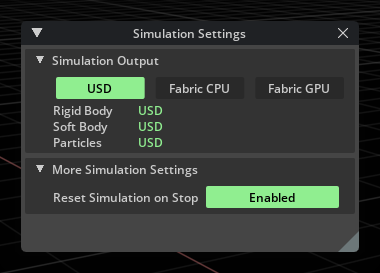
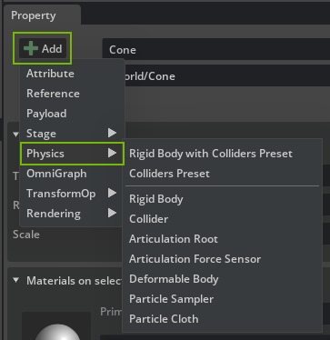
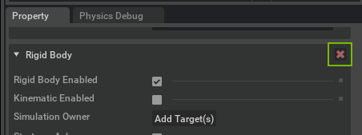
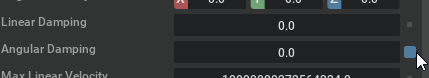
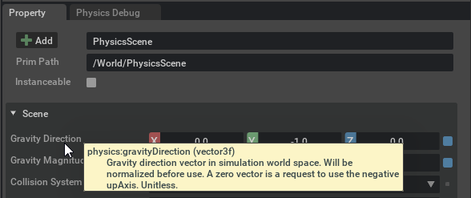

.. _Physics_Simulation_Management:

=====================
Simulation Management
=====================

Through the :ref:`Omni Physx UI` extension, you have access to fine grained control over PhysX simulations. To do this, you can adjust settings that are located in five key places in the UI:

1. The `property window`_ of the prims that are simulation objects, for example rigid bodies. In the property window, you can add and remove simulation components, and fine-tune properties such as mass, collision-shape approximation, etc.
2. The property window of the :ref:`Physics scene <Physics Scene>` that holds general simulation properties such as gravity and solver parameters.
3. The `Physics Settings`_ window provides per-stage settings saved in USD metadata for portability; for example, settings include a lower bound on the simulation rate and mouse-interaction parameters.
4. The `Physics Preferences`_ in **Edit > Preferences** provide general simulation settings such as the option to en/disable reset on stop.
5. The :ref:`layer metadata<usdunits>` that USD uses to scale units (e.g. distance). The physics extension considers this scaling when parsing simulation parameters, so you should be aware of what scale you are authoring a simulation in.

.. _Simulation Settings Window:

Simulation Settings Window
--------------------------

This window can be enabled through the *Physics* section of the *Show/Hide* (Eye) menu in the viewport. It allows you to quickly view and change where simulation data (such as new positions and velocities) is being tracked and stored. 

.. note::
    If using Fabric, property windows will not be updated with the current simulation values.

Here you can also toggle whether the simulation data is reset to the initial values when stopped.

.. _Property Window:

Property Window
---------------

In the Property Window (**Window > Property**), you can edit the physics properties of a prim, or you can add or remove simulation components (i.e. USD APIs).

You can *add* physics components with the **Add** button that shows a list of components that you may add to the selected prim. The list is context-sensitive and only shows physics components that are compatible with the prim and other physics components that the prim already has. Adding a component populates the Property Window with a new rollout that shows the component's properties (i.e. API attributes).

.. _AddButton:

You may *remove* a component from a prim by clicking the red X that is shown with the component rollout:

A hint for editing numeric values: *Ctrl*-Click or double-click lets you edit the current value. If you want to reset values to their default, you can do so by clicking the blue square next to the value:

.. _Tool Tips:

Tool Tips
#########

You can hover over the name of a property to reveal a tooltip with further information about a parameter:

.. _Physics Settings:

Physics Settings
----------------

Physics Settings are per-stage settings saved in USD metadata. You can view and change them through **Window > Simulation > Settings**. The Physics Settings window should be by default docked behind the Stage tab on the upper-right side.

Update
########

You can configure what data the simulation writes back to USD (analogous to editing operations).

.. list-table::
    :widths: 30 70
    :header-rows: 0

    * - _`Update to USD`
      - Enables writing object transforms back to USD. Expert setting that should be left enabled.
    * - _`Update velocities to USD`
      - Enables writing object velocities back to USD. If you do not need velocity information, you can disable the writeback to save some computational overhead.
    * - _`Output Velocities in Local space`
      - Display velocities in local coordinate space. The simulation also expects user changes to velocities (like initial velocity of a body) to be in local/global space according to this setting.
    * - _`Update Particles to USD`
      - Enables writing particle positions (and velocities, if update velocities is enabled) back to USD. Particle updates are otherwise disabled if particle iso-surface mesh generation is enabled. 
    * - _`Update Residuals to USD`
      - Enables writing residuals back to USD. If you do not need solver residual information (e. g. for monitoring solver convergence), you can disable the writeback to save some computational overhead.
	  
Simulator
#########

.. list-table::
    :widths: 30 70
    :header-rows: 0

    * - _`Min Simulation Frame Rate`
      - Sets the minimum simulation update rate in Hertz with respect to render-frame updates. In general, the Physics simulation runs in real (wall) time, so if rendering is slow, the simulation may take many steps at ``Time Steps Per Second`` to keep the Physics simulation state synchronized with wall time. This parameter limits how many steps the simulation may take to keep up synchronization. For example, if ``Min Simulation Frame Rate`` is 30Hz and the PhysicsScene ``Time Steps Per Second`` is 60 (Hz), the simulation takes at most two steps between render frame updates, no matter how long a frame render takes. This is a useful parameter when rendering a Physics scene to keep the simulation updates in lockstep with rendering: Just set ``Min Simulation Frame Rate`` equal to the ``Time Steps Per Second`` value to maintain synchronization.

.. _MouseInteraction:

Mouse Interaction
#################

.. list-table::
    :widths: 30 70
    :header-rows: 0

    * - _`Mouse Interaction Enabled`
      - Enables interaction with physics objects through shift-click *if the simulation is running*.
    * - _`Mouse Grab`
      - Toggles between grabbing behavior (enabled) and applying a push (disabled).
    * - _`Mouse Grab Ignore Invisible`
      - Toggles whether to affect Prims that are set to be invisible.
    * - _`Mouse Grab With Force`
      - Toggles between grabbing using a force (enabled) or using a D6 joint (disabled). Both the force and D6 are applied at the click (raycast) location.
    * - _`Mouse Grab Force Coefficient`
      - Scales the force used for grabbing. The grabbing force is proportional to the mass of the grabbed object and multiplied with this parameter.
    * - _`Mouse Push Acceleration`
      - Scales the push-acceleration applied to the object.

.. _Physics Preferences:

Physics Preferences
-------------------

Besides the physics scene and physics settings, the *Physics* tab in **Edit > Preferences** provides global simulation-related settings.

General
###########

.. list-table::
    :widths: 30 70
    :header-rows: 0

    * - _`Create Temporary Default PhysicsScene When Needed`
      - Controls whether a scene is auto-created when you press Play and simulation objects are present but no PhysicsScene was added to the stage.
    * - _`Reset simulation on stop`
      - If enabled, the state (i.e. transforms, velocities) of the simulation objects is reset to the initial state before Play was pressed.
    * - _`Use Active CUDA Context`
      - If enabled, the PhysX simulation uses the currently active CUDA context for its GPU computations. If disabled, a new context is created for the simulation.
    * - _`Use Physics Scene Multi-GPU Mode`
      - **Use all devices** will simulate all PhysicScenes in the stage by assigning them to available GPUs in a round-robin fashion. **Use all devices except first** will do the same except it will skip the GPU with device ordinal 0. Also :ref:`see<simulation_on_multiple_gpus>` the explanation of the underlying setting.
    * - Reset Physics Preferences
      - Use this button to reset the values of the Physics preferences here, along with the :ref:`viewport overlays<viewport_overlays>`.

Backward Compatibility
##########################

.. list-table::
    :widths: 30 70
    :header-rows: 0

    * - _`Backward Compatibility Check on Scene Open`
      - Configures the behavior of the physics USD backward compatibility module: In case of opening a scene with deprecated USD schema the extension can either ignore it, print out a warning to console, show a visual prompt to upgrade, or upgrade the scene automatically without prompting.
    * - Run Backwards Compatibility On Current Stage
      - Manually trigger a backwards compatibility check and update on current stage.
    * - Run Backwards Compatibility On Folder
      - Manually trigger a backwards compatibility check and update on a folder.

Simulator
#############

.. list-table::
    :widths: 30 70
    :header-rows: 0

    * - _`Num Simulation Threads`
      - The number of simulation threads controls how many background threads are spawned and reserved for simulation.
    * - _`Use PhysX CPU Dispatcher`
      - Use internal PhysX task scheduler instead of the default one. Can be more efficient for some scenes.
    * - _`Expose PhysX SDK Profiler Data`
      - Adds PhysX SDK profiling zones to the Kit profiler.
    * - Release Physics Cooked Data
      - Deletes cooked data (i.e. pre-optimized simulation data for collision meshes, etc.) for all prims on the stage from USD, i.e. deletes the corresponding API and attributes holding the data. Forces re-cooking of the data (if the local mesh cache is cleared as well).

.. _localMeshCache:

Local Mesh Cache
################

This section allows customizing the options connected to caching of collision mesh approximations as described in :ref:`meshCooking`.

.. list-table::
    :widths: 30 70
    :header-rows: 0

    * - _`Enable Local Mesh Cache`
      - If checked enables the cache. Simulation will lookup collision meshes from the cache at simulation start. When unchecked it will cause the simulation to re-compute collision approximations every time a simulation is started, potentially delaying for the entire time needed.
    * - _`Local Mesh Cache Size MB`
      - This is the user suggested size in MegaBytes for the collision meshes cache. The actual size of the cache can sometimes exceed this value before garbage collection will do its work to purge older entries. 
    * - _`Enable UJITSO Collision Cooking`
      - The UJITSO caching system replaces the pre-existing legacy cooking data caching system. If cooking related errors appear on the log, it's suggested to try disabling it for diagnostic purposes. This option is on by default and non-persistent so it must be changed at every application reboot if required.
    * - _`UJITSO Cooking Max Process Count`
      - This value determines the maximum number of concurrent UJITSO processes that will be cooking data, spreading the computation across multiple threads.
