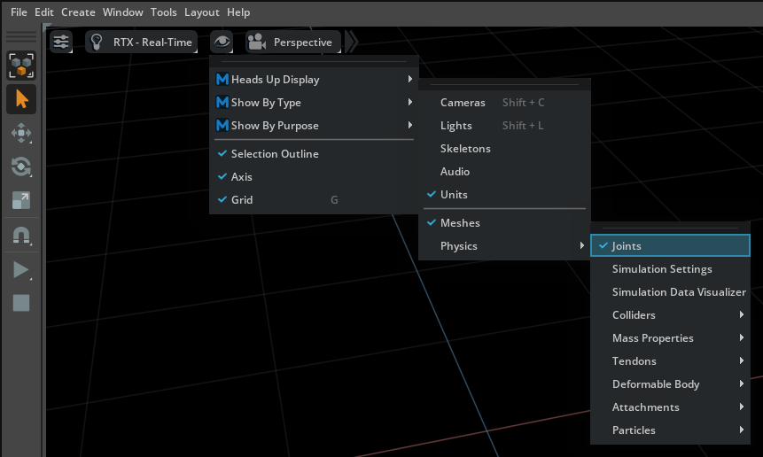

.. _viewport_overlays:

=================
Viewport Overlays
=================

To help you better analyze and locate potential issues in a simulation, the :ref:`Omni Physx UI` and :ref:`Omni USD Physics UI` extensions feature a number of ways to visualize the physics elements of the scene.

These can be enabled through the Physics section of the *Show/Hide* (Eye) menu in the viewport:

Here you can toggle the drawing of things including collision-shape approximations for physics bodies and the location of joints. You can also be able to enable the :ref:`Simulation Settings Window` and the :ref:`Simulation Data Visualizer Window`.

.. note::
    Viewport visualization overlays can be slow when simulating large scenes.

In addition, there are also many visualization and other debug options available in the :ref:`Physics Debug Window`.

Mouse Interaction
-----------------

In addition to visualizing physics elements, the :ref:`Omni Physx UI` extension also provides an overlay that enables you to *interact* with objects during simulation. You can push or grab objects by shift-clicking them in the viewport when the simulation is running. See the related settings and description in the :ref:`Mouse Interaction Settings<MouseInteraction>`.
