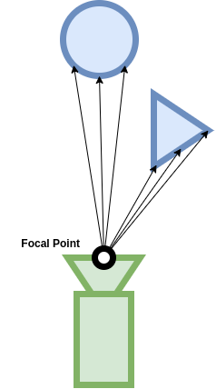
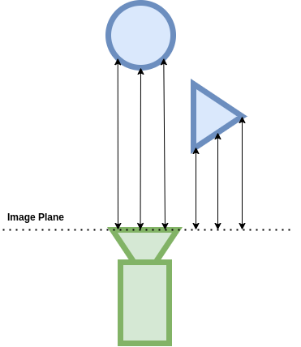

The current annotators that are available through the registry are:

.. csv-table:: Annotators
   :file: csv/annotators.csv
   :header-rows: 1

Some annotators support initialization parameters. For example, segmentation annotators can be parametrized with a ``colorize`` attribute specify the output format.

.. code:: python

    omni.replicator.core.annotators.get("semantic_segmentation", init_params={"colorize": True})

To see how annotators are used within a writer, we have prepared scripts that implement the basic writer which covers all standard annotators.

Standard Annotators
^^^^^^^^^^^^^^^^^^^

These annotators can be used in any rendering mode. Each annotator's usage and outputs are described below.

LdrColor
~~~~~~~~

Annotator Name: ``LdrColor``, (alternative name: ``rgb``)

The ``LdrColor`` or ``rgb`` annotator produces the low dynamic range output image as an array of type ``np.uint8`` with shape ``(width, height, 4)``, where the four channels correspond to R,G,B,A.

**Example**

.. code:: python

    import omni.replicator.core as rep

    async def test_ldr():
        # Add Default Light
        distance_light = rep.create.light(rotation=(315,0,0), intensity=3000, light_type="distant")

        cone = rep.create.cone()

        cam = rep.create.camera(position=(500,500,500), look_at=cone)
        rp = rep.create.render_product(cam, (1024, 512))

        ldr = rep.AnnotatorRegistry.get_annotator("LdrColor")
        ldr.attach(rp)

        await rep.orchestrator.step_async()
        data = ldr.get_data()
        print(data.shape, data.dtype)   # ((512, 1024, 4), uint8)

    import asyncio
    asyncio.ensure_future(test_ldr())

Normals
~~~~~~~

Annotator Name: ``normals``

The ``normals`` annotator produces an array of type ``np.float32`` with shape ``(height, width, 4)``.
The first three channels correspond to ``(x, y, z)``. The fourth channel is unused.

**Example**

.. code:: python

    import omni.replicator.core as rep

    async def test_normals():
        # Add Default Light
        distance_light = rep.create.light(rotation=(315,0,0), intensity=3000, light_type="distant")

        cone = rep.create.cone()

        cam = rep.create.camera(position=(500,500,500), look_at=cone)
        rp = rep.create.render_product(cam, (1024, 512))

        normals = rep.AnnotatorRegistry.get_annotator("normals")
        normals.attach(rp)

        await rep.orchestrator.step_async()
        data = normals.get_data()
        print(data.shape, data.dtype)   # ((512, 1024, 4), float32)

    import asyncio
    asyncio.ensure_future(test_normals())

Distance to Camera
~~~~~~~~~~~~~~~~~~

Annotator Name: ``distance_to_camera``

Outputs a depth map from objects to camera positions. The ``distance_to_camera`` annotator produces a 2d array of types ``np.float32`` with 1 channel.

**Data Details**

* The unit for distance to camera is in meters (For example, if the object is 1000 units from the camera, and the meters_per_unit variable of the scene is 100, the distance to camera would be 10).
* 0 in the 2d array represents infinity (which means there is no object in that pixel).

Distance to Image Plane
~~~~~~~~~~~~~~~~~~~~~~~

Annotator Name: ``distance_to_image_plane``

Outputs a depth map from objects to image plane of the camera. The ``distance_to_image_plane`` annotator produces a 2d array of types ``np.float32`` with 1 channel.

**Data Details**

* The unit for distance to image plane is in meters (For example, if the object is 1000 units from the image plane of the camera, and the meters_per_unit variable of the scene is 100, the distance to camera would be 10).
* 0 in the 2d array represents infinity (which means there is no object in that pixel).

Motion Vectors
~~~~~~~~~~~~~~

Annotator Name: ``motion_vectors``

Outputs a 2D array of motion vectors representing the relative motion of a pixel in the camera's viewport between frames.

The MotionVectors annotator returns the per-pixel motion vectors in in image space.

**Output Format**

.. code:: python

    array((height, width, 4), dtype=<np.float32>)

The components of each entry in the 2D array represent four different values encoded as floating point values:

* x: motion distance in the horizontal axis (image width) with movement to the left of the image being positive and movement to the right being negative.
* y: motion distance in the vertical axis (image height) with movement towards the top of the image being positive and movement to the bottom being negative.
* z: unused
* w: unused

**Example**

.. code:: python

    import asyncio
    import omni.replicator.core as rep

    async def test_motion_vectors():
        # Add an object to look at
        cone = rep.create.cone()

        # Add motion to object
        cone_prim = cone.get_output_prims()["prims"][0]
        cone_prim.GetAttribute("xformOp:translate").Set((-100, 0, 0), time=0.0)
        cone_prim.GetAttribute("xformOp:translate").Set((100, 50, 0), time=10.0)

        camera = rep.create.camera()
        render_product = rep.create.render_product(camera, (512, 512))

        motion_vectors_anno = rep.annotators.get("MotionVectors")
        motion_vectors_anno.attach(render_product)

        # Take a step to render the initial state (no movement yet)
        await rep.orchestrator.step_async()

        # Capture second frame (now the timeline is playing)
        await rep.orchestrator.step_async()
        data = motion_vectors_anno.get_data()
        print(data.shape, data.dtype, data.reshape(-1, 4).min(axis=0), data.reshape(-1, 4).max(axis=0))
        # (1024, 512, 4), float32,  [-93.80073  -1.       -1.       -1.     ] [ 0.       23.450201  1.        1.      ]

    asyncio.ensure_future(test_motion_vectors())

.. note::

    The values represent motion relative to camera space.

.. include:: annotators_docs.rst

RT Annotators
^^^^^^^^^^^^^

RT Annotators are only available in `RayTracedLighting` rendering mode (RTX - Real-Time)

**Example**

.. code:: python

    import asyncio
    import omni.replicator.core as rep

    async def test_pt_anno():
        # Set rendermode to PathTracing
        rep.settings.set_render_rtx_realtime()

        # Create an interesting scene
        red_diffuse = rep.create.material_omnipbr(diffuse=(1, 0, 0.2), roughness=1.0)
        metallic_reflective = rep.create.material_omnipbr(roughness=0.01, metallic=1.0)
        glow = rep.create.material_omnipbr(emissive_color=(1.0, 0.5, 0.4), emissive_intensity=100000.0)
        rep.create.cone(material=metallic_reflective)
        rep.create.cube(position=(100, 50, -100), material=red_diffuse)
        rep.create.sphere(position=(-100, 50, 100), material=glow)
        ground = rep.create.plane(scale=(100, 1, 100), position=(0, -50, 0))

        # Attach render product
        W, H = (1024, 512)
        camera = rep.create.camera(position=(400., 400., 400.), look_at=ground)
        render_product = rep.create.render_product(camera, (W, H))

        anno = rep.annotators.get("SmoothNormal")
        anno.attach(render_product)

        await rep.orchestrator.step_async()

        data = anno.get_data()
        print(data.shape, data.dtype)
        # (512, 1024, 4), float32

    asyncio.ensure_future(test_pt_anno())

SmoothNormal
~~~~~~~~~~~~

**Output Format**

.. code:: python

    np.ndtype(np.float32)   # shape: (H, W, 4)

BumpNormal
~~~~~~~~~~

**Output Format**

.. code:: python

    np.ndtype(np.float32)   # shape: (H, W, 4)

AmbientOcclusion
~~~~~~~~~~~~~~~~

**Output Format**

.. code:: python

    np.ndtype(np.float16)   # shape: (H, W, 4)

Motion2d
~~~~~~~~

**Output Format**

.. code:: python

    np.ndtype(np.float32)   # shape: (H, W, 4)

DiffuseAlbedo
~~~~~~~~~~~~~

**Output Format**

.. code:: python

    np.ndtype(np.uint8) # shape: (H, W, 4)

SpecularAlbedo
~~~~~~~~~~~~~~

**Output Format**

.. code:: python

    np.ndtype(np.float16)   # shape: (H, W, 4)

Roughness
~~~~~~~~~

**Output Format**

.. code:: python

    np.ndtype(np.uint8) # shape: (H, W, 4)

DirectDiffuse
~~~~~~~~~~~~~

**Output Format**

.. code:: python

    np.ndtype(np.float16)   # shape: (H, W, 4)

DirectSpecular
~~~~~~~~~~~~~~

**Output Format**

.. code:: python

    np.ndtype(np.float16)   # shape: (H, W, 4)

Reflections
~~~~~~~~~~~

**Output Format**

.. code:: python

    np.ndtype(np.float32)   # shape: (H, W, 4)

IndirectDiffuse
~~~~~~~~~~~~~~~

**Output Format**

.. code:: python

    np.ndtype(np.float16)   # shape: (H, W, 4)

DepthLinearized
~~~~~~~~~~~~~~~

**Output Format**

.. code:: python

    np.ndtype(np.float32)   # shape: (H, W, 1)

EmissionAndForegroundMask
~~~~~~~~~~~~~~~~~~~~~~~~~

**Output Format**

.. code:: python

    np.ndtype(np.float16)   # shape: (H, W, 1)

PathTracing Annotators
^^^^^^^^^^^^^^^^^^^^^^

PathTracing Annotators are only available in `PathTracing` rendering mode (RTX - Interactive).
In addition, the following carb settings must be set on app launch:

* rtx-transient.aov.enableRtxAovs = true
* rtx-transient.aov.enableRtxAovsSecondary = true

**Example**

.. code:: python

    import asyncio
    import omni.replicator.core as rep

    async def test_pt_anno():
        # Set rendermode to PathTracing
        rep.settings.set_render_pathtraced()

        # Create an interesting scene
        red_diffuse = rep.create.material_omnipbr(diffuse=(1, 0, 0.2), roughness=1.0)
        metallic_reflective = rep.create.material_omnipbr(roughness=0.01, metallic=1.0)
        glow = rep.create.material_omnipbr(emissive_color=(1.0, 0.5, 0.4), emissive_intensity=100000.0)
        rep.create.cone(material=metallic_reflective)
        rep.create.cube(position=(100, 50, -100), material=red_diffuse)
        rep.create.sphere(position=(-100, 50, 100), material=glow)
        ground = rep.create.plane(scale=(100, 1, 100), position=(0, -50, 0))

        # Attach render product
        W, H = (1024, 512)
        camera = rep.create.camera(position=(400., 400., 400.), look_at=ground)
        render_product = rep.create.render_product(camera, (W, H))

        anno = rep.annotators.get("PtGlobalIllumination")
        anno.attach(render_product)

        await rep.orchestrator.step_async()

        data = anno.get_data()
        print(data.shape, data.dtype)
        # (512, 1024, 4), float16

    asyncio.ensure_future(test_pt_anno())

PtDirectIllumation
~~~~~~~~~~~~~~~~~~

**Output Format**

.. code:: python

    np.ndtype(np.float16)   # Shape: (Height, Width, 4)

PtGlobalIllumination
~~~~~~~~~~~~~~~~~~~~

**Output Format**

.. code:: python

    np.ndtype(np.float16)   # Shape: (Height, Width, 4)

PtReflections
~~~~~~~~~~~~~

**Output Format**

.. code:: python

    np.ndtype(np.float16)   # Shape: (Height, Width, 4)

PtRefractions
~~~~~~~~~~~~~

**Output Format**

.. code:: python

    np.ndtype(np.float16)   # Shape: (Height, Width, 4)

PtSelfIllumination
~~~~~~~~~~~~~~~~~~~~~~~~~~

**Output Format**

.. code:: python

    np.ndtype(np.float16)   # Shape: (Height, Width, 4)

PtBackground
~~~~~~~~~~~~~

**Output Format**

.. code:: python

    np.ndtype(np.float16)   # Shape: (Height, Width, 4)

PtWorldNormal
~~~~~~~~~~~~~

**Output Format**

.. code:: python

    np.ndtype(np.float16)   # Shape: (Height, Width, 4)

PtWorldPos
~~~~~~~~~~~~~

**Output Format**

.. code:: python

    np.ndtype(np.float16)   # Shape: (Height, Width, 4)

PtZDepth
~~~~~~~~~~~~~

**Output Format**

.. code:: python

    np.ndtype(np.float16)   # Shape: (Height, Width, 4)

PtVolumes
~~~~~~~~~~~~~

**Output Format**

.. code:: python

    np.ndtype(np.float16)   # Shape: (Height, Width, 4)

PtDiffuseFilter
~~~~~~~~~~~~~~~~~~~~~~~~~~

**Output Format**

.. code:: python

    np.ndtype(np.float16)   # Shape: (Height, Width, 4)

PtReflectionFilter
~~~~~~~~~~~~~~~~~~~~~~~~~~

**Output Format**

.. code:: python

    np.ndtype(np.float16)   # Shape: (Height, Width, 4)

PtRefractionFilter
~~~~~~~~~~~~~~~~~~~~~~~~~~

**Output Format**

.. code:: python

    np.ndtype(np.float16)   # Shape: (Height, Width, 4)

PtMultiMatte0
~~~~~~~~~~~~~

**Output Format**

.. code:: python

    np.ndtype(np.float16)   # Shape: (Height, Width, 4)

PtMultiMatte1
~~~~~~~~~~~~~

**Output Format**

.. code:: python

    np.ndtype(np.float16)   # Shape: (Height, Width, 4)

PtMultiMatte2
~~~~~~~~~~~~~

**Output Format**

.. code:: python

    np.ndtype(np.float16)   # Shape: (Height, Width, 4)

PtMultiMatte3
~~~~~~~~~~~~~

**Output Format**

.. code:: python

    np.ndtype(np.float16)   # Shape: (Height, Width, 4)

PtMultiMatte4
~~~~~~~~~~~~~

**Output Format**

.. code:: python

    np.ndtype(np.float16)   # Shape: (Height, Width, 4)

PtMultiMatte5
~~~~~~~~~~~~~

**Output Format**

.. code:: python

    np.ndtype(np.float16)   # Shape: (Height, Width, 4)

PtMultiMatte6
~~~~~~~~~~~~~

**Output Format**

.. code:: python

    np.ndtype(np.float16)   # Shape: (Height, Width, 4)

PtMultiMatte7
~~~~~~~~~~~~~

**Output Format**

.. code:: python

    np.ndtype(np.float16)   # Shape: (Height, Width, 4)
