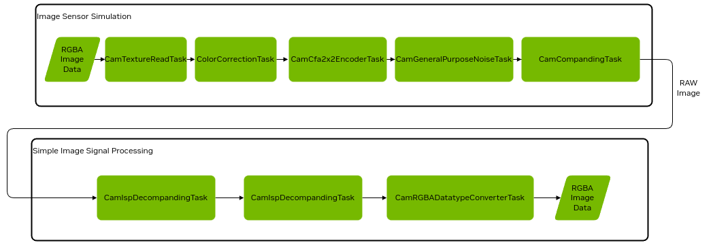
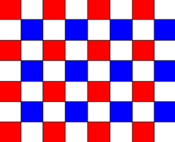
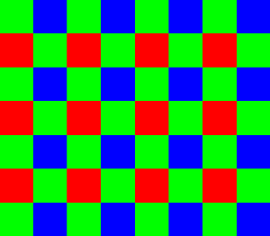
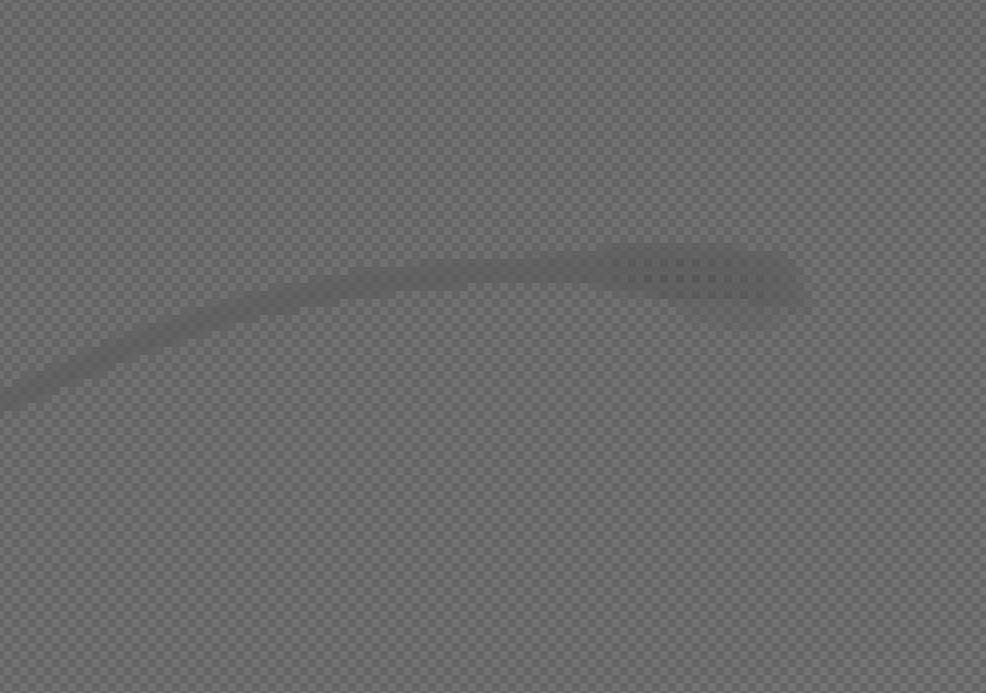
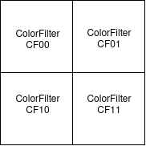
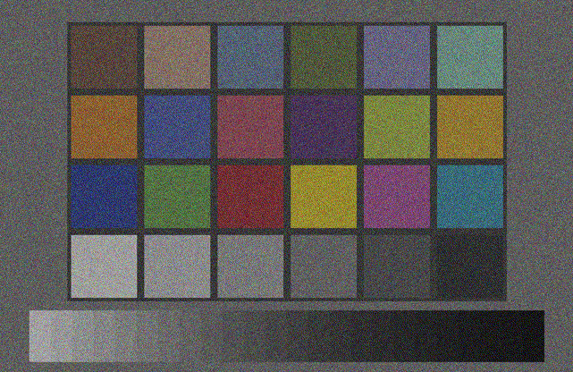
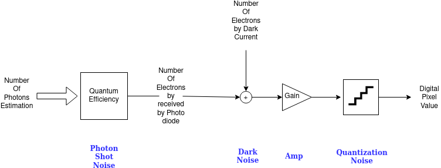
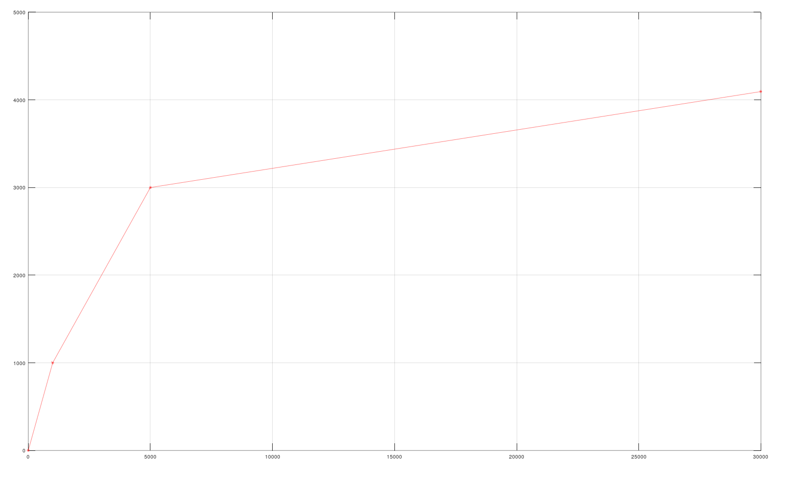
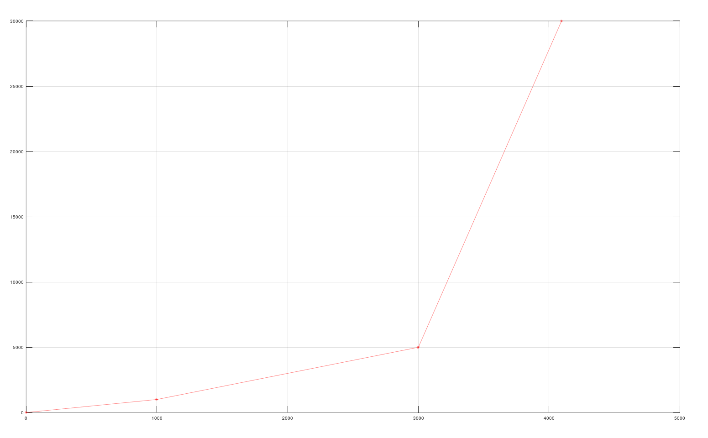

.. _ext_omni_sensors_nv_camera:

==========================
Omniverse Camera Extension
==========================

Introduction
------------

In Omniverse the camera pipeline is simulated in both the renderer (via shaders) and in post processing tasks implemented in Omnigraph nodes.
In the final application the scenario script will setup the camera pipeline.
The camera simulation is developed by connecting camera task nodes and defining a camera pipeline/graph. The developer could start with a simple runnable camera graph and could improve the simulation fidelity by adding new tasks and tweaking the graph node settings.
For the most part the lens simulation is done directly in the renderer.
A separate depth camera sensor simulation is available as a post process operation in the renderer.

The sensor simulation pipeline is described first and the depth sensor is described in a separate section.

^^^^^^^^^^^^^^^^^^^^^^^^^^^^^^^^^^^^^

Render Options
--------------

* RTX Raytracing Renderer : Realtime renderer based on raytracing with optimizations to run in real time

* RTX Pathtracing Renderer: Perception Renderer which focus more on light precision than on real time

* IRAY Photoreal Renderer: Renderer for experimental spectral rendering (only offline rendering)

^^^^^^^^^^^^^^^^^^^^^^^^^^^^^^^^^^^^^

Render Image Data
-----------------

The rendering is currently provided in two precisions:

RGBA Low Dynamic Range (LDR)
############################
8-bit sRGB with alpha channel

+-----------------------+----------------------------+
|Primaries              | 4 : Red, Green, Blue, Alpha|
+-----------------------+----------------------------+
|Minimum Component Value| 0                          |
+-----------------------+----------------------------+
|Maximum Component Value| 255                        |
+-----------------------+----------------------------+

RGBA High Dynamic Range (HDR)
#############################

float16 HDR RGB with alpha channel, linear mapable to physical irradiance/radiance units like W/m^2

+-----------------------+----------------------------+
|Primaries              | 4 : Red, Green, Blue, Alpha|
+-----------------------+----------------------------+
|Minimum Component Value| 0.0                        |
+-----------------------+----------------------------+
|Maximum Component Value| 65504.0                    |
+-----------------------+----------------------------+

^^^^^^^^^^^^^^^^^^^^^^^^^^^^^^^^^^^^^

Camera Simulation in the post processing
----------------------------------------

The camera post processing is organized as a graph with task nodes defining the image transfer functions

Here is the full Omniverse Core API rendering pipeline:

Standard Inputs and Outputs
###########################

All cameras task nodes beside special nodes have the following five standardized input pins:

+------------------+-----------------------------------------------------------+------+-------+
|Parameter         |Description                                                |Value |Default|
+==================+===========================================================+======+=======+
|inputs:rp         |The render product on which the CUDA computation is applied|uint64|0      |
|                  |                                                           |      |       |
+------------------+-----------------------------------------------------------+------+-------+
|inputs:gpu        |The Omniverse GPU interface                                |uint64|0      |
+------------------+-----------------------------------------------------------+------+-------+
|inputs:src        |The source buffer which consists of the image descriptor   |uint64|0      |
|                  |and the image buffer                                       |      |       |
+------------------+-----------------------------------------------------------+------+-------+
|inputs:simTimeIn  |If the application provides a simulation time it's passed  |double|0.0    |
|                  |by this parameter.                                         |      |       |
+------------------+-----------------------------------------------------------+------+-------+
|inputs:hydraTimeIn|The hydra engine time, usually used to support animations  |double|0.0    |
+------------------+-----------------------------------------------------------+------+-------+

All cameras task nodes beside special nodes have the following five output pins:

+--------------------+-------------------------------------------------------------+------+-------+
|Parameter           |Description                                                  |Value |Default|
+====================+=============================================================+======+=======+
|outputs:rp          |The render product on which the CUDA computation is applied  |uint64|0      |
|                    |                                                             |      |       |
+--------------------+-------------------------------------------------------------+------+-------+
|outputs:gpu         |The Omniverse GPU interface                                  |uint64|0      |
+--------------------+-------------------------------------------------------------+------+-------+
|outputs:dest        |The destination buffer which consists of the image descriptor|uint64|0      |
|                    |and the image buffer                                         |      |       |
+--------------------+-------------------------------------------------------------+------+-------+
|outputs:simTimeOut  |If the application provides a simulation time it's passed    |double|0.0    |
|                    |by this parameter.                                           |      |       |
+--------------------+-------------------------------------------------------------+------+-------+
|outputs:hydraTimeOut|The hydra engine time, usually used to support animations    |double|0.0    |
+--------------------+-------------------------------------------------------------+------+-------+

To connect two nodes you have to connect the output to the input pins:

 * Task1.outputs:rp -> Task2.inputs:rp
 * Task1.outputs:gpu -> Task2.inputs:gpu
 * Task1.outputs:dest -> Task2.inputs:src
 * Task1.outputs:simTimeOut -> Task2.inputs:simTimeIn
 * Task1.outputs:hydraTimeOut -> Task2.inputs:hydraTimeIn

^^^^^^^^^^^^^^^^^^^^^^^^^^^^^^^^^^^^^

Camera Tasks and their parameter settings
#########################################

CamTextureReadTaskNode
^^^^^^^^^^^^^^^^^^^^^^

**Introduction**

The CamTextureReadTaskNode is selecting the render product which is used to feed into the camera pipeline. Furthermore it initiates the descriptor on which successor graph nodes

You have to make sure that the render product was included into the requested RTX render products

Currently the following render products are supported
 * Low Dynamic Range Image
 * High Dynamic Range Image
 * High Dynamic Range Image
 * Depth Map
 * Segmentation Map

**Omnigraph Node Name**

omni.sensors.nv.camera.CamTextureReadTaskNode

**Parameters & Attributes**

+------------------+-----------------------------------+----------+-------------------------+-------------+-------+
|Parameter Name    |Description                        |Value Type|Value Range              |Default Value|Example|
+==================+===================================+==========+=========================+=============+=======+
|inputs:aov        |Determines which render AOV is used|string    | * LDR                   |LDR          |LDR    |
|                  |                                   |          | * HDR                   |             |       |
|                  |                                   |          | * HDR32                 |             |       |
|                  |                                   |          | * DEPTH,                |             |       |
|                  |                                   |          | * SEGMENTIC_SEGMENTATION|             |       |
+------------------+-----------------------------------+----------+-------------------------+-------------+-------+

^^^^^^^^^^^^^^^^^^^^^^^^^^^^^^^^^^^^^

ColorCorrectionTaskNode
^^^^^^^^^^^^^^^^^^^^^^^

**Introduction**

To adapt to the color space and the dynamics of a real camera sensor this task applies a color correction, dynamic range limiting and constant white balance. With these parameters the user can consider items like exposure and color shift of image sensors.

**Omnigraph Node Name**

omni.sensors.nv.camera.ColorCorrectionTaskNode

**Parameters & Attributes**

+----------------------+---------------------------------------------------------------------------+----------+-----------+---------------+---------------+
|Parameter Name        |Description                                                                |Value Type|Value Range|Default Value  |Example        |
+======================+===========================================================================+==========+===========+===============+===============+
|inputs:fullwell_black |The value range of the output from the black level value                   |float     |full range |1.0            |               |
|                      |to saturation                                                              |          |           |               |               |
+----------------------+---------------------------------------------------------------------------+----------+-----------+---------------+---------------+
|inputs:black          |Black level                                                                |float     |full range |0.0            |               |
+----------------------+---------------------------------------------------------------------------+----------+-----------+---------------+---------------+
|inputs:output_float16 |Indicates whether the output shall be float16 or uint8_t                   |boolean   | 0,1       |0              |               |
+----------------------+---------------------------------------------------------------------------+----------+-----------+---------------+---------------+
|inputs:Rr             |Red to Red conversion                                                      |float     |full range |1.0            |               |
+----------------------+---------------------------------------------------------------------------+----------+-----------+---------------+---------------+
|inputs:Rg             |Red to Green conversion                                                    |float     |full range |0.0            |               |
+----------------------+---------------------------------------------------------------------------+----------+-----------+---------------+---------------+
|inputs:Rb             |Red to Blue                                                                |float     |full range |0.0            |               |
+----------------------+---------------------------------------------------------------------------+----------+-----------+---------------+---------------+
|inputs:Gr             |Green to Red                                                               |float     |full range |0.0            |               |
+----------------------+---------------------------------------------------------------------------+----------+-----------+---------------+---------------+
|inputs:Gg             |Green to Green                                                             |float     |full range |1.0            |               |
+----------------------+---------------------------------------------------------------------------+----------+-----------+---------------+---------------+
|inputs:Gb             |Green to Blue                                                              |float     |full range |0.0            |               |
+----------------------+---------------------------------------------------------------------------+----------+-----------+---------------+---------------+
|inputs:Br             |Blue to Red conversion                                                     |float     |full range |0.0            |               |
+----------------------+---------------------------------------------------------------------------+----------+-----------+---------------+---------------+
|inputs:Bg             |Blue to Green conversion                                                   |float     |full range |0.0            |               |
+----------------------+---------------------------------------------------------------------------+----------+-----------+---------------+---------------+
|inputs:Bb             |Blue to Blue conversion                                                    |float     |full range |0.0            |               |
+----------------------+---------------------------------------------------------------------------+----------+-----------+---------------+---------------+
|inputs:redBlueSwap    |swaps the red and blue component (RGBA->BGRA or BGRA->RGBA)                |boolean   | 0,1       |0              |               |
+----------------------+---------------------------------------------------------------------------+----------+-----------+---------------+---------------+
|inputs:whiteBalance   |Defines the general gain for each color component after the CCM, could also|float3    |full range |[1.0, 1.0, 1.0]|[0.8, 1.9, 1.3]|
|                      |be used to scale the values to the image sensor's digital number (DN)      |          |           |               |               |
+----------------------+---------------------------------------------------------------------------+----------+-----------+---------------+---------------+
|inputs:applySaturation|Indicates whether the saturation parameters should be applied              |boolean   | 0,1       |0              |               |
+----------------------+---------------------------------------------------------------------------+----------+-----------+---------------+---------------+

^^^^^^^^^^^^^^^^^^^^^^^^^^^^^^^^^^^^^

CamCfa2x2EncoderTaskNode
^^^^^^^^^^^^^^^^^^^^^^^^

**Introduction**

Camera sensors are equipped with a color filter array (CFA) to capture the color information, where the most used pattern is the 2x2.
This tasks converts the RGBA images into 2x2 CFA images, which is the common image raw format in cameras.
In theory you could use any 2x2 CFA pattern, the color filters could be defined individually.

RCCB (Red-Clear-Clear-Blue) is a frequently used CMOS camera color scheme in ADAS/AD, with obvious advantage that clear pixels provide more low-light sensitivity, thus leading to lower noise in low light scenarios than other schemes. A disadvantage is the lower color separation, which could lead to problems in color sensitive applications e.g. with traffic lights (red vs orange).

This task could be also used to encode RGGB Outputs or other CMOS 2x2 mosaic encodings(like RCCC) by setting the CFA weights accordingly. RGGB has the advantage of a better separation of the colors and the easier conversion to common color spaces as RGB/YUV.

RGGB Mosaic

The CFA Encoding Task takes a RGBA/BGRA stream and converts it to the CFA scheme color space.
The output is a 16bit (RAW10,RAW12,RAW16) or 32bit(RAW20,RAW24)

The color filters are defined as follows:

**Omnigraph Node Name**

omni.sensors.nv.camera.CamCfa2x2EncoderTaskNode

**Parameters & Attributes**

+---------------------+---------------------------------------------------------------------+----------+-----------+-------------+-----------+
|Parameter Name       |Description                                                          |Value Type|Value Range|Default Value|Example    |
+=====================+=====================================================================+==========+===========+=============+===========+
|inputs:flipHorizontal|Dependent on the read direction the image has to flipped horizontally|boolean   |0,1        | 0           | 0         |
+---------------------+---------------------------------------------------------------------+----------+-----------+-------------+-----------+
|inputs:flipVertical  |Dependent on the read direction the image has to flipped vertically  |boolean   |0,1        | 0           | 0         |
+---------------------+---------------------------------------------------------------------+----------+-----------+-------------+-----------+
|inputs:CFA_CF00      |Calculation of the CF00 by (R,G,B)                                   |float[3]  |full range | N.A.        | (1, 0, 0) |
+---------------------+---------------------------------------------------------------------+----------+-----------+-------------+-----------+
|inputs:CFA_CF01      |Calculation of the CF01 by (R,G,B)                                   |float[3]  |full range | N.A.        | (0, 1, 0) |
+---------------------+---------------------------------------------------------------------+----------+-----------+-------------+-----------+
|inputs:CFA_CF10      |Calculation of the CF10 by (R,G,B)                                   |float[3]  |full range | N.A.        | (0, 1, 0) |
+---------------------+---------------------------------------------------------------------+----------+-----------+-------------+-----------+
|inputs:CFA_CF11      |Calculation of the CF11 by (R,G,B)                                   |float[3]  |full range | N.A.        | (0, 0, 1) |
+---------------------+---------------------------------------------------------------------+----------+-----------+-------------+-----------+
|cfaSemantic          |Semantic of the Color Filter array:                                  | string   |           | N.A.        |           |
|                     | * RGGB                                                              |          |           |             |           |
|                     | * GRBG                                                              |          |           |             |           |
|                     | * BGGR                                                              |          |           |             |           |
|                     | * RCCB                                                              |          |           |             |           |
|                     | * CRBC                                                              |          |           |             |           |
|                     | * BCCR                                                              |          |           |             |           |
|                     | * RCCC                                                              |          |           |             |           |
|                     | * CCCR                                                              |          |           |             |           |
|                     | * CRCC                                                              |          |           |             |           |
|                     | * CCCC                                                              |          |           |             |           |
+---------------------+---------------------------------------------------------------------+----------+-----------+-------------+-----------+
|maximalValue         | If the input is normalized to 1: maximal value of output            |uint64    |full range | N.A.        |16777215   |
|                     | Else: a linear multiplier to the output                             |          |           |             |           |
+---------------------+---------------------------------------------------------------------+----------+-----------+-------------+-----------+

^^^^^^^^^^^^^^^^^^^^^^^^^^^^^^^^^^^^^

CamGeneralPurposeNoiseTask
^^^^^^^^^^^^^^^^^^^^^^^^^^

**Introduction**

Noise is a common problem in image sensors. This tasks adds the dynamic noises to the image, photon shot noise and dark shot noise.
The photon noise is modeled as a Poisson distribution. The dark shot noise is modeled as a Gaussian distribution.
This task doesn't simulate any spatial noise effects, like fixed pattern noise, photo response non-uniformity (PRNU) or dark signal non-uniformity (DSNU).

The noise model could be seen as the following transfer function

**Omnigraph Node Name**

omni.sensors.nv.camera.CamGeneralPurposeNoiseTask

**Parameters & Attributes**

+-------------------------+-----------------------------------------------------+------------+-----------+-------------+--------------------------------------+
|Parameter Name           |Description                                          |Value Type  |Value Range|Default Value|Example                               |
+=========================+=====================================================+============+===========+=============+======================================+
|inputs:darkShotNoiseGain |Gain applied of the dark noise generated             |float       |full range |     N.A.    | 10                                   |
+-------------------------+-----------------------------------------------------+------------+-----------+-------------+--------------------------------------+
|inputs:darkShotNoiseSigma|The sigma of the normal distribution noise randomizer|float       |full range |     N.A.    | 0.5                                  |
+-------------------------+-----------------------------------------------------+------------+-----------+-------------+--------------------------------------+
|inputs:hdrCombinationData|Specification of the gains and offsets               |float2 array|full range |     N.A.    |[(5.8, 4000), (58, 8000), (70, 16000)]|
|                         |to simulate different HDR zones                      |            |           |             |                                      |
+-------------------------+-----------------------------------------------------+------------+-----------+-------------+--------------------------------------+

^^^^^^^^^^^^^^^^^^^^^^^^^^^^^^^^^^^^^

Companding
^^^^^^^^^^

**Introduction**

Internally, an HDR image sensor works with 20 bit or 24 bit precision. To transmit the data, the pixels are compressed/companded by a piece-wise-linear function to the output format (e.g. RAW8, RAW10, RAW12, RAW16).

Here is a simple example of a PWL companding function to RAW12:

**Omnigraph Node Name**

omni.sensors.nv.camera.CamCompandingTaskNode

**Parameters & Attributes**

+-------------------------+--------------------------------------------------------+------------------+-------------------------+-------------+-------+
|Parameter Name           |Description                                             |Value Type        |Value Range              |Default Value|Example|
+=========================+========================================================+==================+=========================+=============+=======+
|inputs:Alignment         |The alignment of the resulting raw value                | uint32           | * 16 bit values : (0-15)|N.A.         |11     |
|                         |whereby LSB = 0                                         |                  | * 32 bit values : (0-31)|             |       |
|                         |If the maximal PWL output value is greater than 65535,  |                  |                         |             |       |
|                         |the output array will have uint32 pixels, else uint16   |                  |                         |             |       |
|                         |pixels.                                                 |                  |                         |             |       |
|                         |For example if the output is RAW12 and it should be     |                  |                         |             |       |
|                         |aligned to the MSB of a 16bit value, you have to set it |                  |                         |             |       |
|                         |to 15                                                   |                  |                         |             |       |
+-------------------------+--------------------------------------------------------+------------------+-------------------------+-------------+-------+
|inputs:PrePedestal       |A pedestal applied before the companding                | uint32           |full range               |0            | 0     |
+-------------------------+--------------------------------------------------------+------------------+-------------------------+-------------+-------+
|inputs:PostPedestal      |A pedestal applied after the companding                 | uint32           |full range               |0            | 0     |
+-------------------------+--------------------------------------------------------+------------------+-------------------------+-------------+-------+
|inputs:LinearCompandCoeff|The PWL companding coefficients                         | array of float[2]|full range               |N.A.         |       |
|                         |                                                        |                  |                         |             |       |
|                         | * Represented in (x,y)                                 |                  |                         |             |       |
|                         | * x is the internal representation value (uncompressed)|                  |                         |             |       |
|                         | * y is the compressed value                            |                  |                         |             |       |
+-------------------------+--------------------------------------------------------+------------------+-------------------------+-------------+-------+

^^^^^^^^^^^^^^^^^^^^^^^^^^^^^^^^^^^^^

Decompanding
^^^^^^^^^^^^

**Introduction**

Decompanding is the decompression of the image values via a piece-wise-linear function.

Here is a simple example of the PWL decompanding of the function which has been shown in CamCompandingTaskNode:

**Omnigraph Node Name**

omni.sensors.nv.camera.CamIspDecompandingTaskNode

**Parameters & Attributes**

+-------------------------+-----------------------------------------------+-----------------+-------------------------+-------------+-------+
|Parameter Name           |Description                                    |Value Type       |Value Range              |Default Value|Example|
+=========================+===============================================+=================+=========================+=============+=======+
|inputs:LinearCompandCoeff|The PWL decompanding coefficients              |array of float[2]|full range               |     N.A.    | 1     |
|                         |                                               |                 |                         |             |       |
|                         | * Represented in (x,y)                        |                 |                         |             |       |
|                         | * x is the companded value (compressed)       |                 |                         |             |       |
|                         | * y is the uncompressed value                 |                 |                         |             |       |
+-------------------------+-----------------------------------------------+-----------------+-------------------------+-------------+-------+
|inputs:PostPedestal      |A pedestal applied before the decompanding     |uint             |full range               |     N.A.    | 0     |
+-------------------------+-----------------------------------------------+-----------------+-------------------------+-------------+-------+
|inputs:PrePedestal       |A pedestal applied after the decompanding      |uint             |full range               |     N.A.    | 0     |
+-------------------------+-----------------------------------------------+-----------------+-------------------------+-------------+-------+
|inputs:Alignment         | The alignment of the companded RAW value      |uint             | * 16 bit values : (0-15)|     N.A.    | 11    |
|                         | (see description in CamCompandingTaskNode)    |                 | * 32 bit values : (0-31)|             |       |
+-------------------------+-----------------------------------------------+-----------------+-------------------------+-------------+-------+
|inputs:ConvertTo16bit    |The data type to which the data is converted to|boolean          |0,1                      |     N.A.    | 1     |
+-------------------------+-----------------------------------------------+-----------------+-------------------------+-------------+-------+

^^^^^^^^^^^^^^^^^^^^^^^^^^^^^^^^^^^^^

ISP RGGB Demosaicing
^^^^^^^^^^^^^^^^^^^^

**Introduction**

This tasks converts CFA images which use common Red, Green, Blue color filters to RGBA images.

**Omnigraph Node Name**

omni.sensors.nv.camera.CamIspRGGBDemosaicingTaskNode

**Parameters & Attributes**

+-------------------+--------------------------------------------------+----------+-----------+-------------+----------+
|Parameter Name     |Description                                       |Value Type|Value Range|Default Value|Example   |
+===================+==================================================+==========+===========+=============+==========+
|inputs:bayerGrid   |Indicates which RGGB demosaicing should be applied|string    | * RGGB    |     N.A.    | "RGGB"   |
|                   |                                                  |          | * BGGR    |             |          |
|                   |                                                  |          | * GBRG    |             |          |
|                   |                                                  |          | * GRBG    |             |          |
+-------------------+--------------------------------------------------+----------+-----------+-------------+----------+
|inputs:outputFormat|The data type to which the data is converted to   |string    |           |     N.A.    | "UINT8"  |
+-------------------+--------------------------------------------------+----------+-----------+-------------+----------+

^^^^^^^^^^^^^^^^^^^^^^^^^^^^^^^^^^^^^

RGBADatatypeConverter
^^^^^^^^^^^^^^^^^^^^^

**Introduction**

This task provides a simple image type conversion. No sophisticated tonemapping is applied, just a simple one which could result in loosing image structures

**Omnigraph Node Name**

omni.sensors.nv.camera.CamRGBADatatypeConverterTaskNode

**Parameters & Attributes**

+-------------------------------+-----------------------------------------------+----------+-----------+-------------+-----------------------+
|Parameter Name                 |Description                                    |Value Type|Value Range|Default Value|Example                |
+===============================+===============================================+==========+===========+=============+=======================+
|inputs:uintApplyGammaCorrection|Indicates whether a gamma correction should be |boolean   |   0,1     |     N.A.    | 1                     |
|                               |applied                                        |          |           |             |                       |
+-------------------------------+-----------------------------------------------+----------+-----------+-------------+-----------------------+
|inputs:rgbaDataType            |The data type to which the data is converted to|float     | * UINT8   |     N.A.    | "UINT8"               |
|                               |                                               |          | * UINT16  |             |                       |
|                               |                                               |          | * FLOAT16 |             |                       |
|                               |                                               |          | * FLOAT32 |             |                       |
+-------------------------------+-----------------------------------------------+----------+-----------+-------------+-----------------------+

^^^^^^^^^^^^^^^^^^^^^^^^^^^^^^^^^^^^^

Depth Camera Sensor
-------------------

A depth camera sensor is a device to measure the distance from the sensor to objects in the scene, often using stereo disparity or projector time-of-flight.

Unlike the sensor and ISP simulation, the depth camera sensor simulation is not implemented as an Omnigraph pipeline. Instead, it is a
post process operation in the renderer.

Single View Depth Camera
------------------------

This depth camera sensor model uses a single camera view to simulate a stereo camera pair and compute disparity and depth.
Depth values from the rendering process are converted to disparity, which is then used to reproject the depth from the left imager position to the right imager position. This leaves gaps in regions that are occluded from both imagers.

To simulate disparity noise, a Gaussian noise model is applied to the disparity samples.
The disparity samples are quantized to pixel steps of the noise mean size, then randomized according to the sigma deviation curve. The randomness for the deviation is different each frame, resulting in temporal and spatial noise in the output depth.

A confidence map is also generated to indicate the reliability of the depth values.
The confidence map is created from a Sobel edge detection operation applied to the input color image.
The Sobel result is saturated to 0-1 and then scaled by the confidence threshold to create the confidence map.
Depth values with a confidence below the threshold are discarded.

**USD Schema**
The depth camera sensor can be enabled by adding the `OmniSensorDepthSensorSingleViewAPI` class to the RenderProduct.
Documentation for the schema can be found in the schema file.

Example usage:

.. code-block:: usda

    def RenderProduct "CameraDepthSingleView"(
        prepend apiSchemas = ["OmniSensorDepthSensorSingleViewAPI"]
    )
    {
        bool omni:rtx:post:depthSensor:enabled = 1
        float omni:rtx:post:depthSensor:baselineMM = 75.0
        float omni:rtx:post:depthSensor:focalLengthPixel = 897.0
        float omni:rtx:post:depthSensor:sensorSizePixel = 1280.0
        float omni:rtx:post:depthSensor:maxDisparityPixel = 150.0
        float omni:rtx:post:depthSensor:confidenceThreshold = 1.0
        float omni:rtx:post:depthSensor:noiseMean = 0.25
        float omni:rtx:post:depthSensor:noiseSigma = 0.25
        float omni:rtx:post:depthSensor:noiseDownscaleFactorPixel = 1.0
        float omni:rtx:post:depthSensor:minDistance = 0.5
        float omni:rtx:post:depthSensor:maxDistance = 9999.9
        int omni:rtx:post:depthSensor:rgbDepthOutputMode = 3

        rel camera = </Camera>
        rel orderedVars = [
          </Render/Vars/depthSensorDepth>,
          </Render/Vars/depthSensorPointCloudDepth>,
          </Render/Vars/depthSensorPointCloudColor>,
          </Render/Vars/depthSensorLeftImager>,
          </Render/Vars/ldrColor>
        ]
        uniform int2 resolution = (1280, 720)
    }

**Output AOVs**

+------------------------------+-------------+-----------------------------------------------------------------------------+
| AOV Name                     | Format      | Description                                                                 |
+==============================+=============+=============================================================================+
| DepthSensorDistance          | Float32     | Distance in meters                                                          |
+------------------------------+-------------+-----------------------------------------------------------------------------+
| DepthSensorPointCloudPosition| RGBAFloat32 | X,Y,Z positions in meters relative to the left imager camera                |
+------------------------------+-------------+-----------------------------------------------------------------------------+
| DepthSensorPointCloudColor   | RGBAUnorm8  | Color for each point cloud point                                            |
+------------------------------+-------------+-----------------------------------------------------------------------------+
| DepthSensorLeftImager        | Float32     | Left imager LDR luminance (8 bit data, but no easy way to get RUnorm8)      |
+------------------------------+-------------+-----------------------------------------------------------------------------+

**Parameters**

+---------------------+------------+---------------------------+---------------+-------------------------------------------------------------------------------+
| Parameter Name      | Value Type | Range                     | Default Value | Description                                                                   |
+=====================+============+===========================+===============+===============================================================================+
| Baseline            | float      | Full range                | 55.0          | The distance in mm between the simulated cameras. Larger positive/negative    |
|                     |            |                           |               | values will increase the 'unknown' black/hole regions around objects where    |
|                     |            |                           |               | the cameras cannot see.                                                       |
+---------------------+------------+---------------------------+---------------+-------------------------------------------------------------------------------+
| Focal Length        | float      | Positive values           | 897.0         | Simulated focal length of the camera in pixel units. This does not match the  |
|                     |            |                           |               | Camera prim focal length. Combined with the Sensor Size setting, this sets    |
|                     |            |                           |               | the field of view for the disparity calculation. Since the actual FOV is      |
|                     |            |                           |               | controlled on the camera prim, this only adjusts the amount of left/right     |
|                     |            |                           |               | disparity. Lower focal length decreases disparity.                            |
+---------------------+------------+---------------------------+---------------+-------------------------------------------------------------------------------+
| Sensor Size         | float      | Positive values           |               | Sets width of the sensor in pixel units. This does not match the actual       |
|                     |            |                           |               | RenderProduct pixel size! Combined with Focal Length, this affects the        |
|                     |            |                           |               | amount of disparity. Higher values decrease disparity.                        |
+---------------------+------------+---------------------------+---------------+-------------------------------------------------------------------------------+
| Max Disparity       | float      | Positive values           |               | Sets the maximum number of disparity pixels. Higher values allow the          |
|                     |            |                           |               | sensor to resolve closer (more disparate) objects. Lower values reduces       |
|                     |            |                           |               | the depth sensing range.                                                      |
+---------------------+------------+---------------------------+---------------+-------------------------------------------------------------------------------+
| Disparity Noise     | float      | Full range                | 0.5           | Controls the quantization factor for the disparity noise, in pixels.          |
| Mean                |            |                           |               | Higher values reduce depth resolution.                                        |
+---------------------+------------+---------------------------+---------------+-------------------------------------------------------------------------------+
| Disparity Noise     | float      | Full range                | 1.0           | Controls the variation in the disparity noise. Higher values make depth       |
| Sigma               |            |                           |               | values vary wider across the quantization (noise mean) range.                 |
+---------------------+------------+---------------------------+---------------+-------------------------------------------------------------------------------+
| Disparity Noise     | float      | 1.0 - 10.0                | 1.0           | Sets the coarseness of the disparity noise in pixels. Higher values reduce    |
| Downscale           |            |                           |               | the spatial resolution of the noise.                                          |
+---------------------+------------+---------------------------+---------------+-------------------------------------------------------------------------------+
| Disparity           | float      | Positive values           | 0.9           | Controls how likely a depth sample is considered valid. Lower values result   |
| Confidence          |            |                           |               | in more depth values from smooth surfaces being rejected.                     |
+---------------------+------------+---------------------------+---------------+-------------------------------------------------------------------------------+
| Outlier Removal     | boolean    | True or False             | True          | Filter out single pixel samples caused by antialiasing jitter and             |
|                     |            |                           |               | reprojection resolution.                                                      |
+---------------------+------------+---------------------------+---------------+-------------------------------------------------------------------------------+
| Min Distance        | float      | Positive values           | 0.5           | Convenience setting for setting the minimum range cutoff. This does not       |
|                     |            |                           |               | model real sensor parameters. Also adjusts the gradient for the grayscale     |
|                     |            |                           |               | and rainbow depth visualizations.                                             |
+---------------------+------------+---------------------------+---------------+-------------------------------------------------------------------------------+
| Max Distance        | float      | Greater than Min Distance | 10.0          | Convenience setting for setting the maximum range cutoff. This does not       |
|                     |            |                           |               | model real sensor parameters. Also adjusts the gradient for the grayscale     |
|                     |            |                           |               | and rainbow depth visualizations.                                             |
+---------------------+------------+---------------------------+---------------+-------------------------------------------------------------------------------+
| RGB Depth Output    | int        | 0 - 7                     | 1             | Overrides the LDRColor buffer with a debug visualization. The grayscale       |
| Value               |            |                           |               | and rainbow options are similar to RealSense visualizations.                  |
|                     |            |                           |               | 0 - Pass through LDRColor                                                     |
|                     |            |                           |               | 1 - Repeated 1 meter grayscale gradient                                       |
|                     |            |                           |               | 2 - Grayscale gradient over min/max distance                                  |
|                     |            |                           |               | 3 - Rainbow gradient over min/max distance                                    |
|                     |            |                           |               | 4 - Input Depth values in grayscale                                           |
|                     |            |                           |               | 5 - Reprojected depth with confidence culling applied                         |
|                     |            |                           |               | 6 - Confidence Map with Disparity                                             |
|                     |            |                           |               | 7 - Disparity values in grayscale                                             |
+---------------------+------------+---------------------------+---------------+-------------------------------------------------------------------------------+
| Show Distance       | boolean    |                           | false         | Prints a debug value of the center distance in meters to the console.         |
+---------------------+------------+---------------------------+---------------+-------------------------------------------------------------------------------+
