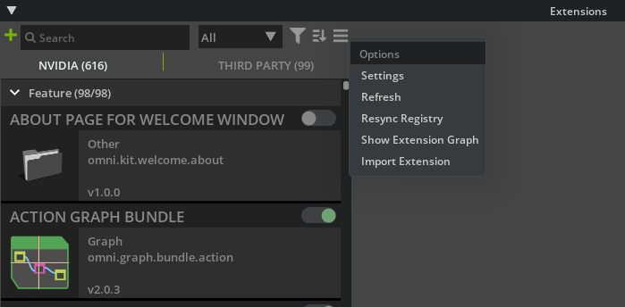
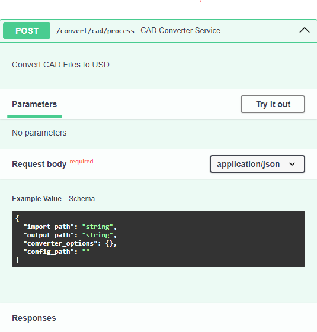

# Usage

This document provides detailed instructions for setting up, using, and deploying the CAD Converter Service Extension.

## Table of Contents

- [1.0 How to set your extension up as a Kit Service](#10-how-to-set-your-extension-up-as-a-kit-service)
- [2.0 How to use a Service](#20-how-to-use-a-service)
- [3.0 How to run batch jobs locally via CLI](#30-how-to-run-batch-jobs-locally-via-cli)

## 1.0 How to set your extension up as a Kit Service

This section goes over how to build and register a converter extension with the CAD Converter Service Extension in the Omniversion Application USD Composer for testing.

An example of setting up an extension as a Kit Service can be found at https://docs.omniverse.nvidia.com/services/latest/services/services_convert.html.

This section assumes you have already developed a converter backend with Python bindings and module with the naming convention of omni.connect.{file format} (e.g., `"omni.connect.foo"`) available for interfacing with your converter extension as well as a helper class for accessing this interface. Registering with the Service extension also requires a method to be called for creating conversion tasks for your extension. This section also assumes you have this method (e.g., `create_converter_task`) to call your converter backend to begin conversion.

This section is divided into what extensions to add as dependencies to gain access to important Python modules and necessary modifications to your extension including inheritance and imported methods with their required parameters.

### 1.1 Adding the Common Converter and CAD Service extensions as a dependency

This sub-section adds the service extension as a dependency to your extension. This allows your kit extension to look for and load the service extension's python module and import important classes and variables. This is done by adding a dependency to an extension's extension.toml file. All kit extensions need this file to define its name, dependencies, version number, author names, etc.

1. Navigate to your extension.toml - you can place your extension file here: {repository_root}/source/extensions/{extension name}/config/extension.toml

2. Modify your dependencies section to add the Common Converter and CAD Service extensions

```text
[dependencies]
"omni.kit.converter.common" = { version = "500.0.0"}
"omni.services.convert.cad" = { version = "500.0.0", optional = true }
```

### 1.2 Setting up your extension to register and un-register with the service extension

Now that you added the Converter Common extension in your extension.toml file, you will have to import the module `omni.kit.converter.common`. You do not need to import the entire module, only the class `ICadCoreExtBase`. The former is a base class (from omni.kit.converter.common/python/cad_core_ext_base.py) that we can inherit from that handles registering and un-registering extensions with the CAD Service extension. It adds variables such as `"FILTER_DATA"` and `"OPTIONS_CLS"` necessary for the CAD Service extension to determine whether a converter extension can process the incoming conversion task.

1. To inherit from the class, add the class name to your class like below:

    ```python
    class FOOConverter(ICadCoreExtBase):
    ```

2. Within this class, you need to add your filters (`"FILTER_DATA"`), options (`"OPTIONS_CLS"`), and the service title (`"SERVICE_TITLE"`). The first two will be discussed later in subsections 1.3 and 1.4.

    ```python
    FILTER_DATA = FOO_CORE_FILTER_DATA
    OPTIONS_CLS = FOOOptions
    SERVICE_TITLE = "FOO Converter"
    ```

3. The methods `on_startup` and `on_shutdown` are required and must be defined. You can create global instances and call the base class's `_on_startup` and `_on_shutdown`.

    ```python
    def on_startup(self, ext_id):
        """
        Initialize the FOO Converter and/or registers the service
        """
        global _global_instance
        _global_instance = weakref.ref(self)
        super()._on_startup(ext_id)

    def on_shutdown(self):
        """
        Uninitialize the FOO Converter and/or un-registers the service
        """
        global _global_instance
        _global_instance = None
        super()._on_shutdown()
    ```

### 1.3 Add filters for file format conversion

CAD converter extension filters list what formats (`"FOO_CONVERTER_SUPPORTED_FORMATS"`) are supported by a converter. The filter data (`"FOO_CORE_FILTER_DATA"`) contains the name of the converter extension denoted by "CAD Converter - {name of converter}", the filter regular expressions, and the filter descriptions.

1. Create a file under your extension: `{repository_root}/source/extensions/omni.kit.converter.my_core/python/impl/filters.py`

    ```python
    from omni.kit.converter.common import ConverterFilterData

    # list of supported file formats by omni.kit.convert.my_core
    FOO_CONVERTER_SUPPORTED_FORMATS = ["(.*\\.FOO$)"]

    FOO_CORE_FILTER_DATA = [
        ConverterFilterData("CAD Converter - FOO", ["(.*\\.FOO$)"], ["FOO Files (*.FOO)"]),
    ]
    ```

### 1.4 Add options

The options class adds configurations to be updated based on JSON configuration file. You will need the Python module `dataclasses`. This modeule contains dataclass which is a decorator for creating user-defined classes, in this case a Python class (e.g., `FOOOptions`) based on your specifications class from your Python bindings (e.g., `omni.connect.foo.Spec`).

You can also import `typing` for `Dict` class. This is optional. The DGN and HOOPS converter extensions possess the parseArgs method from their respective backend's specification class (called by `super().parseArgs(args)`). Both extensions convert JSON formatted strings into Python dictionaries containing the options as strings. The documentation assumes your extension handles parsing of arguments for options.

1. Create a file under your extension : {repository_root}/source/extensions/omni.kit.converter.my_core/python/impl/options.py

    ```python
    from dataclasses import dataclass
    from typing import Dict

    import omni.connect.foo # this name is based on the Python module of your converter

    __all__ = ["FOOOptions"]


    @dataclass
    class FOOOptions(omni.connect.foo.Spec):
        def __init__(self):
            omni.connect.foo.Spec.__init__(self)

        # optional - this depends
        def parse(self, args: dict[str, str]):
            super().parseArgs(args)
    ```

### 1.5 Updating your Helper Class

This subsection goes over using the Converter Common extension as previously mentioned in the section. This subsection assumes you already possess a helper class for calling the Python bindings interface to your converter backend.

Reference omni.kit.converter.*_core extensions' helper classes (omni.kit.converter.FOO_core/python/impl/helper.py) for examples of helper class implementation.

Import the following classes and methods from the Converter Common extension:
- ConverterStatus - a tuple containing the error code (0 if successful) and the error message
- OmniClientWrapper - used to check whether a folder exists
- OmniUrl - creates a URL valid for Nucleus
- ProgressLogConsumer - optional; used for parsing the converter logs for progress in CAD Converter GUI extension; see omni.kit.converter.common/python/progress_log_consumer.py
- run_scene_opt - runs the scene optimizer extension as a post-process to run the user's config file, JSON object, to generate UVs for meshes, remove hidden prims, or edit the stage metrics of the up-axis and/or the meters per unit.

```python
from omni.kit.converter.common import ConverterStatus, OmniClientWrapper, OmniUrl, ProgressLogConsumer, run_scene_opt
```

To review how the Service extension sends requests for conversion tasks, your extension registers itself with the Service extension in subsection 1.2 and provides it with a conversion task function, e.g., `create_converter_task`. This method should call a function from your helper class to use the interface to convert a CAD file. Let's call this `_create_import_task`.

In your `_create_import_task` method, use `ConverterStatus` to return the error code and error message to the Service extension. The content of the string is dependent on the error code value. Note that the example code below is from `omni.kit.converter.jt_core` which returns an integer to denote a success or the error type. The extensions `omni.kit.converter.dgn_core` and `omni.kit.converter.hoops_core` return success flags with status strings.

Here are examples of using `ConverterStatus`:

```python
# example if the input path is invalid
if not input_file_url.exists:
  return "", ConverterStatus(-1, "Input file does not exist!")

res, local_file_url = await input_file_url.get_local_file_async()

# confirm local file exists; else return
if res != omni.client.Result.OK:
    omni.log.error(f"Could not get local file: {local_file_url}. Reason: {res}")
    return "", ConverterStatus(error_code=error_code, error_msg=error_msg)
```

```python
result = await self._convert_obj_async(str(local_file_url), output_destination_url, file_format_args)

message = ""
if result[0] != 0:
    message = result[1]
    omni.log.warn(message)
else:
    omni.log.info(message)

return str(output_destination_url), ConverterStatus(result[0], message)
```

In your `_create_import_task` method, use `OmniClientWrapper` to check whether a folder exists and to create a folder in Nucleus.

Here is an example of using `OmniClientWrapper`:

```python
output_directory = temp_output_folder or Path(host_dir)
if not await OmniClientWrapper.exists(str(output_directory)):
    await OmniClientWrapper.create_folder(str(output_directory))
```

In your `_create_import_task` method, use OmniUrl to create valid URLs.

```python
async def _create_import_task(self, input_path: str, output_path: str, file_format_args: dict[str, str]):
    ...
    input_file_url = OmniUrl(input_path)
    export_url = OmniUrl(output_path)
```

The class `ProgressLogConsumer` parses output from the converter backends. It reads standard output, and the CAD Converters provided updates using "`*step*`", "`*prog*`", and "`*Begin*`". "`*step*`" denotes a new stage of the conversion whether it is, for example, the "Reading CAD" stage or "Exporting to USD" stage. "`*prog*`" provides updates on the conversion of the file. DGN, HOOPS, and JT provide this information to update the progress bar for the GUI extension. "`*Begin*`" denotes the beginning of a new step in the converter. To use `ProgressLogConsumer`, you can call its extract_line function like below to parse current progress updates:

```python
# Replace '[log_prefix]' with the desired log prefix for each converter.
# - '[omni.converter.jtk_progress]' for JT converter / JT file conversion
# - '[omni.converter.dgn_progress]' for DGN converter / DGN file conversion
# - '[omni.converter.hoops_progress]' for JT converter / Hoops supported file conversion
log_consumer = ProgressLogConsumer("[log_prefix]")
log_consumer.extract_line(stdout_line)
```

In your `_create_import_task` method, use `run_scene_opt` to run the user's Scene Optimizer config file or JSON object or to generate UVs for meshes in USD, remove hidden prims, or edit the stage metrics of the up-axis and/or the meters per unit.

```python
# Run Scene Optimizer
run_scene_opt(output_path, options.bOptimize, options.bConvertHidden, options.sOptimizeConfig, options.dMetersPerUnit, options.iUpAxis)
```

### 1.6 Building the extension
1. Navigate to your repository's root folder via terminal and run the following command.

```text
./repo.bat build -xrd
```

2. This will generate builds of your extension for both release and debug configurations located at `{repository_root}/_build/{platform}/{config}/exts`.


## 2.0 How to use a Service

This section covers how to use your extension in an Omniverse Application and running requests through OpenAPI. The section is divided into how to enable your service extension, test requests against your extension in OpenAPI, and testing ypur extension in a CAD Container (if applicable).

### 2.1 Enabling your Kit Service on USD Composer

Follow these instructions to set up the Service extension and other converter extensions in Composer:

1. Ensure you have built the CAD Converter extensions.

2. Open Composer using Kit 106 (e.g., version 2024.1.0).

3. Open the Extensions Manager window.

4. Click the three-horizontal bar icon to access Settings (refer to the screenshot below):

   

5. Add the path to the built Service extension's containing folder and the folders of other converters (e.g., `{repository_root}/_build/{platform}/{config}/exts`).

6. Enable the Service extension first, and then enable the converters.


### 2.2 Testing your Kit Service through OpenAPI

1. Once the Service extension is enabled, navigate to the local host link in a web browser. The link should scroll you down to the CAD section.

```text
http://localhost:8111/docs#/cad/asset_convert_convert_cad_process_post
```

2. Select "Try it out" and apply the following settings:

    - `import_path`: Path to the file to be converted.
    - `output_path`: Path to the usd output file.
    - `converter_options`: Dictionary representing the converter options to use.
    - `config_path`: Path to the JSON config file (optional and soon to be deprecated).

```text
{
 "import_path": "C:/Github/cad-converter-service-ext/test_data/1-box-1.SLDPRT",
 "output_path": "C:/Github/cad-converter-service-ext/test_data/1-box-1.usd",
 "converter_options": { "bInstancing": true },
 "config_path": "C:/Github/hoops-exchange-cad-converter/data/Omni_CADConverterConfig_Annotated_Simplified.json",
}
```

3. Once you have updated the settings, select "Post".
   

### 2.3 Running the CAD Converter service extension on a CAD Container

This section assumes the user has access to Omniverse NVIDIA GPU Cloud (NGC) Catalog (https://catalog.ngc.nvidia.com/) and an team's pool of CAD Container images. To view a team's pool of images, the user needs to login at https://ngc.nvidia.com/signin and select their team.

This section also assumes that you already have docker installed.
Docker install link: https://docs.docker.com/engine/install/ubuntu/

For NGC need to run docker login nvcr.io
With username = `$oauthtoken`
And API Key coming from one generated here: https://ngc.nvidia.com/setup/api-key

Run the container with the following:
`docker run -it -v {path_to_host_directory_containing_files}:{path_on_container_to_access_files} --env "ACCEPT_EULA=Y" -p {port}:{port} {link_to_image} /startup.sh`

Example {link_to_image}:
`nvcr.io/{my_ngc_team}/omniverse-cad-converter:0.1.8-kit.105.0-alpha.1`

Once you the container is up go to and you should see the OpenAPI docs: http://localhost:8011/docs. The last lines to show up when the container is ready are:

**_NOTE:_** The port number (e.g., 8011) may vary depending on the application. Refer to the [API specification.](https://docs.omniverse.nvidia.com/services/latest/services/services_convert.html#read-the-api-specification)

```text
[Info] [omni.kit.app.plugin] app ready
app ready
[Info] [omni.kit.app._impl] python GC: gc.enable()
```

The Open API docs page should look like the below image:
   

Scroll down to the GET request and click on it. You will a button "Try it out". Click on it to see another blue button "Execute". Click on "Execute" to see an HTML response with code 200 under "Responses" to see the CAD Converters loaded with the container. They should show as "CAD Converter;DGN Converter;JT Converter".

**_NOTE:_** If the container has been closed (e.g., docker process was killed), then the user will see a response code of "undocumented" and a response body of "Failed to fetch.".

Scroll down to the POST request and click on it. You will see a JSON request body:

```json
{
  "import_path": "string",
  "output_path": "string",
  "converter_options": "dict"
  "config_path": "string"
}
```

- `import_path`: absolute path to CAD file
- `output_path`: absolute path to output file
- `converter_options`: dictionary representing the converter options to use
- `config_path`: Path to the JSON config file (optional and soon to be deprecated)

## 3.0 How to run batch jobs locally via CLI

It is also possible to run the CAD Converter Services extension via CLI/terminal.

**Pre-Requisites:**

1. A local installation of a Kit Application (USD Composer, Isaac Sim, Kit App Template, etc.).

2. Installation of the following CC Extensions. This can be completed via the [Extension Manager](https://docs.omniverse.nvidia.com/extensions/latest/ext_core/ext_extension-manager.html) in the Kit Application:

    - omni.kit.converter.common
    - omni.kit.converter.dgn_core
    - omni.kit.converter.hoops_core
    - omni.kit.converter.jt_core
    - omni.services.convert.cad

**Steps to Run:**

1. Navigate to the directory containing the Kit executable. This is usually within your choice of Kit application's install folder (e.g., Isaac Sim, USD Composer, Kit-App-Templates).
    - If you've pulled the [Kit-App-Template](https://github.com/NVIDIA-Omniverse/kit-app-template) repository, you will need to add `"omni.services.convert.cad" = {}` to the .kit file's `[dependencides]` section for your desired application template because the omni.services.convert.cad extension isn't included by default. For example, if you wish to create an USD Composer application template, you would add `"omni.services.convert.cad" = {}` to source/templates/usd_composer/omni.usd_composer.kit's [dependencies] section before creating and building the template application.
    - After building Kit-App-Template, your Kit file may be located within this directory:
        - Windows: `%USERPROFILE%\Documents\kit-app-template\_build\windows-x86_64\release\kit`
        - Linux: `/home/${USERNAME}/Documents/kit-app-template/_build/linux-x86_64/release/kit`

2. There are four inputs needed to pass as arguments to Kit.exe

    - Script Path: this script parses the CLI arguments to run CC
    - Input Path: the absolute input file path for the CAD file to convert
    - Output Path: the absolute output file path to save the USD file (including file extension)
    - Config Path: the absolute path for optional conversion options (leave empty for default values)

3. Template to run via CLI:

    ```text
    <path_to_Kit_exe> \
    --allow-root \
    --enable omni.kit.converter.<insert_cc_core_extension_name> \
    --exec \
    --/app/fastShutdown=1 \
    '<path_to_cc_services_extension>/omni/services/convert/cad/services/process/<dgn/hoops/jt>_main.py \
        --input-path "<path_to_cad_file>" \
        --output-path "<output_file_path>.<usd/usda/usdc>" \
        --config-path "<config_file_path>"' \
    --info
    ```

    - `<path_to_Kit_exe>`: Replace this with your path to the Kit.exe. For Linux, omit the `.exe`
    - `--allow-root`: allows root access in Linux
    - `--enable omni.kit.converter.<insert_cc_core_extension_name>`: replace this with the extension needed to perform conversion of the input CAD file

        - Use `omni.kit.converter.dgn_core` to convert DGN files
        - Use `omni.kit.converter.hoops_core` to convert [HOOPS Supported Files](https://docs.omniverse.nvidia.com/kit/docs/omni.kit.converter.hoops/latest/Overview.html#supported-cad-file-formats)
        - Use `omni.kit.converter.jt_core` use to convert JT files
    - `--exec`: command-line option
    - `--/app/fastShutdown=1`: enables faster shutdown process
    - **`<path_to_cc_services_extension>`**`/omni/services/convert/cad/services/process/`**`<dgn/hoops/jt>`**`_main.py`
        - Your local extension cache could be located within these directories:
            - Windows: `%USERPROFILE%\Documents\kit-app-template\_build\windows-x86_64\release\extscache`
            - Linux: `/home/${USERNAME}/Documents/kit-app-template/_build/linux-x86_64/release/extscache`
        - Use this extension path to update `<path_to_cc_services_extension>`
        - To complete the path, specify which script to call `dgn_main.py`, `hoops_main.py`, or `jt_main.py`
    - `--info`: captures logging information

4. A Complete Example (Windows):

    ```text
    ./kit.exe \
    --allow-root \
    --enable omni.kit.converter.dgn_core \
    --exec \
    --/app/fastShutdown=1 \
    'C:/Projects/KAT-latest/_build/windows-x86_64/release/extscache/omni.services.convert.cad-503.1.1+106.3.0/omni/services/convert/cad/services/process/dgn_main.py \
    --input-path "C:/Projects/cad-converter-service-ext/test_data/WelchResidence_2022-3DView-{3D}.dgn" \
    --output-path "C:/Projects/cad-converter-service-ext/test_data/WelchResidence_2022-3DView-{3D}.usd" \
    --config-path "C:/Projects/cad-converter-service-ext/test_data/test.json"' \
    --info
    ```