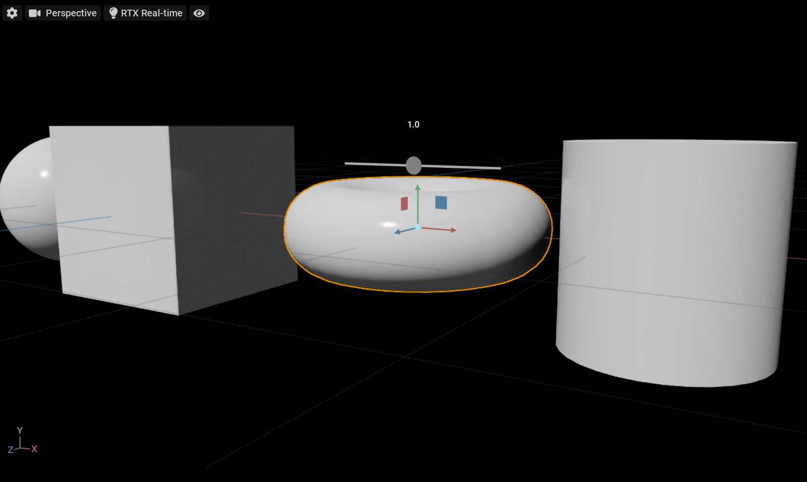

# Example

We provide the End-to-End example that draws a 3D slider in the viewport overlay
on the top of the bounding box of the selected imageable. The slider controls
the scale of the prim. It has a custom manipulator, model, and gesture. When the
slider's value is changed, the manipulator processes the custom gesture that
changes the data in the model, which changes the data directly in the USD stage.

The viewport overlay is synchronized with the viewport using `Tf.Notice` that
watches the USD Camera.



The extension name is `omni.ui.scene.example`.

## Manipulator

The manipulator is a very basic implementation of the slider in 3D space. The
main feature of the manipulator is that it redraws and recreates all the
children once the model is changed. It makes the code straightforward. It takes
the position and the slider value from the model, and when the user changes the
slider position, it processes a custom gesture. It doesn't write to the model
directly to let the user decide what to do with the new data and how the
manipulator should react to the modification. For example, if the user wants to
implement the snapping to the round value, it would be handy to do it in the
custom gesture.

## Model

The model contains the following named items:

 - `value` - the current value of the slider
 - `min` - the minimum value of the slider
 - `max` - the maximum value of the slider
 - `position` - the position of the slider in 3D space

The model demonstrates two main strategies working with the data.

The first strategy is that the model is the bridge between the manipulator and
the data, and it doesn't keep and doesn't duplicate the data. When the
manipulator requests the position from the model, the model computes the
position using USD API and returns it to the manipulator.

The first strategy is that the model can be a container of the data. For
example, the model pre-computes min and max values and passes them to the
manipulator once the selection is changed.

## Sync with USD Camera

To track the camera in the USD Stage, it's possible to use the standard USD way
to track the changes in UsdObjects which is a pert of Tf.Notice system.

`Usd.Notice.ObjectsChanged` sent in response to authored changes that affect
UsdObjects. The kinds of object changes are divided into two categories:
"resync" and "changed-info". We are interested in "changed-info" which means
that a nonstructural change has occurred, like an attribute value change or a
value change.

If the camera is in the changed-info list, we can extract view and projection
matrices and set them to the sc.SceneView object and it will redraw everything
with the new camera position and projection.

```python
##
import omni.usd
##
# Tracking the camera
stage = omni.usd.get_context().get_stage()
self._stage_listener = Tf.Notice.Register(
    Usd.Notice.ObjectsChanged, self._notice_changed, stage)

def _camera_changed(self):
    """Called when the camera is changed"""
    def flatten(transform):
        """Convert array[n][m] to array[n*m]"""
        return [item for sublist in transform for item in sublist]

    # Extract view and projection
    frustum = UsdGeom.Camera(self._camera_prim).GetCamera().frustum
    view = frustum.ComputeViewMatrix()
    projection = frustum.ComputeProjectionMatrix()

    # Convert Gf.Matrix4d to list
    view = flatten(view)
    projection = flatten(projection)

    # Set the scene
    self._scene_view.model.view = view
    self._scene_view.model.projection = projection

def _notice_changed(self, notice, stage):
    """Called by Tf.Notice"""
    for p in notice.GetChangedInfoOnlyPaths():
        if p.GetPrimPath() == self._camera_path:
            self._camera_changed()
```

## Standard Manipulators

The base manipulators for translate, rotate, and scale are provided in a
separate extension `omni.kit.manipulator.transform`. It's the same set of
manipulators that Kit is using. It's possible to enable the extension in the
Extensions explorer or click the button below.

```execute 30
##
import omni.kit.app

manager = omni.kit.app.get_app().get_extension_manager()

def enable(button, ext):
    manager.set_extension_enabled_immediate(ext, True)
    button.text = "Extension is Enabled"

if manager.is_extension_enabled("omni.kit.manipulator.transform"):
    label_enabled = "Extension is Enabled"
else:
    label_enabled = "Click to Enable Extension omni.kit.manipulator.transform"
##

button = ui.Button(label_enabled, height=30)
button.set_clicked_fn(lambda: enable(button, "omni.kit.manipulator.transform"))
```

TransformManipulator is a model-based manipulator. It can be used to scale,
translate or rotate custom items like objects, control points, or helpers in
both 2d and 3d views.

Like all the model-based items, to use it, it's necessary to either reimplement
the model or subscribe to the model's changes.

The reimplemented model should have four mandatory fields. Listening to the
following fields is necessary when subscribing to the model changes.

 - `transform`: is used to set the position of the manipulator
 - `translate`: the manipulator sets this value when it's being dragged
 - `rotate`: the manipulator sets this value when it's being rotated
 - `scale`: the manipulator sets this value when it's being scaled

It's the same set of manipulators that Kit is using. The advantage of using it
is that it's always up to date, and the look is consistent with the Viewport
manipulator.

In this simple example, it's possible to select and move points with the mouse.

```execute 200
##
import omni.kit.app
from omni.ui import scene as sc

self.frame = ui.Frame(height=200)

self.manager = omni.kit.app.get_app().get_extension_manager()
self.hook = self.manager.subscribe_to_extension_enable(
    lambda _: self.frame.rebuild(),
    lambda _: self.frame.rebuild(),
    ext_name="omni.kit.manipulator.transform",
    hook_name="omni.ui.scene.docs listener",
)


def build():
    if not self.manager.is_extension_enabled("omni.kit.manipulator.transform"):
        ui.Spacer()
        return

    from omni.kit.manipulator.transform.manipulator import TransformManipulator
    from omni.kit.manipulator.transform.manipulator import Axis
    from omni.kit.manipulator.transform.simple_transform_model import SimpleRotateChangedGesture
    from omni.kit.manipulator.transform.simple_transform_model import SimpleScaleChangedGesture
    from omni.kit.manipulator.transform.simple_transform_model import SimpleTranslateChangedGesture
    from omni.kit.manipulator.transform.types import Operation
##
    # Camera matrices
    projection = [1e-2, 0, 0, 0]
    projection += [0, 1e-2, 0, 0]
    projection += [0, 0, -2e-7, 0]
    projection += [0, 0, 1, 1]
    view = sc.Matrix44.get_translation_matrix(0, 0, -5)

    # Selected point
    self._selected_item = None

    def _on_point_clicked(shape):
        """Called when the user clicks the point"""
        self._selected_item = shape

        pos = self._selected_item.positions[0]
        model = self._manipulator.model
        model.set_floats(model.get_item("translate"), [pos[0], pos[1], pos[2]])

    def _on_item_changed(model, item):
        """
        Called when the user moves the manipulator. We need to move
        the point here.
        """
        if self._selected_item is not None:
            if item.operation == Operation.TRANSLATE:
                self._selected_item.positions = model.get_as_floats(item)

    with sc.SceneView(sc.CameraModel(projection, view)).scene:
        # The manipulator
        self._manipulator = TransformManipulator(
            size=1,
            axes=Axis.ALL & ~Axis.Z & ~Axis.SCREEN,
            gestures=[
                SimpleTranslateChangedGesture(),
                SimpleRotateChangedGesture(),
                SimpleScaleChangedGesture(),
            ],
        )

        self._sub = \
            self._manipulator.model.subscribe_item_changed_fn(_on_item_changed)

        # 5 points
        select = sc.ClickGesture(_on_point_clicked)
        sc.Points([[-5, 5, 0]], colors=[ui.color.white], sizes=[10], gesture=select)
        sc.Points([[5, 5, 0]], colors=[ui.color.white], sizes=[10], gesture=select)
        sc.Points([[5, -5, 0]], colors=[ui.color.white], sizes=[10], gesture=select)
        sc.Points([[-5, -5, 0]], colors=[ui.color.white], sizes=[10], gesture=select)
        self._selected_item = sc.Points(
            [[0, 0, 0]], colors=[ui.color.white], sizes=[10], gesture=select
        )
##

self.frame.set_build_fn(build)
##
```
