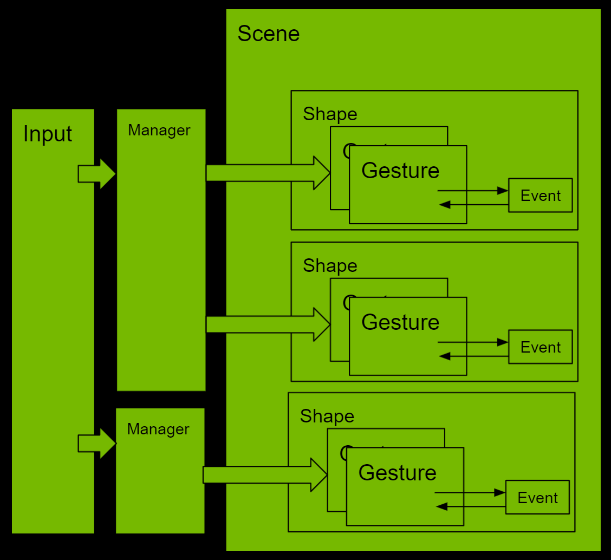

# Gestures



Gestures handle all of the logic needed to process user-input events such as
click and drag and recognize when those events happen on the shape. When
recognizing it, SceneUI runs a callback to update the state of a view or perform
an action.

## Add Gesture Callback

Each gesture applies to a specific shape in the scene hierarchy. To recognize a
gesture event on a particular shape, it's necessary to create and configure the
gesture object. SceneUI provides the full state of the gesture to the callback
using the `gesture_payload` object. The `gesture_payload` object contains the
coordinates of the itersection of mouse pointer and the shape in world and shape
spaces, the distance between last itersection and parametric coordinates.
It's effortless to modify the state of the shape using this data.

```execute 200
##
from omni.ui import scene as sc
from omni.ui import color as cl
from functools import partial

proj = [0.5, 0, 0, 0, 0, 0.5, 0, 0, 0, 0, 2e-7, 0, 0, 0, 1, 1]
view = sc.Matrix44.get_translation_matrix(0, 0, -10)
scene_view = sc.SceneView(
    sc.CameraModel(proj, view),
    aspect_ratio_policy=sc.AspectRatioPolicy.PRESERVE_ASPECT_FIT,
    height=200
)

##

def move(transform: sc.Transform, shape: sc.AbstractShape):
    """Called by the gesture"""
    translate = shape.gesture_payload.moved
    # Move transform to the direction mouse moved
    current = sc.Matrix44.get_translation_matrix(*translate)
    transform.transform *= current

with scene_view.scene:
    transform = sc.Transform()
    with transform:
        sc.Line(
            [-1, 0, 0],
            [1, 0, 0],
            color=cl.blue,
            thickness=5,
            gesture=sc.DragGesture(
                on_changed_fn=partial(move, transform)
            )
        )
```

## Reimplementing Gesture

Some gestures can receive the update in a different state. For example,
DragGesture offers the update when the user presses the mouse, moves the mouse,
and releases the mouse: `on_began`, `on_changed`, `on_ended`. It's also possible
to extend the gesture by reimplementing its class.

```execute 200
##
from omni.ui import scene as sc
from omni.ui import color as cl
from functools import partial

proj = [0.3, 0, 0, 0, 0, 0.3, 0, 0, 0, 0, 2e-7, 0, 0, 0, 1, 1]
view = sc.Matrix44.get_translation_matrix(0, 0, -10)
scene_view = sc.SceneView(
    sc.CameraModel(proj, view),
    aspect_ratio_policy=sc.AspectRatioPolicy.PRESERVE_ASPECT_FIT,
    height=200
)

##

class Move(sc.DragGesture):
    def __init__(self, transform: sc.Transform):
        super().__init__()
        self.__transform = transform

    def on_began(self):
        self.sender.color = cl.red

    def on_changed(self):
        translate = self.sender.gesture_payload.moved
        # Move transform to the direction mouse moved
        current = sc.Matrix44.get_translation_matrix(*translate)
        self.__transform.transform *= current

    def on_ended(self):
        self.sender.color = cl.blue

with scene_view.scene:
    transform = sc.Transform()
    with transform:
        sc.Rectangle(color=cl.blue, gesture=Move(transform))
```

## Gesture Manager

Gestures track incoming input events separately, but it's normally necessary to
let only one gesture be executed because it prevents user input from triggering
more than one action at a time. For example, if multiple shapes are under the
mouse pointer, normally, the only gesture of the closest shape should be
processed. However, this default behavior can introduce unintended side effects.
To solve those problems, it's necessary to use the gesture manager. 

GestureManager controls the priority of gestures if they are processed at the
same time. It prioritizes the desired gestures and prevents unintended gestures
from being executed.

In the following example, the gesture of the red rectangle always wins even if
both rectangles overlap.

```execute 200
##
from omni.ui import scene as sc
from omni.ui import color as cl
from functools import partial

proj = [0.5, 0, 0, 0, 0, 0.5, 0, 0, 0, 0, 2e-7, 0, 0, 0, 1, 1]
view = sc.Matrix44.get_translation_matrix(0, 0, -10)
scene_view = sc.SceneView(
    sc.CameraModel(proj, view),
    aspect_ratio_policy=sc.AspectRatioPolicy.PRESERVE_ASPECT_FIT,
    height=200
)

##

class Manager(sc.GestureManager):
    def __init__(self):
        super().__init__()

    def should_prevent(self, gesture, preventer):
        # prime gesture always wins
        if preventer.name == "prime":
            return True

def move(transform: sc.Transform, shape: sc.AbstractShape):
    """Called by the gesture"""
    translate = shape.gesture_payload.moved
    current = sc.Matrix44.get_translation_matrix(*translate)
    transform.transform *= current

mgr = Manager()

with scene_view.scene:
    transform1 = sc.Transform()
    with transform1:
        sc.Rectangle(
            color=cl.red,
            gesture=sc.DragGesture(
                name="prime",
                manager=mgr,
                on_changed_fn=partial(move, transform1)
            )
        )
    transform2 = sc.Transform(
        transform=sc.Matrix44.get_translation_matrix(2, 0, 0)
    )
    with transform2:
        sc.Rectangle(
            color=cl.blue,
            gesture=sc.DragGesture(
                manager=mgr,
                on_changed_fn=partial(move, transform2)
            )
        )
```