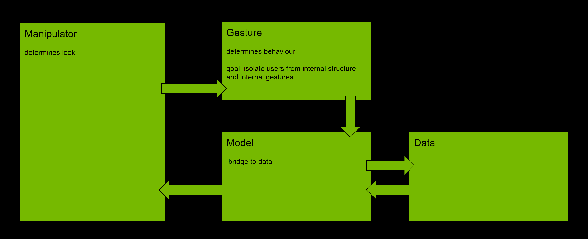

# Manipulator



Manipulator provides a model-based template that is flexible for implementing
navigation and editing objects, points, and properties. It's a container that
can be reimplemented. It can have a model.

## Immediate mode

It's possible to regenerate the content of the Manipulator item by calling
the `invalidate` method. Once it's called, Manipulator will flush the old
children and execute `build_fn` to create new ones. Suppose the `invalidate`
method is called inside `build_fn`. In that case, Manipulator will
call `build_fn` every frame, which provides, on the one hand, a maximum of
control and flexibility to the scene configuration. Still, on the other hand,
it also generates a continuous workload on the CPU.

```execute 200
##
from omni.ui import scene as sc
from omni.ui import color as cl
##

class RotatingCube(sc.Manipulator):
    def __init__(self, **kwargs):
        super().__init__(**kwargs)
        self._angle = 0

    def on_build(self):
        transform = sc.Matrix44.get_rotation_matrix(
            0, self._angle, 0, True)

        with sc.Transform(transform=transform):
            sc.Line([-1, -1, -1], [1, -1, -1])
            sc.Line([-1, 1, -1], [1, 1, -1])
            sc.Line([-1, -1, 1], [1, -1, 1])
            sc.Line([-1, 1, 1], [1, 1, 1])

            sc.Line([-1, -1, -1], [-1, 1, -1])
            sc.Line([1, -1, -1], [1, 1, -1])
            sc.Line([-1, -1, 1], [-1, 1, 1])
            sc.Line([1, -1, 1], [1, 1, 1])

            sc.Line([-1, -1, -1], [-1, -1, 1])
            sc.Line([-1, 1, -1], [-1, 1, 1])
            sc.Line([1, -1, -1], [1, -1, 1])
            sc.Line([1, 1, -1], [1, 1, 1])

        # Increase the angle
        self._angle += 1

        # Redraw all
        self.invalidate()

# Projection matrix
proj = [1.7, 0, 0, 0, 0, 3, 0, 0, 0, 0, -1, -1, 0, 0, -2, 0]

# Move camera
rotation = sc.Matrix44.get_rotation_matrix(30, 50, 0, True)
transl = sc.Matrix44.get_translation_matrix(0, 0, -6)
view = transl * rotation

scene_view = sc.SceneView(
    sc.CameraModel(proj, view),
    aspect_ratio_policy=sc.AspectRatioPolicy.PRESERVE_ASPECT_FIT,
    height=200
)

with scene_view.scene:
    RotatingCube()
```

## Model

The model is the central component of Manipulator. It is the dynamic data
structure, independent of the user interface. It can contain nested data, but
it's supposed to be the bridge between the user data and the Manipulator object.
It follows the closely model-view pattern.

When the model is changed, it calls `on_model_updated` of Manipulator. Thus,
Manipulator can modify the children or rebuild everything completely depending
on the change.

It's abstract, and it is not supposed to be instantiated directly. Instead, the
user should subclass it to create the new model.

```execute 200
##
from omni.ui import scene as sc
from omni.ui import color as cl
##

class MovingRectangle(sc.Manipulator):
    """Manipulator that redraws when the model is changed"""

    def __init__(self, **kwargs):
        super().__init__(**kwargs)
        self._gesture = sc.DragGesture(on_changed_fn=self._move)

    def on_build(self):
        position = self.model.get_as_floats(self.model.get_item("position"))
        transform = sc.Matrix44.get_translation_matrix(*position)
        with sc.Transform(transform=transform):
            sc.Rectangle(color=cl.blue, gesture=self._gesture)

    def on_model_updated(self, item):
        self.invalidate()

    def _move(self, shape: sc.AbstractShape):
        position = shape.gesture_payload.ray_closest_point
        item = self.model.get_item("position")
        self.model.set_floats(item, position)


class Model(sc.AbstractManipulatorModel):
    """User part. Simple value holder."""

    class PositionItem(sc.AbstractManipulatorItem):
        def __init__(self):
            super().__init__()
            self.value = [0, 0, 0]

    def __init__(self):
        super().__init__()
        self.position = Model.PositionItem()

    def get_item(self, identifier):
        return self.position

    def get_as_floats(self, item):
        return item.value

    def set_floats(self, item, value):
        item.value = value
        self._item_changed(item)


# Projection matrix
proj = [1.7, 0, 0, 0, 0, 3, 0, 0, 0, 0, -1, -1, 0, 0, -2, 0]
# Move/rotate camera
rotation = sc.Matrix44.get_rotation_matrix(30, 30, 0, True)
transl = sc.Matrix44.get_translation_matrix(0, 0, -6)

scene_view = sc.SceneView(
    sc.CameraModel(proj, transl * rotation),
    aspect_ratio_policy=sc.AspectRatioPolicy.PRESERVE_ASPECT_FIT,
    height=200
)

with scene_view.scene:
    MovingRectangle(model=Model())
```
