.. _ui_joints:

######################
Joint Visual Authoring
######################

Part of the :ref:`Omni USD Physics UI` extension, the joint visual authoring overlay enables you to view and manipulate the properties of :ref:`joints<joints>` directly in the viewport. It is toggled by the **Joints** setting in the **Physics** section of the Show/Hide (Eye) viewport menu:

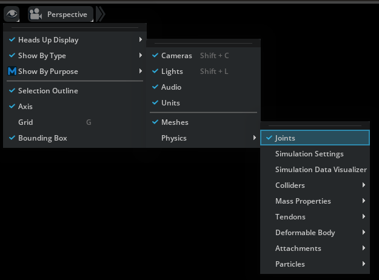

Viewport Icons
==============

When enabled, :ref:`joint type<jointTypes>` specific icons will appear at the base position of the joints in the viewport.

.. note:: In the context of joint visualization, the *base position* signifies the offset applied to the first attachment/Body 0.

+---------------------------------------------------------------------------------------------+----------------------------------------------------------+
| Icon                                                                                        | Type                                                     |
+=============================================================================================+==========================================================+
| .. image:: ../../../../../../data/icons/omni.usdphysics.ui/physicsJoint/D6Joint.png         | :ref:`ui_joint_d6`                                       |
|    :height: 48px                                                                            |                                                          |
|    :width: 48px                                                                             |                                                          |
+---------------------------------------------------------------------------------------------+----------------------------------------------------------+
| .. image:: ../../../../../../data/icons/omni.usdphysics.ui/physicsJoint/DistanceJoint.png   | :ref:`ui_joint_distance`                                 |
|    :height: 40px                                                                            |                                                          |
|    :width: 40px                                                                             |                                                          |
+---------------------------------------------------------------------------------------------+----------------------------------------------------------+
| .. image:: ../../../../../../data/icons/omni.usdphysics.ui/physicsJoint/FixedJoint.png      | :ref:`ui_joint_fixed`                                    |
|    :height: 40px                                                                            |                                                          |
|    :width: 40px                                                                             |                                                          |
+---------------------------------------------------------------------------------------------+----------------------------------------------------------+
| .. image:: ../../../../../../data/icons/omni.physx.ui/physicsJoint/GearJoint.png            | :ref:`ui_joint_gear` *                                   |
|    :height: 40px                                                                            |                                                          |
|    :width: 40px                                                                             |                                                          |
+---------------------------------------------------------------------------------------------+----------------------------------------------------------+
| .. image:: ../../../../../../data/icons/omni.usdphysics.ui/physicsJoint/PrismaticJoint.png  | :ref:`ui_joint_prismatic`                                |
|    :height: 40px                                                                            |                                                          |
|    :width: 40px                                                                             |                                                          |
+---------------------------------------------------------------------------------------------+----------------------------------------------------------+
| .. image:: ../../../../../../data/icons/omni.physx.ui/physicsJoint/RackAndPinionJoint.png   | :ref:`ui_joint_rack_and_pinion` *                        |
|    :height: 40px                                                                            |                                                          |
|    :width: 40px                                                                             |                                                          |
+---------------------------------------------------------------------------------------------+----------------------------------------------------------+
| .. image:: ../../../../../../data/icons/omni.usdphysics.ui/physicsJoint/RevoluteJoint.png   | :ref:`ui_joint_revolute`                                 |
|    :height: 40px                                                                            |                                                          |
|    :width: 40px                                                                             |                                                          |
+---------------------------------------------------------------------------------------------+----------------------------------------------------------+
| .. image:: ../../../../../../data/icons/omni.usdphysics.ui/physicsJoint/SphericalJoint.png  | :ref:`ui_joint_spherical`                                |
|    :height: 40px                                                                            |                                                          |
|    :width: 40px                                                                             |                                                          |
+---------------------------------------------------------------------------------------------+----------------------------------------------------------+

`*` *requires the* :ref:`Omni PhysX UI` *extension*

Once you have selected a joint, the visualization and manipulation UI for the specific joint will appear. This UI varies based on the specific joint type, which will be explained in detail below. However, there are also some common features:

Floating Infobox
================

A floating infobox will appear next to the selected joint, providing convenient access to information about the joint. This infobox also allows you to *swap* the attachments, so that Body 0 becomes Body 1 and vice versa:

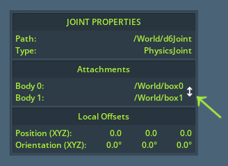

Swapping the attachments can (among other things) be useful since most of the visualizations use Body 0 as the reference point when displaying movement constraints. When swapping, limits are also flipped accordingly, so that the actual behavior of the joint remains unchanged.

The Local Offsets displays the orientation and translation offset between the attachment points in the Body 0 coordinates frame of reference. This also correspondents to how limits are defined, so you can use it to observe how close or far the current attachment point offset is relative to the defined limits.

Manipulation Gizmo
==================

Whenever the joint visual authoring overlay is enabled, the standard manipulation gizmos for **move** and **rotate** will appear for the respective modes when joints are selected too. Use these to change the attachment offset of the bodies.

Attachments
===========

The attached bodies of the selected joint will be enclosed by green bounding boxes for easy identification:

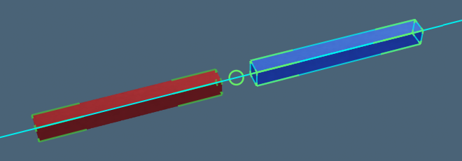

Whenever you are manipulating a limit, the bounds of the attached body when moving to that limit is displayed as a cyan box:

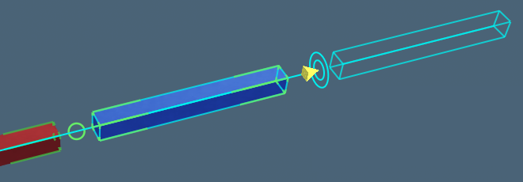

Additionally, a stippled box will appear signifying the bounds of the attached body when at the base position. This is particularly useful during simulation as it helps you identify how far the attached body is dislocated from the base position:

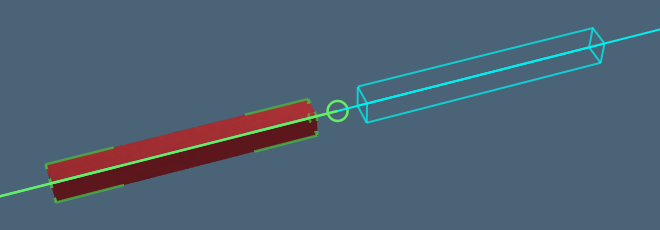

In addition, the attachment points of the selected joint with be displayed by green circles with a line connecting them:

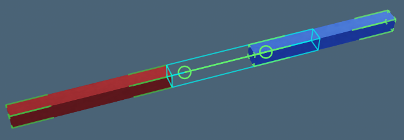

Often the two attachment points will overlap however, in which case the line connector disappears and you only see a single green circle.

If the offset between the two attachment points is invalid (that is, it fails to satisfy the constraints of the specified limits), the circles and line will turn red and arrows will appear that enables you to move either attachment point to a valid offsets relative to the other:

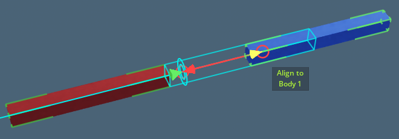

Joint-type Specific visualizations
==================================

.. _ui_joint_fixed:

Fixed Joint
------------

Arguably the simplest type of joint, the visualization for a Fixed Joint will simply tell you whether the attachment points overlap, and if not, allow you to align them:

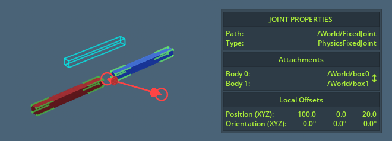

.. _ui_joint_prismatic:

Prismatic Joint
----------------

For prismatic joints, a line will appear showing the axis of movement with double rectangles and manipulation arrow handles at each end signifying the limits:

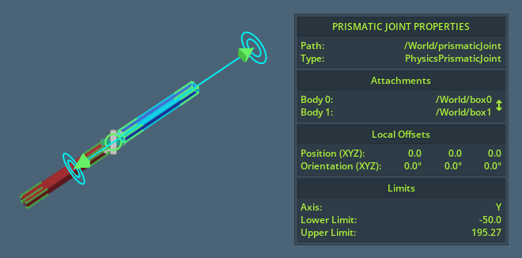

Note that the limits signify the lower and upper permitted offset of attachment point 1 relative to attachment point 0. Hover the manipulation arrow handles to observe the extents of Body 1 when moved to this limit.

.. _ui_joint_revolute:

Revolute Joint
---------------

For the revolute joints, a rotation arc will be displayed extending from the attachment point 0. The arc is automatically oriented and scaled so that it shows the degrees of movement at the furthest side of the bounding box if Body 1, providing you with some indication of the potential reach of attachment:

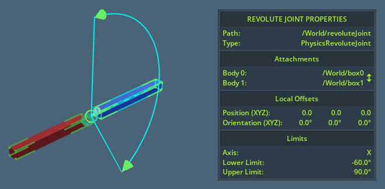

.. _ui_joint_spherical:

Spherical Joint
----------------

Spherical joints resemble the revolute joints except that it has two orthogonal rotation arcs rather than one. In addition, a curved line is drawn between the outer arc limits, which displays the exact freedom of movement at any given angle between the two arcs:

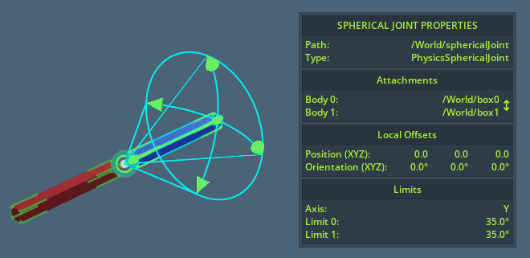

.. _ui_joint_distance:

Distance Joint
---------------

Distance Joints are shown as an inner and outer circle that correspondents to the minimum and maximum allowed offset between the two attachment points:

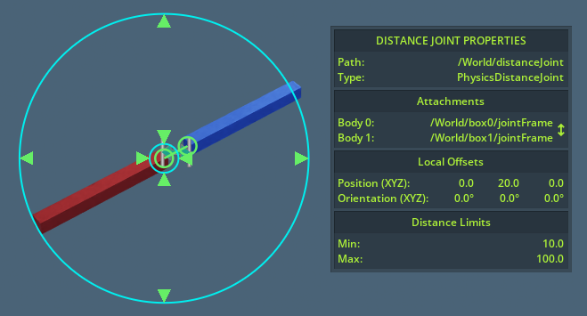

.. _ui_joint_d6:

D6 Joint
---------

D6 Joints display as a combination of multiple Revolute and Prismatic Joints depending on what limits have been applied to them. Additionally, if translation constraints are added to all three axes, a cyan box showing the outer boundaries of movement will appear:

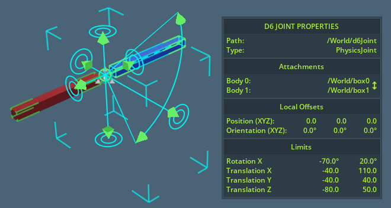

.. _ui_joint_gear:

Gear Joint
-----------

This joint type is made available by enabling the :ref:`Omni PhysX UI` extension.

It functions by connecting two other :ref:`Revolute Joints<ui_joint_revolute>`, specified as Hinge 0 and Hinge 1. When having a Gear Joint selected, you will be able to swap Hinge 0 and Hinge 1 in the infobox window.

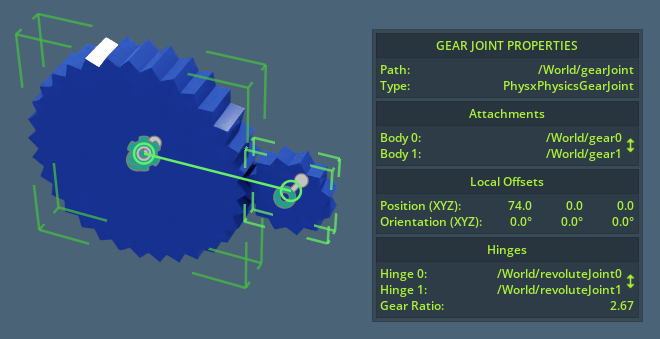

Note that for the best result, Hinge 0 and Hinge 1 should correspond with attachment 0 and 1 respectively.

.. _ui_joint_rack_and_pinion:

Rack And Pinion Joints
----------------------

This joint type is made available by enabling the :ref:`Omni PhysX UI` extension.

Similar to the :ref:`ui_joint_gear`, but instead connecting a :ref:`ui_joint_revolute` and a :ref:`ui_joint_prismatic`.

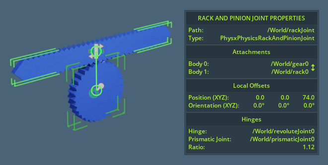

`*` *requires the* :ref:`Omni PhysX UI` *extension*