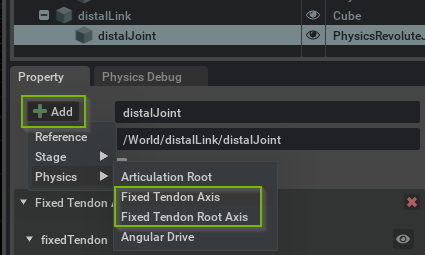
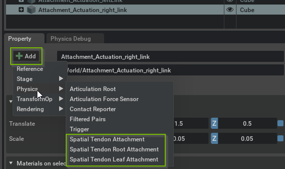

.. _ui_tendons:

#########################
Tendon Visual Authoring
#########################

.. _createFixedTendon:

Creating a Fixed Tendon
-----------------------

When creating a fixed tendon, it is important to be aware of the articulation structure, since the tendon cannot link arbitrary joints in the articulation, but must follow the articulation structure exactly. In particular, all joint axes in the tendon must be connected to each other by exactly one articulation link. More details may be found in section :ref:`articulationTendons`.

This means that just like articulations, fixed tendons have a tree-like structure, and the root axis must be at the root of the tendon, i.e. applied to the articulation joint that is the single common ancestor of all other joints with axes in the tendon. For example in the snippet, the root axis must be on the joint between the red and blue link, as it is the articulation-ancestor of the second joint between the two blue links.

After identifying the root, apply the *Fixed Tendon Root Axis* (i.e. the ``PhysxTendonAxisRootAPI``) using the *Add* button in the property window of the target joint. You are prompted for an instance name that is used to group axes into a single tendon.

Add additional *Fixed Tendon Axis* (i.e. ``PhysxTendonAxisAPI``) to joints, taking the above structure constraints into account. Make sure to set the same instance name for all axes intended to be part of the same tendon. Then, proceed to configure gearings for all axes and common parameters in the root axis.

If the behavior is not as expected, make sure to check the log output for any warnings related to tendons.

.. note::
    - Fixed tendons currently only support Revolute and Prismatic joints. Support for Spherical and other joints will be added in the future.
    - Tendon axes are grouped into tendons by instance name, so make sure to use the same name for all axes belonging to the same tendon.

.. _createSpatialTendon:

Creating a Spatial Tendon
-------------------------

Spatial tendons are created by adding attachments to articulation links in the property window *Add* menu, see above. Since an articulation link may have multiple attachments, you must provide an instance name for each attachment.

The tendon (tree) structure is created by defining parent-child relationships between attachments. An attachment's parent is defined by 1) the *parentLink* relationship that points to the articulation link that has the parent attachment, and 2) the *parentAttachment* token that specifies the instance name of the parent attachment. Note that unlike fixed tendons, spatial tendons are not constrained by the articulation structure.

The second *Spatial Tendon* snippet found in *Physics Demo Scenes* demonstrates a branching spatial tendon.

You may create a spatial tendon as follows:

1. Add a *Spatial Tendon Root Attachment* to an articulation link.
2. Add intermediate *Spatial Tendon Attachment*'s to links (note that it is possible to add multiple attachments belonging to the same tendon to the same articulation link).
3. Add a *Spatial Tendon Leaf Attachment* to terminate a sub-tendon, i.e. branch of the tendon tree.
4. Configure the connectivity of the tendon by defining the attachments' parents (see the Authoring hints below for a graphical approach to this).
5. Configure gearings and the tendon-wide and sub-tendon parameters in the root and leaf, respectively.

Authoring and Debug Visualization
---------------------------------

The debug-visualization spheres can be moved interactively to position them on the articulation link. After an attachment is added to a link, the debug-visualization sphere is auto-selected for immediate positioning.

Connections are auto-created when two attachments that are eligible for connection are selected. If it is not clear on which of the two attachments the parent attributes should be set, e.g. for two regular attachments that do not have any parent attributes set, the selection order determines which attachment has its parents attributes set: The first-selected attachment has the parent attributes set to point to the second-selected attachment.

The parent link and instance name are reflected in the debug-visualization sphere USD prim paths. You can browse to the corresponding attachment API in the property window by either de-selecting the attachment (press Escape) or selecting the parent link after selecting the attachment sphere; the property window will scroll to the corresponding API-type section. Going the other way is possible as well: Just click the Eye button shown with the API in the property window and the corresponding attachment is selected.

All these authoring concepts are further illustrated in this brief tutorial video:

.. raw:: html

    

        

        

        

        

        
        
        

    

Debug Visualization
-------------------

You can enable debug visualization for tendons in the *Show/Hide* (Eye) menu in the viewport, see :ref:`viewport overlays<viewport_overlays>`. Choose *Selected* to visualize tendons related to a selected joint or link, or choose *All* to show all tendons in the stage, which is the recommended setting when editing Spatial Tendons in particular.

Further tendon-type-specific details on the visualization are provided in the respective sections :ref:`createFixedTendon` and :ref:`createSpatialTendon`.

Spatial tendons are visualized with spheres at the attachment points and blue lines between subsequent attachment points in each tendon chain. A color code is employed to distinguish leaf (yellow), root (cyan) and regular attachments (magenta).  For reference, the video of section :ref:`articulationSpatialTendons` was prepared with debug visualization enabled and with a small vertical offset to each attachment to make them visible outside the render geometry of the articulation links.  Note that an attachment obscured by render geometry may be made visible by clicking on the eye icon of the link in the stage tab.