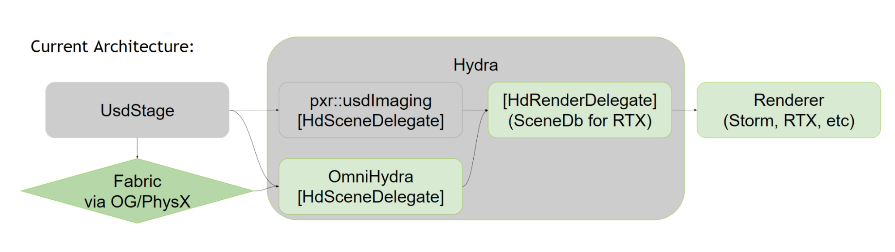
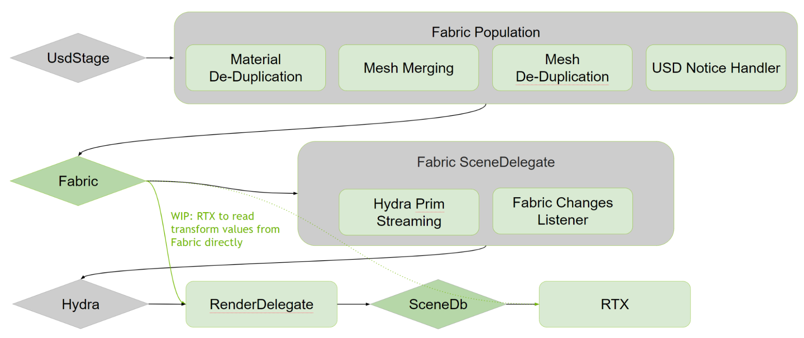

# Introduction to the Fabric Scene Delegate

## The Fabric Scene Delegate goal

The “Fabric Scene Delegate” is meant to replace Pixar’s usdImaging and NVIDIA’s OmniHydra plugins,
as their implementations can be conflicting (an example is that Scene Delegates are meant to read
from multiple different scene data sources, but we have a few cases where both usdImaging and OmniHydra
read from USD) and we have chosen to use Fabric as our main runtime data source, see diagram below:

The main drawback of the previous design is that we relied on USD for most of our runtime, and only supported reading some data from Fabric (mostly used in DriveSim and deformation GPU Interop use cases in Kit 103/104).

Some of the goals of the new Fabric Scene Delegate are:

* Use Fabric as the single source of truth to populate Hydra
* Rely on Fabric’s vectorized data to speed up Hydra population
* Provide an optimized USD→Fabric population plugin (this part is in a separate plugin from the Scene Delegate)
* Provide some UJITSO (Universal Just In Time Scene Optimization) features in the population plugin such as merging of small meshes and deduplication of materials and geometry
* Provide a natural place for HyperScale integration (HyperScale OmniVerse does rely on Fabric, so one potential use case will be able to bypass the USD population on some clients and stream Fabric directly instead, exact plans still being designed)

New architecture:

## Supported features and limitations

Fabric Population and Scene Delegate plugins are still very much in development, and the feature has to be turned on manually in the Rendering Preferences.
The preference resets when the Kit application is restarted. This behavior will change in the future.

In Kit 105, the Fabric Scene Delegate supports the following features:

* Meshes (`UsdGeomMesh`)
* Curves (`UsdGeomCurves`)
* Implicit shapes (`UsdGeomCapsule`, `UsdGeomCone`, `UsdGeomCylinder`, `UsdGeomSphere`, `UsdGeomCube`)
* Point instancing (`UsdGeomPointInstancer`)
* Cameras (`UsdGeomCamera`)
* Lights
* usdSkel animation
* General time sampled data for most USD attributes
* USD Scene Graph Instancing (excluding nested instancing)
* Fast variant switching (keeps Hydra rprims during USD resync events instead of destroying and recreating them)
* Material de-duplication
* Optional geometry streaming for meshes (streamed in order of projected size on screen)
* Optional mesh merging for subcomponents and instance prototypes
* Optional culling of small Hydra meshes (using the solid angle limit preference)

And these features not yet implemented, but are planned for Kit 106:

* Nested Scene Graph instancing
* Point Clouds (`UsdGeomPoints`)
* Implicit shapes do not update in Hydra when their USD attribute such as `radius` or `size` change
* USD Scene Graph Instances in OmniGraph and Physics
* Correct handling of material deletion (there is currently no visible clearing of the material on geometry with the material assigned, will fix with fast bi-directional connection handling in Fabric)
* Many more issues that we don't know about yet

## Integration Challenges

OmniGraph has been built on top of Fabric, and the new Fabric Population scheme has changed some of the OmniGraph's assumptions on the content of Fabric.
As of Kit 105 we have fixed most of the integration issues with OmniGraph, but some corner cases are likely to show up.

Similarly, the Physics plugin was not expecting Fabric to store the content of the whole USD Stage, and many scenarios have not been fully tested yet.

Our goal is to keep testing and continue fixing extensions iteratively.
