*********
Batch API
*********

Fabric is a projection of USD-like interfaces onto more runtime-friendly abstractions. Specifically, Fabric restricts omniverse's in-memory data layouts to maximize compute throughput and enable vectorized compute. However, this restriction forces programming into patterns that are Fabric-specific, and is sometimes at-odds with application development and Fabric integration. From this observation, it becomes clear that a general-purpose library of "best practices" on how to integrate Fabric data and interact with it would be highly beneficial. This library is the Batch API.

.. toctree::
 :maxdepth: 2

Overview
========
Batch API IS...

* a canonical way to interact with Fabric data, but not the only way.
* entirely optional. Use as little or as much as desired to aid with Fabric integration.
* particularly useful for efficient, vectorized, in-place edits of Fabric data.
* a mechanism to provide flexible compute, enabling users to switch from CPU to GPU using unified interfaces.
* a general solution that is optimized for maximum throughput and minimal overhead.

Batch API IS NOT...
* guaranteed to be more efficient than an entirely bespoke solution (but it is intended to reach near-peak performance with much less effort).
* utilizing any special Fabric-only or internal-only mechanisms to accomplish its goals.
* opinionated on execution or scheduling.
* any sort of tasking or threading library.
&nbsp;

Batch API specializes in dealing with Fabric data. Fabric organizes prims and attributes into columnar storage format to optimize for compute efficiency. Fabric data storage may experience (good) fragmentation to group similar prims as cache local as possible. This naturally leads to several engineering tasks being required of any Fabric integration:

* Query to find prims with desired attributes to operate over
* Acquire CPU/GPU-mirrored data to operate over
* Traverse over fragmented, columnar memory layout to access vectorized data segments

Batch API must do all of this as well. The above three engineering tasks map directly onto these mechanisms of the Batch API:

* Codify the attributes we wish to find in a :code:`BatchFilter`
* Codify the access modes we wish to acquire in a :code:`BatchFilter`
* Efficiently traverse vectorized data segments via a unified :code:`View` API, for both CPU and GPU kernels.

Primer For Returning Fabric Developers
--------------------------------------
The following section is a primer intended mainly for returning Fabric developers. If this is your first time using *any* Fabric code, you are welcome to skip this section, you will not miss any necessary information.

Many readers may be familiar with some or all of these concepts:
* Fabric splits its data into tables ("buckets"), where each table has rows ("prims") with identical data *structure* and tagging.
* Iterating over Fabric data typically involves using :code:`StageReaderWriter::findPrims()`.
* Accessing data of multiple elements through non-vectorized APIs, like :code:`StageReaderWriter::getAttributeWr()`, is slow.
* Accessing data of multiple elements through vectorized APIs, like :code:`StageReaderWriter::getAttributeArrayWr()`, is fast.

Thus, a typical integration might look something like this::

    StageReaderWriter stage(<fabricId>);

    const Type position_type(BaseDataType::eFloat, 3, 0, AttributeRole::eNone);
    const Token position_token("position");
    const AttrNameAndType position_attr(position_type, position_token);

    const Type velocity_type(BaseDataType::eFloat, 3, 0, AttributeRole::eNone);
    const Token velocity_token("velocity");
    const AttrNameAndType velocity_attr(velocity_type, velocity_token);

    const float dt = ...;

    PrimBucketList primBucketList = stage.findPrims({position_attr, velocity_attr});
    for(size_t bucketIndex = 0; bucketIndex < primBucketList.size(); ++bucketIndex)
    {
        const gsl::span<const float[3]> position_span = stage.getAttributeArrayRd<const float[3]>(primBucketList, bucketIndex, position_token);
        gsl::span<float[3]> velocity_span = stage.getAttributeArrayWr<float[3]>(primBucketList, bucketIndex, velocity_token);

        for (size_t i = 0; i < position_span.size(); ++i)
        {
            position_span[i][0] += dt * velocity_span[i][0];
            position_span[i][1] += dt * velocity_span[i][1];
            position_span[i][2] += dt * velocity_span[i][2];
        }
    }

Note:

* The :code:`findPrims(...)` method returns a list of buckets, with each bucket containing multiple prims that match the provided filters.
* Using :code:`getAttributeArrayRd` and :code:`getAttributeArrayWr` performs vectorized access into internal Fabric data, which is very efficient.

For some cases, this might be enough. For performance critical sections, though, there are some opportunities for optimization:

* The above code is executed entirely serially, and modern machines are capable of highly concurrent workflows. To increase throughput, CPU or GPU multiprocessing mechanisms should be employed.
* The data load between buckets is not guaranteed to be even, and often isn't. This makes parallelizing the above code nontrivial, because it's not obvious how to deal with uneven load. Simply wrapping a :code:`parallel_for` around the outer loop might still end up executing mostly serially if one bucket contains most of the prims.
* Consider the above snippet occuring every frame in a runtime that is simulating many prims moving about. If the structure of Fabric data is mostly static, where only value edits are being performed and there are no topological changes occuring, then we have wasted overhead re-acquiring the :code:`spans` on each frame. Conversely, caching the :code:`spans` is considered dangerous and not recommended, because any topology change to Fabric might invalidate them. Thus, we should amortizing the costs of acquiring data :code:`spans`, but this is nontrivial to do.

Batch API solves these problems in a canonical way. First, a rewrite to use Batch API preserving the exact same execution behavior (aka still processed serially)::

    Batch batch;

    struct MyVars
    {
        AttributeRef position_ref;
        AttributeRef velocity_ref;
        float dt;
    } myVars;

    myVars.position_ref = update_positions_filter.readWriteAttribute(position_attr);
    myVars.velocity_ref = update_positions_filter.readAttribute(velocity_attr);
    myVars.dt = ...;

    const View& view = batch.generateView(<fabricId>, ViewGenerationOptions{}, update_positions_filter);

    omni::fabric::batch::ViewIterator iter(view);
    while (iter.advance())
    {
        float (&position)[3] = iter.getAttributeWr<float[3]>(myVars.position_ref);
        const float (&velocity)[3] = iter.getAttributeRd<const float[3]>(myVars.velocity_ref);

        position[0] += myVars.dt * velocity[0];
        position[1] += myVars.dt * velocity[1];
        position[2] += myVars.dt * velocity[2];
    }

Note:

* There is now only a single loop. All prims are directly accessible within the single loop and "logically coherent", meaning they are addressable by a global index provided by the :code:`View`. No data copy costs were incurred in generating the view.

Those familiar with :code:`carb::tasking` or :code:`tbb` might immediately say, "Great! Let's throw that loop body in a parallel_for!" Indeed, that is the value provided here. The above code is trivially parallelizable like so::

    Batch batch;

    struct MyVars
    {
        AttributeRef position_ref;
        AttributeRef velocity_ref;
        float dt;
    } myVars;

    myVars.position_ref = update_positions_filter.readWriteAttribute(position_attr);
    myVars.velocity_ref = update_positions_filter.readAttribute(velocity_attr);
    myVars.dt = ...;

    const View& view = batch.generateView(<fabricId>, ViewGenerationOptions{}, update_positions_filter);

    const size_t primCount = view.count();
    const size_t grainSizeHint = std::max(1, view.count() / std::thread::hardward_concurrency());

    tbb::parallel_for(
        tbb::blocked_range<size_t>(0, primCount, grainSizeHint),
        [this, &batch, &runContextScope](tbb::blocked_range<size_t>& r) {
            for (size_t index = r.begin(); index < r.end(); ++index)
            {
                omni::fabric::batch::ViewIterator iter(view, index);
                if (iter.peek())
                {
                    float (&position)[3] = iter.getAttributeWr<float[3]>(myVars.position_ref);
                    const float (&velocity)[3] = iter.getAttributeRd<const float[3]>(myVars.velocity_ref);

                    position[0] += myVars.dt * velocity[0];
                    position[1] += myVars.dt * velocity[1];
                    position[2] += myVars.dt * velocity[2];
                }
            }
        },
        tbb::simple_partitioner());

Note:

* We can apply parallel_for directly to the View as if there were no buckets involved, even if Fabric internally has still fragmented data into potentially many buckets of uneven load.
* :code:`ViewIterator` is the API for both forward- and random-access iteration, and can be provided a random-access index directly.
* Although it *looks* like we're using non-vectorized Fabric access via :code:`View::getAttributeRd` and :code:`View::getAttributeWr`, this is still actually vectorized access. The trick is that :code:`View` internally implements this synonymously as using :code:`spans` for access, as in the prior example, with some additional optimizations involving layout packing. These :code:`View` methods are equivalent to (and, depending, potentially more efficient than) :code:`getAttributeArrayRd` and :code:`getAttributeArrayWr`.

There is still some room for improvement, though:

* We still have overhead cost waste each frame generating the :code:`View`
* The definition of the Batch, its filter, and the business logic could be done once at application initialization, rather than every frame.

We can improve on this like so::

    extern Batch g_batch;
    extern Lambda g_update_positions_lambda{};
    extern BatchFilter g_update_positions_filter{};

    ...

    // Define Batch once at program startup
    {
        struct MyVars
        {
            AttributeRef position_ref;
            AttributeRef velocity_ref;
            float dt;
        } myVars;

        myVars.position_ref = g_update_positions_filter.readWriteAttribute(position_attr);
        myVars.velocity_ref = g_update_positions_filter.readAttribute(velocity_attr);
        myVars.dt = ...;

        g_update_positions_lambda.options = { omni::fabric::DeviceType::eCpu, /*shouldProvidePaths*/ false};
        g_update_positions_lambda.filter = &g_update_positions_filter;
        g_update_positions_lambda.userData = &myVars;
        g_update_positions_lambda.userDataSize = sizeof(&myVars);
        g_update_positions_lambda.hook =  {
            const MyVars myVars = *(MyVars*)userData;
            omni::fabric::batch::ViewIterator iter(view);
            while (iter.advance())
            {
                float (&position)[3] = iter.getAttributeWr<float[3]>(myVars.position_ref);
                const float (&velocity)[3] = iter.getAttributeRd<const float[3]>(myVars.velocity_ref);

                position[0] += myVars.dt * velocity[0];
                position[1] += myVars.dt * velocity[1];
                position[2] += myVars.dt * velocity[2];
            }
        };
        g_batch.addLambda(g_update_positions_lambda);

        g_batch.addFabricId(<fabricId>);
        g_batch.bake();
    }

    ...

    // Execution Batch during each simulation frame
    {
        SampleTBBExecutor::run(g_batch);
    }

Note:

* We have split batch definition from batch execution. Initialization can occur once at application startup. The :code:`bake()` method must be called after definition, but is not needed per execution frame.
* We replaced our manual :code:`tbb::parallel_for` integration with the :code:`SampleTBBExecutor` provided by Batch API. This helper class is equivalent to using :code:`tbb::parallel_for`, and is intended to simplify execution integration like above. There are additional sample executors provided, such as :code:`SampleCarbExecutor`.
* Internally, as part of the :code:`SampleTBBExecutor`, we create a :code:`BatchRunContextScope`, which is used to automate memoization of :code:`View` generation, effectively reducing the overhead of :code:`View` generation when a Batch is executed over many frames.
* We can add *multiple* :code:`Lambdas` and :code:`FabricIds` to a Batch to build up bigger workflows, as desired.

This section is just a primer for uploading context into the minds of existing users that are familiar with :code:`findPrims()`. There are a lot of new concepts, don't feel overwhelmed! Each new concept is elaborated on in more detail throughout the rest of the document.

Using Batch API
===============

Batch API separates the definition from execution. This allows applications to define once, but execute many times. In some applications, this can add convenience to allow a particular Batch to execute at potentially multiple, conditional parts of a runtime. There are also two "modes" for using the Batch API, *Immediate Mode* and *Deferred Mode*.

This document begins by explaining how to define a Batch in *Immediate Mode*, and then execute logic accessing Fabric data. *Immediate Mode* conceptually has less moving parts, and is generally considered easier and a more natural way of learning Batch API. Later sections then explain how to use Batch API in *Deferred Mode*.

Immediate Mode
==============

Defining a BatchFilter
----------------------

The first step to defining a Batch is selecting the desired attributes using a :code:`BatchFilter`. A :code:`BatchFilter` is a collection of attributes, along with a desired access and filter mode. It is a condensed way to codify the intended attributes an application will operate over.

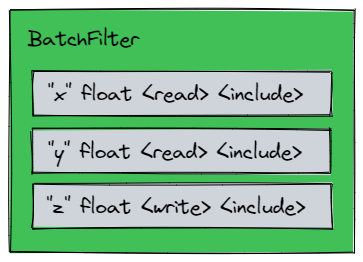

**AccessModes**

.. list-table::
   :header-rows: 0
   :widths: 25 95

   * - Read
     - Acquires read access for the given attribute.
   * - Write
     - Acquires write access for the given attribute.
   * - NoAccess
     - Data will not be accessed, but the attribute is still present to be used by the filter mode.

**FilterModes**

.. list-table::
   :header-rows: 0
   :widths: 25 95

   * - Include
     - Finds prims where the attribute IS present.
   * - Exclude
     - Finds prims where the attribute IS NOT present.
   * - Create
     - Finds prims where the attribute IS NOT present. The Attribute will be dynamically created during view generation. Implicitly requires <write> access.

Some combinations would be nonsensical, or feel repetitive to type. For this reason, the Batch API codifies all valid combinations into explicit methods on :code:`BatchFilter`. Here are a few :code:`BatchFilter` examples demonstrating this::

    // Find all prims WITH ("x", "y", "z")
    // - Acquire read  access for "x"
    // - Acquire read  access for "y"
    // - Acquire write access for "z"
    AttributeRef ref_x, ref_y, ref_z;
    BatchFilter filter;
    {
        ref_x = filter.readAttribute(attr_x);   //  <read>     <include>
        ref_y = filter.readAttribute(attr_y);   //  <read>     <include>
        ref_z = filter.writeAttribute(attr_z);  //  <write>    <include>
    }

    // Find all prims WITH ("x", "y"), and NOT WITH ("z",)
    // - Acquire read  access for "x"
    // - Acquire read  access for "y"
    // - Create "z" dynamically at View Generation time.
    // - Acquire write access for "z".
    AttributeRef ref_x, ref_y, ref_z;
    BatchFilter filter;
    {
        ref_x = filter.readAttribute(attr_x);   //  <read>     <include>
        ref_y = filter.readAttribute(attr_y);   //  <read>     <include>
        ref_z = filter.createAttribute(attr_z); //  <write>    <create>
    }

    // Find all prims WITH ("x", "y", "z"), and NOT WITH ("tag",)
    // - Acquire read  access for "x"
    // - Acquire read  access for "y"
    // - Acquire write access for "z"
    AttributeRef ref_x, ref_y, ref_z;
    BatchFilter filter;
    {
        ref_x = filter.readAttribute(attr_x);   //  <read>     <create>
        ref_y = filter.readAttribute(attr_y);   //  <read>     <create>
        ref_z = filter.writeAttribute(attr_z);  //  <write>    <create>
        filter.excludeTag(attr_tag);            //  <noaccess> <exclude>
    }

:code:`BatchFilter` is a struct that acts as a filter *definition* only. Defining a :code:`BatchFilter` does not immediately incur side-effects within a Fabric cache. Side-effects will only occur during *View Generation* and *Execution Driving*. For this reason, they are also highly reusable and sharable, and it is recommended to so if you desire.

Note that the code above stores the return values of various :code:`BatchFilter` methods in :code:`AttributeRef` variables. These are used for `Accessing Data Using a View`_. This concept is expanded on later in `Managing AttributeRefs`_.

Creating a Batch Instance
-------------------------
APIs used in this document beyond this point will require the the user to create a Batch instance before using it, like so::

    #include <omni/fabric/batch/Batch.h>

    ...

    Batch batch;

A Batch instance internally tracks the concept of its thread "owner". This concept exists as a thread safety mechanism against unsafe usage. This is elaborated on further within `Reentrancy`_

Generating a View
-----------------
At the heart of Batch API's user model is the :code:`View`. The :code:`View` represents the results of a query made using a :code:`BatchFilter`. It logically condenses all filtered prims so they can be uniformly addressed, even if Fabric internals have chosen to arrange data fragmented across multiple separate data buffers. The :code:`View` is a zero-copy abstraction that allows fast random- or forward-iterative-access across multiple Fabric data segments.

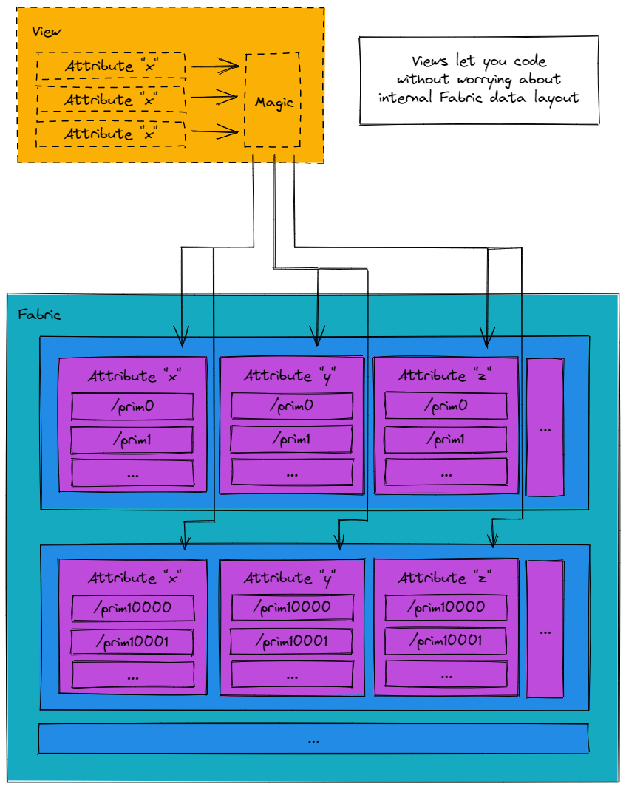

Generating a view using a filter is straightforward::

    const View& view = batch.generateView(<fabricId>, <ViewGenerationOptions>, filter);

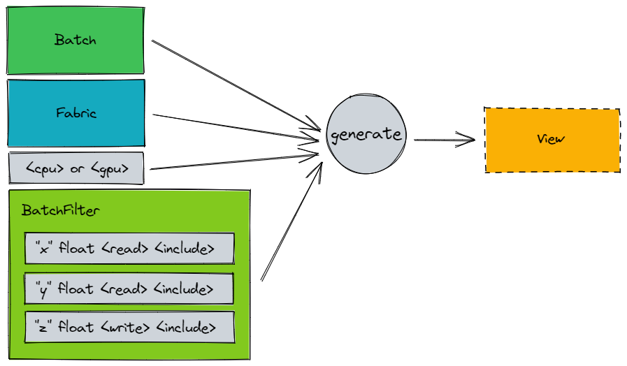

At the time of writing, :code:`ViewGenerationOptions` is comprised of::

    struct ViewGenerationOptions
    {
        // Determines the target device that Fabric data will be hosted on at the time the Lambda is executed or the View is generated.
        // GPU devices will use async memcpy to do this, so technically the data copy request will guarantee to be
        // submitted, but the stream may not have been flushed yet.
        omni::fabric::DeviceType device;

        // Determines if View's will provide path information to the user.
        // This is well supported, but it should be noted that requesting paths to be provided will cost significantly more memory,
        // and in the case of GPU kernels, significantly larger memory transfer performance costs for kernel launches.
        bool providePaths;
    };

There are two device types currently supported:

.. list-table::
   :header-rows: 0
   :widths: 25 95

   * - omni::fabric::fabric::DeviceType::eCpu
     - Fabric data will be prepared for access within Cpu kernels
   * - omni::fabric::fabric::DeviceType::eCuda
     - Fabric data will be prepared for access within CUDA kernels

Generating a :code:`View` does not incur *additional* Fabric data copies. More specifically, any data access in Fabric might incur CPU<->GPU data mirroring, but using a :code:`View` does not do anything additional on top of whatever using Fabric directly would have already performed. For optimal performance of Fabric, in general, it is best to keep data on-GPU (or on-CPU) for as long as possible before mirroring. The same stays true for Batch API.

If a <create> filter was used to generate the :code:`View`, the act of generating the :code:`View` will dynamically create attributes on all prims that matched the given filter.

When generating and accessing a :code:`View`, data access to Fabric data is amortized such that Fabric APIs that acquire data for read/write are called as few times as possible, even if data spans multiple segments.

Accessing Data Using a View
---------------------------

Building a system using Batch ultimately requires reading and writing attributes within a kernel. The :code:`View` is the core mechanism through which this is accomplished. Recall, the :code:`View` is a zero-copy abstraction that allows fast random- or forward-iterative-access across multiple Fabric data segments.

Here are some additional key takeaways about the :code:`View` model:

- A View contains a single range of indices [0, N), representing the total set of prims selected.
- View indices are not synonymous with prim indices / elements of an Attribute span returned by IFabric APIs.
- :code:`Views` are cheap to copy. No deep copy of data will occur in doing so.
- Views (and related support classes) are available in both CPU and GPU kernels.

Accompanying the :code:`View` is the :code:`ViewIterator`. The :code:`ViewIterator` allows fast random- or forward-iterative access to prims within a View, and has been optimized independently for both CPU and GPU access. Use of the 

------------

**Batch-ism:** Does the Batch API require me to use the :code:`ViewIterator` to access fabric data within my kernels?

No. :code:`ViewIterator` is a convenience provided to effeciently traverse the View and made edits. Some advanced integrations may want to directly access fabric data using just the :code:`View`. This is allowed, encouraged, and common. In fact, this is how some other parts of the core Omniverse Runtime and its greater ecosystem integrate with Batch API already.

------------

**View Indices**

As mentioned above, a View contains a single range of prim indices [0, N). N can be retrieved directly from the :code:`View`::

    View view;
    ...
    const size_t N = view.count();
    if (index >= N) return;
    ...

This can be used to prevent out-of-range access errors, as shown above.

**Random Access**

A :code:`ViewIterator` can be initialized and used as a random-access iterator for any index within a View's range::

    AttributeRef ref;
    ...
     ViewIterator iter(view, <random index>);
     if (iter.peek())
     {
         const float& value = iter.getAttributeRd(ref);
     }

The caller must always :code:`peek()` before acquiring any data using the :code:`ViewIterator` when using random-access patterns.

**Forward Iterative Access**

Similar to *Random Access*, :code:`ViewIterator` can be used to forward-iterate through prims in a :code:`View`::

    AttributeRef ref;
    ...
    omni::fabric::batch::ViewIterator iter(view);
    while(iter.advance())
    {
         const float& value = iter.getAttributeRd(ref);
    }

The caller must always :code:`advance()` before acquiring any data using the :code:`ViewIterator` when using forward-iterative-access patterns.

------------

Note how both *Random Access* and *Forward Iterative Access* use a :code:`AttributeRef` to access attribute data.

**Batch-ism:** Why is the user required to save and then use :code:`AttributeRef` in this manner?

The crux of the problem is that USD does not guarantee deterministic ordering of attributes, and since Fabric is built to accelerate with USD, we must protect the user against this nondeterminism.

Batch API solves this by guaranteeing that attributes within a generated :code:`View` have relative order determinism with respect to the user's :code:`BatchFilter`. If multiple processes are involved, this will still hold true as long as they are the same software version. This provides the strongest guarantee we can to the user, while not having to impose unnecessary restrictions on USD/Fabric itself.

------------

**Batch-ism:** For GPU compute, it is imperative that :code:`View` is passed-by-copy to the CUDA kernel at the point of kernel launch. No Fabric data will be deep-copied (or harmed) in the process. :code:`View` is enforced to fit within 64 bytes, and is trivially-copyable, so this is fairly cheap. Failure to do so will likely cause CUDA errors because passing CPU variables by reference to a CUDA kernel is akin to deferencing CPU memory on the GPU, which will not go well.

------------

**Batch-ism:** Instead of the :code:`View` abstraction, can Batch API do work to generate a flattened bucket/prim index lookup table, and have that exposed as some sort of POD-style struct I can index into?

This was tested, and it was determined that, for the general case, this was not the correct implementation choice for efficient editing of Fabric data. Generating the flattened index lookup table is extremely memory intensive. It often ends up being a very large LUT, and by extension, memory access is very slow. This is even worse if GPU transfer is involved. Just performing the LUT lookup led to kernels being severely handicapped by memory-bandiwidth limitations.

Deferred Mode
=============

The previous sections describe how to use Batch API in Immediate Mode. Please read those before continuing to this section.

*Immediate Mode* Batch API is efficient, and may be the right answer for many Fabric integrations. However, more complex integrations of Fabric may desire support for additional features, which slot better into *Deferred Mode*. These features include:

* Filtering over multiple Fabric caches
* Amortizing View generation
* Deferring execution
* Connecting sequences of data transformations
* Automating View Partitioning for CPU multitasking
* Aggregating statistics and analysis

Defining a Batch instance to use *Deferred Mode* begins similar to Immediate Mode. A :code:`BatchFilter` is still required. There are some other key differences::

    struct MyUserData
    {
        omni::fabric::batch::AttributeRef ref_x;
        omni::fabric::batch::AttributeRef ref_y;
        omni::fabric::batch::AttributeRef ref_z;
    };

    ...

    MyUserData userData;
    BatchFilter filter;
    Lambda lambda;

    userData.x_ref = filter.readAttribute(attr_x);
    userData.y_ref = filter.readAttribute(attr_y);
    userData.z_ref = filter.writeAttribute(attr_z);

    lambda.filter = &filter;
    lambda.options.device = <device type>;
    lambda.options.providePaths = false;
    lambda.hook = <kernel hook function>;
    lambda.userData = &userData;
    lambda.userDataSize = sizeof(userData);

    batch.addLambda(lambda);
    batch.addFabricId(<fabricId>);
    batch.bake();

This introduces several new concepts that are detailed below.

**Lambda**

A :code:`Lambda` defines the kernel that will eventually be executed over Fabric data. This is the framework used to define a single code "system". In a more general programming sense, this can be thought of a C++ lambda with some extra steps to optimize fabric data access.

**User Data**

When using *Deferred Mode*, it is highly recommended the user defines a custom type to pass any non-Fabric data used when operating over a :code:`View` within a :code:`Lambda`. At minimum, this will often look like just a POD-style struct that retains any :code:`AttributeRef` saved during definition of the :code:`BatchFilter`. Above, the struct :code:`MyUserData` is used as an example.

**Kernel Hook Function**

A kernel hook function is any C function matching the signature::

    void (*)(const struct View& view, const struct BatchFilter& filter, void *userData);

This function will be called with some :code:`View` when the Batch is executed. Additionally, any *User Data* provided in the Batch definition will be passed back to each invocation of a *Kernel Hook Function*. This allows for attribute access like so::

    void MyKernelHook(const struct View& view, const struct BatchFilter& filter, void* userData)
    {
        MyUserData* user = (MyUserData*)userData;

        ViewIterator iter(view);

        while (iter.advance())
        {
            const float& x = iter.getAttributeRd<float>(user->ref_x);
            const float& y = iter.getAttributeRd<float>(user->ref_y);
            float& z = iter.getAttributeWr<float>(user->ref_z);

            ...
        }
    }

**Other Notes**

Note how the :code:`filter` and :code:`lambda` can be defined at some different scope than when they are applied to a specific Batch instance. These definitions can be reused multiple times, and it is recommended to do so if that is an option.

Similarly, multiple scopes could add additional :code:`FabricId` or :code:`Lambda` to a single Batch instance, if desired. In this way, some higher level library or application logic that is capable of task coordination and scheduling could amortize overhead by constructing longer sequences of :code:`Lambdas` over multiple Fabric caches. One could even JIT compile from a DSL or graph and output as a Batch :code:`Lambda` sequence. Since Batch is defined to support caching, this might only happen once at application start!

The :code:`IBatch::bake()` function must be called anytime a Batch definition changes. This perfoms some calculations to prepare views, and these calculations can always be safely amortized to only happen once per Batch definition modification. This is not related at all to Fabric topology changes. The :code:`IBatch::bake()` call is *only* concerned with Batch definition changes.

The above code snippet defines a Batch instance such that it can be run in Deferred Mode. Once run, these definitions are used internally to generate :code:`View`'s, much like in Immediate Mode, which are then forwarded to the *Kernel Hook Function* for the user to implement any application-specific logic.

Deferred Mode Execution
-----------------------

In the simplest case, we can execute a Batch in Deferred Mode serially on the current thread like so::

    const BatchRunContextId runContextId = batch.runPrologue();
    batch.run(runContextId);
    batch.runEpilogue(runContextId);

For CPU compute, this will limit execution to the calling thread. For GPU compute, the provided *Kernel Hook Function* defined above is allowed to forward the provided :code:`View` (and *User Data*) to CUDA using some wrapper function, as is very standard in other CUDA integrations.

For applications that desire a Batch to perform multiprocessing on the CPU, Batch API supports automated *View Partitioning*. This happens automatically without the user's intervention, but the user does have great flexibility on *how* execution happens, without forcing any particular opinion, as demonstrated in the next sections.

The above snippet also shows the use of :code:`runPrologue / runEpilogue` calls bookending the call to :code:`run(...)`. This is sometimes referred to as the "run window". The :code:`BatchRunContextId` handle generated from :code:`runPrologue` must be used for all APIs used within the run window. The internals are intentionally opaque. It is intended as a form of reentrancy guard against attempts to concurrently use a Batch instance from multiple threads in unsupported ways. This is elaborated on in `Reentrancy`_.

If RAII patterns are desired over explicit :code:`runPrologue / runEpilogue` calls, use :code:`BatchRunContextScope`::

    BatchRunContextScope runContextScope();
    batch.run(runContextScope.getBatchRunContextId());

View Partitioning
-----------------

To achieve high throughput for CPU compute, a :code:`View` must be partitioned such that CPU worker threads can operate as independently as possible. Batch API provides *View Partitioning* automation to achieve this. This mechanism occurs automatically within any *Deferred Mode* run window, and slices up a View into independent portions.

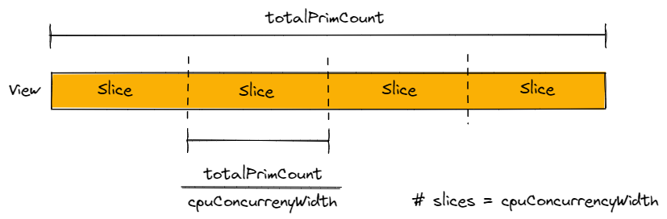

These :code:`View` slices are then placed in :code:`Queues`. Participating CPU worker threads may own an entire :code:`Queue` of work, and blast through them as fast as possible without synchronization. 

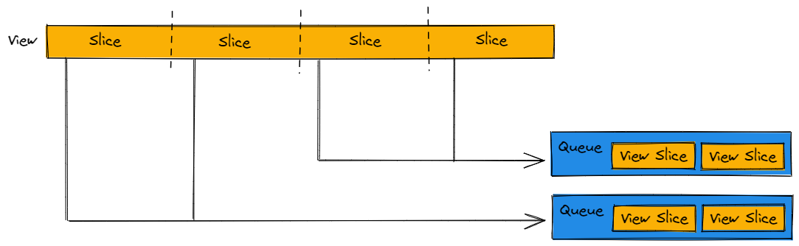

Batch API allows the user to control *View Partitioning* by defining a :code:`BatchPreferences` definition during Deferred Mode::

    BatchPreferences preferences;
    preferences.cpuConcurrencyWidth = <desired width>;
    batch.setPreferences(preferences);

For many situations, a good starting configuration is to have one :code:`View` slice per hardware thread. This is also the default behavior if :code:`BatchPreferences` are unspecified::

    preferences.cpuConcurrencyWidth = std::thread::hardware_concurrency();

For others, a different configuration may be desired. This is elaborated on further in `Queues, Load, and Batch Progression`_.

For GPU compute, this preference can be ignored. Batch API takes special consideration to ensure that a :code:`View` is never sliced prior to handing off to a GPU kernel, because that would incur unacceptable kernel launch overhead. Even if this value is set, it will be ignored if using GPU compute. For similar reasons, this preference is called "cpuConcurrencyWidth" and not simply "concurrencyWidth".

Execution Driving
-----------------

Batch API does not provide any authoritative execution driver. More generally, it has no opinion on execution or scheduling at all. The caller is allowed to use whatever driver they deem best for their specific situation. Using *View Partitioning*, the Batch API can flexibly support most execution drivers.

Below a very explicit example is provided on how to write custom execution drivers. This is written long hand to assist with education, so if you'd like to learn more about how Batch API can be executed, continue reading. If you'd like to skip to a more expedient integration step, see *Sample Executors* just below.

Here is an example of how to write a custom execution driver to integrate with Batch API::

    BatchPreferences preferences;
    preferences.cpuConcurrencyWidth = <cpuConcurrencyWidth>;
    batch.setPreferences(preferences);

    // Using TBB to drive execution
    const BatchRunContextId runContextId = batch.runPrologue();
    tbb::parallel_for(
        tbb::blocked_range<size_t>(0, <cpuConcurrencyWidth>, 1),
        [this, &batch, &runContextId](tbb::blocked_range<size_t>& r)
        {
            for (size_t index = r.begin(); index < r.end(); ++index)
            {
                batch.runWithInitialQueueIndex(runContextId, index);
            }
        },
        tbb::simple_partitioner());
    batch.runEpilogue(runContextId);

    // Using carb::tasking to drive execution
    const BatchRunContextId runContextId = batch.runPrologue();
    tasking->applyRange(<cpuConcurrencyWidth>, [this, &batch, &runContextId](const size_t index) {
        batch.runWithInitialQueueIndex(runContextId, index);
    });
    batch.runEpilogue(runContextId);

The above patterns are fairly equivalent, aside from implementation differences between :code:`tbb` and :code:`carb::tasking`. The application has indicated that :code:`<cpuConcurrencyWidth>` threads will participate in Batch execution. *View Partitioning* is configured with :code:`<cpuConcurrencyWidth>`, which will allow the Batch API to slice a :code:`View` into enough :code:`Queue`'s such that each participating thread has exactly one :code:`Queue` per participating thread. Both drivers then execute the Batch in parallel.

Using :code:`IBatch::runWithInitialQueueIndex` is an optimization, and optional, but highly recommended for any execution driver that can directly map threads to queues. Alternatively, all threads can use the same initial queue index, or just use :code:`IBatch::run`, if desired. There is a small overhead penalty, but it is likely not worth stressing about.

For GPU compute, it is totally acceptable and expected for the current thread to directly kick off Batch execution using :code:`IBatch::run`, as most of the multiprocessing coordination is done by CUDA, drivers, and the hardware itself.

The :code:`IBatch::runPrologue` and  :code:`IBatch::runEpilogue` functions are required to be called by users when using Deferred Mode. Their purpose is intentionally opaque, and Batch API reserves the right to change what happens during those routines. They are useful bookending hooks used to setup and teardown internal state. They employ a :code:`BatchRunContextId` handle generated from :code:`runPrologue`, which must be used for all APIs within the run window.

With *View Partitioning* and *Execution Driving* setup, the world may look like this:

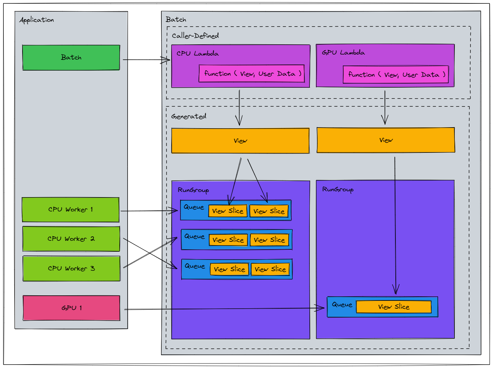

* :code:`View`'s used in CPU compute are sliced into smaller :code:`View`'s for parallel operation
* :code:`View`'s used in GPU compute are kept as large as possible for minimal kernel launch overhead
* CPU workers have been mapped to execute a Batch with some initial queue index

Above, :code:`RunGroup` is listed, but it is not really a concern for users. It is purely an organizational construct for implementation purposes, and is shown just for completeness.

Progression Guaranteed
----------------------
Consider a Batch instance with a single Lambda and some parallel execution driver such as :code:`tbb` or :code:`carb::tasking`. Conceptually, allowing parallel execution leads to a "fan out, fan in" paradigm (sometimes called "ventilate, sink"):

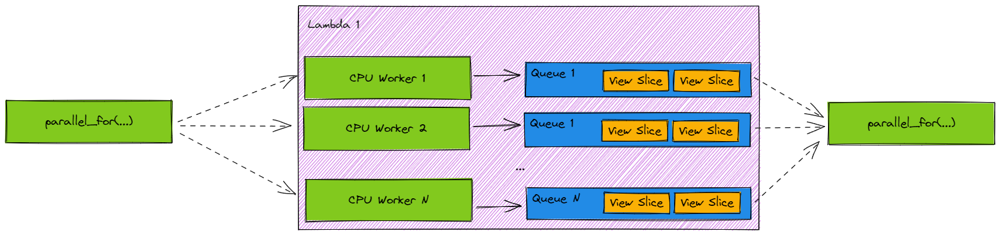

However, this may naturally leads to an important question: What happens if I use *X* threading library, but the library schedules less threads onto my Batch instance than intended? Similarly, what if my OS gives some threads unfair execution ordering/time? Can execution stall?

Batch API guarantees that as long as any single participating thread is given CPU time (and the user's kernel does not behave in ways that lead to deadlocks) the Batch instance can always achieve total progression. This is because **Batch API implements queue-level stealing**. If a thread participating in :code:`run()` completes execution over the :code:`View` slices in its queue, it is allowed to pick up a queue that has not been completed and progress the Batch execution. In other words, one participating thread is capable of executing kernels over all :code:`View` slices contained within a Batch instance, if necessary.

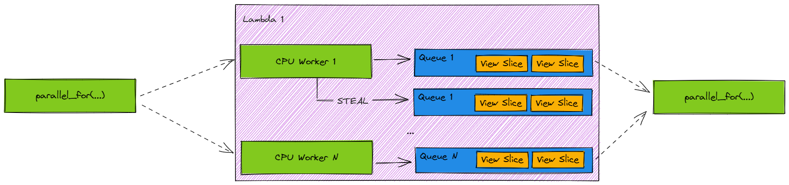

Multiple Lambda Flows
---------------------

It is encouraged to add multiple Lambdas to Batch instance, if desired. It is important to note that **Lambda execution is *ordered* by default**. This holds true for parallel execution as well. Batch API enforces this through implicit synchronization points between each :code:`Lambda`'s' execution. This is a safety net for applications that need ordered read consistency between Lambdas. Remember, Fabric makes no opinion on execution or scheduling, so we must be robust to the behavior of execution drivers that might allow fibers/threads to context switch or task steal. With this synchronization point, *default* behavior looks like: fan out, fan in, fan out, fan in, etc.:

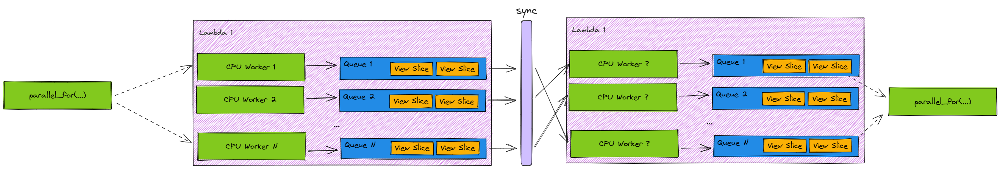

Some applications may want to remove the synchronization point to allow for *unordered* Lambda execution. This is allowed, and available via::

    struct BatchPreferences
    {
        ...

        // Only applies to Batch instances with multiple Lambdas added.
        //
        // Enable to allow threads participating in run() to proceed to execute Lambda N + 1 after completing some work in
        // Lambda N, even if other threads/work are active and not yet completed.
        //
        // This is useful if Batch has multiple lambdas that don't need read consistency and can execute in any order.
        // Default behavior is disabled, requiring all writes from Lambda N to complete, and threads to be synchronized such that those
        // write are visiible to others, before allowing any participating thread to proceed executing Lambda N + 1.
        bool runUnordered = false;

        ...
    };

A common case for this might be concurrent stage population Batches. This might look something like:

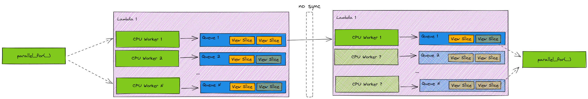

Where:

* CPU Worker 1,2,...,N are all progressing.
* CPU Worker 1 completed Lambda 1 ahead of other participants, and proceeded onto Lambda 2 without syncrhonization.

In the face of unfair CPU time, this feature combined with *Queue-Level Stealing* described in the previous section could potentially allow CPU Worker 1 to progress Lambda 2 through multiple queues of work, increasing the total throughput of the Batch instance despite the poor execution conditions.

**Sample Executors**

Sample execution drivers are also provided to help bootstrap integrating Batch API into custom execution models::

    // see the following sample executors
    #include <omni/fabric/batch/SampleCarbExecutor.h>
    #include <omni/fabric/batch/SampleCUDAExecutor.h>
    #include <omni/fabric/batch/SampleExecutor.h>
    #include <omni/fabric/batch/SampleTBBExecutor.h>

All of the above sample executors encapsulate the steps mentioned above, and integration is as easy as::

        Batch batch;
        ...

        SampleTBBExecutor::run(batch);

Sharp Corners
=============

There are some known sharp corners when using Batch API. Many of these are being addressed in future tech, but they are not available yet for Batch API to automatically leverage on behalf of the user. This will be improved on in the future.

* It is not safe to concurrently use a Batch (in Deferred or Immediate Mode) while also modifying Fabric data using external code. There are not safeguards against this, so the user is, unfortunately, responsible for protecting against this.

* A :code:`View` is invalidated if Fabric topology changes are made. This includes:

  * Adding, Moving, Renaming, or Removing Prims
  * Adding or Removing Attributes
  * Adding or Removing Type registrations

* Generating any :code:`View` using a :code:`<create> BatchFilter` potentially invalidates previously generated :code:`View`'s. This counts as a topological change.

* Data races will occur if Attribute edits to the same prim are made concurrently from both a Batch and external code.

* It is not safe to cache pointers for any Fabric data presented within a :code:`View`, and use them outside the lifetime of the :code:`View`.

* Interleaved CPU and GPU compute is allowed. However, it is not recommended to lean into this heavily because each target swap will incur :code:`host<->device` syncs, and doing so frequrently will likely become unacceptably costly. It will always function correctly, but be sure to measure performance before committing to any interleaved compute pipeline.

* *Deferred Mode* will regenerate :code:`Views` once per :code:`runPrologue/runEpilogue` pair. This can incur costly allocations and :code:`host<->device` syncs. The long-term goal is amortize the :code:`View` generation costs once Fabric is capable of providing the Batch API with stable or generational IDs. This tech does not currently exist. In the mean time, if the user knows that they have not made any topological changes, they can suppress regeneration of :code:`Views` by calling :code:`IBatch::markViewsValid()`. This must be called once per :code:`runPrologue/runEpilogue` pair (which typically means once per frame per Batch).

Not All BatchFilters Are Equal
===============================

Using these :code:`BatchFilter` methods will cause topology changes to occur dynamically during *View Generation* on behalf of the user:

- :code:`createAttribute()`
- :code:`createTag()`

Batches with any :code:`BatchFilter` that uses these methods are sometimes referred to as a "self-mutating Batch". Internally, they are marked by a special flag, :code:`requiresDynamicViews`. 

These methods exist as a convenience for the user, so if this convenience is valuable, by all means use it! This is not a warning message to deter use.

The takeaway is to be mindful that this class of :code:`BatchFilter` has very different performance characteristics:

- Additional cost will be observed in *View Generation* as well as run times
- There may be more performance variance frame-to-frame
- A Batch flagged :code:`requiresDynamicViews` may perform very differently than a Batch flagged :code:`!requiresDynamicViews`. This is not an apples-to-apples comparison.

Reentrancy
==========
A Batch instance is initialized with the calling thread marked as its owner. Every subsequent API call using that Batch instance must be made from the same thread marked as the owner, with the exception of :code:`run(...)` variants, namely:

- :code:`run()`
- :code:`runWithInitialQueueIndex(...)`

This design is to protect against data races that might occur if threads attempted to concurrently modify Batch definitions. Imagine two threads attempting to concurrently :code:`clear()` and :code:`addLambda(...)`. The ordering matters, and it's not clear who should win.

Creating, defining, baking, and setting up the :code:`runPrologue() / runEpilogue()` run window should occur on the owning thread. Other threads may participate within the run window.

The :code:`BatchRunContextId` generated by :code:`runPrologue()` is an opaque handle used as an additional reentrancy guard for bad, concurrent patterns. Recall that, while only the owner can use most of the Batch API, the :code:`run(...)` variants are allowed to be called from any thread. This presents an interesting problem. How should Batch API protect against bad concurrency between APIs requiring ownership and :code:`run(...)` variants? This is exacerbated by real life scenarios where an owner thread and non-owner thread attempting to cooperatively use Batch API might have very different frame rates, OS-scheduled CPU time, or load. This may cause dangerous timings where a non-owning thread may attempt to participate in :code:`run(...)` before the owner thread has a chance to complete :code:`runPrologue(...)`, etc. This would typically only happen if the user failed to separate authorship workflows from execution, or perhaps failed to bookend the run window properly with :code:`runPrologue / runEpilogue`. One solution might be to use some sort of shared mutex, or tiered locking, or other synchronization primitive. This is costly and hard to get right for all workflows. Instead, Batch API requires the user to store and pass back the :code:`BatchRunContextId` as a required parameter. A valid :code:`BatchRunContextId` can only be generated by the owning thread, and only when Batch API is operated correctly and error-free. The other APIs used in the run window then can use this opaque handle to execute within a safe environment, without expensive synchronization. Additionally, the API design requiring this as a parameter is a (hopefully) nice reminder that that run window bookending with  :code:`runPrologue / runEpilogue` must be done properly. That is, called from the owner thread, and only the owner thread, with no calls to :code:`run(...)` variants occuring outside. These are all conditions that we can check without hardware synchronization given the design of the :code:`BatchRunContextId` usage pattern.

If for some reason a Batch instance must be constructed on one thread and passed ownership to another, there is an escape hatch available: :code:`changeOwnerToCurrentThread`. Please be aware that Batch API makes no guarantees about thread safety in doing this. Callers are responsible for thread safety using this advanced feature, so please use caution.

Managing AttributeRefs
======================
Each attribute defined in a filter generates and returns back an opaque :code:`AttributeRef`. The lifetime of an :code:`AttributeRef` is tied to the lifetime of a :code:`BatchFilter`.  The user has a few options on how to manage AttributeRefs.

**1. Free Variables**

This is the pattern used earlier. Each :code:`AttributeRef` is stored in a local variable. This is simple to implement and convenient, especially for Immediate Mode Batch uses::

    AttributeRef ref_x, ref_y, ref_z;
    BatchFilter filter;
    {
        ref_x = filter.readAttribute(attr_x);
        ref_y = filter.readAttribute(attr_y);
        ref_z = filter.writeAttribute(attr_z);
    }

If this fits your needs, it's probably a good choice.

**2. Custom Class Tying Lifetimes**

Another choice would be to colocate :code:`BatchFilter` and its related :code:`AttributeRefs` within a custom struct to ensure lifetimes are tied together, like so::

    struct MyAttributes
    {
        MyAttributes()
        {
            ref_x = filter.readAttribute(attr_x);
            ref_y = filter.readAttribute(attr_y);
            ref_z = filter.writeAttribute(attr_z);
        }

        BatchFilter filter;
        AttributeRef ref_x;
        AttributeRef ref_y;
        AttributeRef ref_z;
    };

**3. Late Binding**

More complex Batch uses may want to bind any :code:`AttributeRef`'s later, during kernel hook invocation. This can be done by using the :code:`BatchFilter` within a *Kernel Hook Function* to find the :code:`AttributeRef`'s needed::

    BatchFilter filter;
    filter.readAttribute(attr_x);
    filter.readAttribute(attr_y);
    filter.writeAttribute(attr_z);

    void MyKernelHook(const View& view, const struct BatchFilter& filter, void* userData)
    {
        AttributeRef ref_x, ref_y, ref_z;
        ref_x = filter.findRef(user->attrs->x);
        ref_y = filter.findRef(user->attrs->y);
        ref_z = filter.findRef(user->attrs->z);

        ...
        // execute cpu or gpu kernel logic
    }

**4. AttributeHandles**

A convenience that allows users to declare intended access mode and type within C++'s type system, and use the wrappers
within kernel code to access data directly.::

    BatchFilter filter;
    AttributeReadHandle<const float> handle_x(filter, attr_x);
    AttributeReadHandle<const float> handle_y(filter, attr_y);
    AttributeWriteHandle<float> handle_z(filter, attr_z);

    void MyKernelHook(const View& view, const struct BatchFilter& filter, void* userData)
    {
        ...
        omni::fabric::batch::ViewIterator iter(view);
        while (iter.advance())
        {
            handle_z(iter) = handle_x(iter) * handle_y(iter);
        }
    }

Queues, Load, and Batch Progression
===================================

As mentioned above, the goal of *View Partitioning* is to slice up a :code:`View` such that CPU threads can blast through independent queues of work. In an ideal scenario, queues would have equal load and fair cpu time. This is almost never the case. In a worst case scenario, if some thread has very uneven load or unfair CPU time, this could lead to slow or even stagnant Batch execution progression.

One should always measure and adjust :code:`<cpuConcurrencyWidth>` to find the sweet spot. On machines with NUMA effects, or with certain kernels, it may not be worth striding all cpu hardware threads, and it is allowed to use less :code:`<cpuConcurrencyWidth>` than the available hardware threads. It is similarly allowed to use more, if the flexibility of the execution driver being able to dynamically map threads to queues outweights the benefits of having more coherent work per queue. And for kernels that have highly conditional logic leading to very uneven loads, Batch progression can still be accelerated by multiple threads if :code:`<cpuConcurrencyWidth>` is tuned such that there are more queues than threads.

Batch API attempts to automatically alleviate some class of problems to do with uneven cpu time and load. Any thread participating in Batch execution is allowed to perform queue-level work stealing. This allows a thread that has low relative load, or high relative cpu time, to progress the Batch on its own.

Performance
===========

Batch API has been tested and measured to ensure it adds as little overhead as possible to kernel execution time, while still providing useful abstractions to traverse multiple Fabric segments. In order to measure overhead, performance analysis was done using multiple SAXPY implementations. SAXPY is an extremely memory-hungry algorithm, and was chosen because it would exacerbate any memory throughput overhead incurred by using Batch API. Performance results were tuned and verified using both CPU and GPU profilers. The results contain series data from:

* :code:`[cpu]` SAXPY using raw C++ and tbb
* :code:`[cuda]` SAXPY using raw CUDA
* :code:`[cuBlas]` SAXPY using cuBlas
* :code:`[batch][cpu]` Batch API using C++
* :code:`[batch][cuda]` Batch API using CUDA

At the time of writing, here are the results:

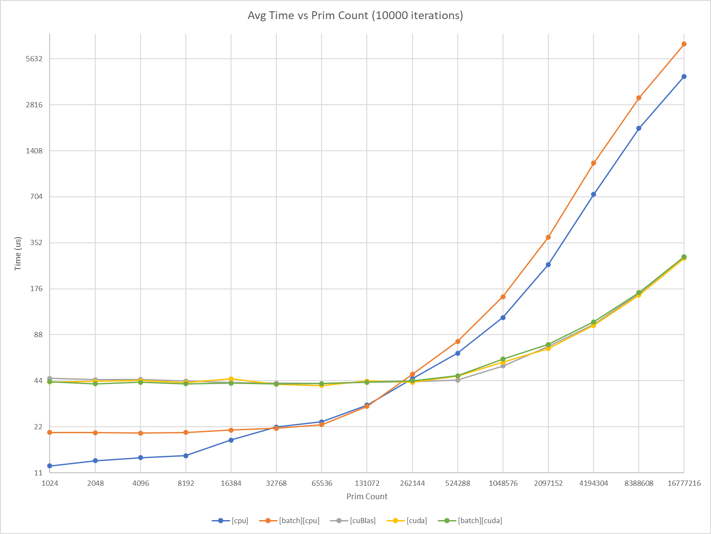

* :code:`[cuBlas]` appears to have a fixed minimum overhead cost of ~44us.
* :code:`[cuda]` appears to have a fixed minimum overhead cost of ~43us.
* :code:`[batch][cuda]` appears to have a fixed minimum overhead cost of ~43us.
* :code:`[cpu]` had no fixed measurable overhead minimum, and scaled throughout.
* :code:`[batch][cpu]` appears to have a fixed minimum overhead cost of ~21us.
* :code:`[cuda]` was negligibly faster than :code:`[cuBlas]`.
* :code:`[batch][cpu]` has zero overhead from [32K, 128K] prims
* :code:`[batch][cuda]` has zero overhead from [1K, 16M] prims
* :code:`[batch][cpu]` has at worst 0.6x slowdown at 16M prims
* :code:`[batch][cuda]` outpaces :code:`[batch][cpu]` starting at 256K prims

In addition, a snippet from NVIDIA NSight Compute reports:

.. list-table::
   :header-rows: 1
   :widths: 95 25 25 

   * - Metric
     - :code:`[cuda]`
     - :code:`[batch][cuda]`
   * - Cycles
     - 372,621
     - 330,665
   * - Registers
     - 26
     - 28
   * - Arithmetic Intensity (FLOPS/byte)
     - 0.17
     - 0.17
   * - GFLOPS
     - 124
     - 141
   * - Compute (SM) %
     - 23.18
     - 40.68
   * - Memory %
     - 81.86
     - 93.05

The above tests were done using Fabric data that was known to be stored in a coherent segment. This was intentional, as it provides the closest parallel to compare against the control implementations of raw CPU, CUDA, and cuBlas SAXPY kernels.

Not all Fabric data may live in one coherent segment. Batch API handles this transparently. Scaling with fragmentation has also been profiled. This time, we do self-comparisons with increasing segment (bucket) counts, since this has to do with impact of Fabric internals:

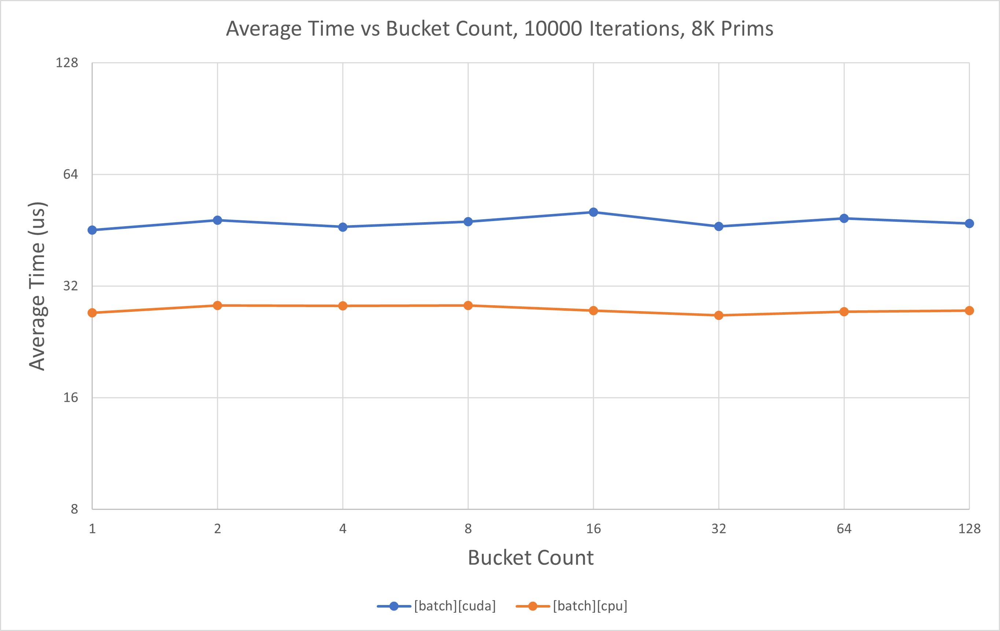

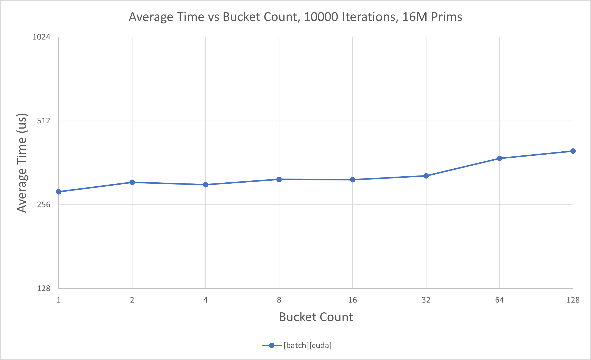

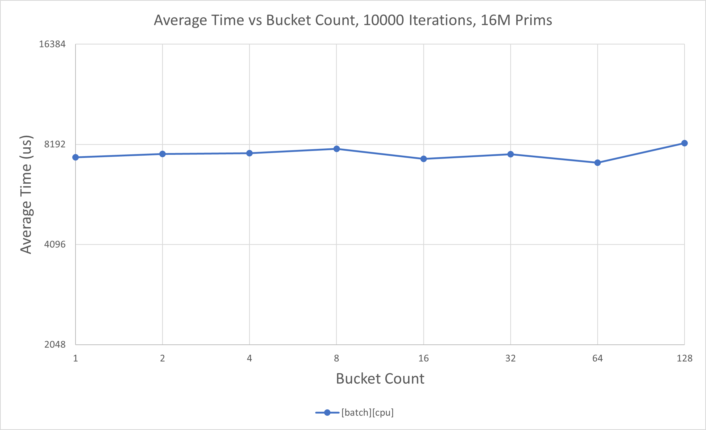

* At  low prim counts, :code:`[batch][cpu]`  has near flat scaling as segment count increases.
* At  low prim counts, :code:`[batch][cuda]` has near flat scaling as segment count increases.
* At high prim counts, :code:`[batch][cpu]`  has near flat scaling as segment count increases.
* At high prim counts, :code:`[batch][cuda]` has minimal   scaling as segment count increases.

Above numbers were captured on a machine equipped with:
- AMD Ryzen Threadripper PRO 3975WX
- NVIDIA GeForce RTX 3090
