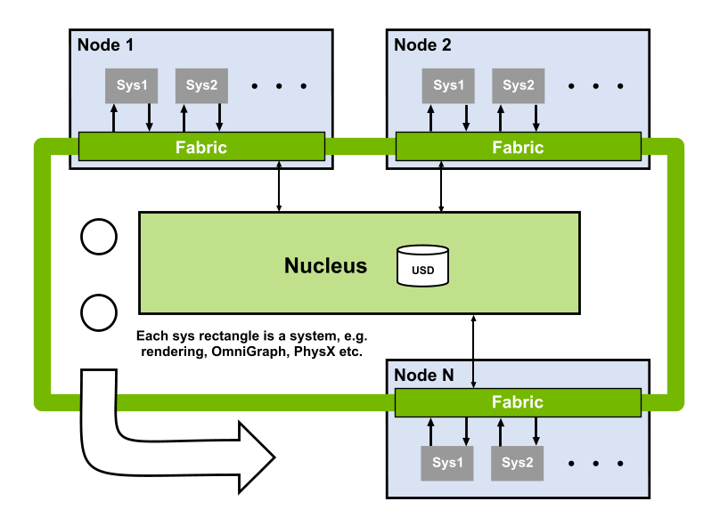

omni.fabric
###########

Overview
--------

Fabric provides fast communication of scene data between:

* Systems like Physics, OmniGraph and Rendering
* CPUs and GPUs
* Machines on a network

Scene data can originate from USD, but you can also add new attributes to prims, or create prims from scratch without 
ever writing them back to USD. This makes Fabric suitable for data that varies at runtime, for example during physics 
simulation, or data that is generated procedurally.

Ready? Let's look at some examples.

Example 1: Modifying a USD prim using Fabric
--------------------------------------------
For our "hello world" example, we'll create a cube using USD, modify its size using Fabric, then observe the change in 
USD. To start, we'll create a cube in USD and set its size.

.. literalinclude:: InlineSampleCodeForDocs.cpp
   :language: c++
   :start-after: example-begin create-cube
   :end-before: example-end create-cube

Before we can modify the prim using Fabric, we need to *prefetch* it to Fabric's cache. 
Typically users only operate on a subset of prims, so Fabric saves memory by not fetching all prims automatically.

.. literalinclude:: InlineSampleCodeForDocs.cpp
   :language: c++
   :start-after: example-begin prefetch-prim
   :end-before: example-end prefetch-prim

Let's use Fabric to modify the cube's dimensions.

.. literalinclude:: InlineSampleCodeForDocs.cpp
   :language: c++
   :start-after: example-begin scale-cube
   :end-before: example-end scale-cube

In this example, we'll write our changes back to USD. Be aware though that writing data back to USD can take from 
milliseconds to hundreds of milliseconds. One of the goals of Fabric is to allow systems to communicate USD data without
having to write back to the USD stage. If you're using systems that can read changes directly from Fabric, like PhysX 
or the USDRT render delegate, then it's best not to write back to USD while the simulation is running.

.. literalinclude:: InlineSampleCodeForDocs.cpp
   :language: c++
   :start-after: example-begin writeback
   :end-before: example-end writeback

Finally, let's check that Fabric correctly modified the USD stage.

.. literalinclude:: InlineSampleCodeForDocs.cpp
   :language: c++
   :start-after: example-begin check-value-changed-in-usd
   :end-before: example-end check-value-changed-in-usd

Example 2: Quickly modifying 1000 USD prims
-------------------------------------------
For the previous example, we could have achieved the same result using only the USD API, and it would have been fewer 
lines of code.
To show the power and performance of the Fabric API, we'll make a thousand prims and move them all. If you wanted to 
modify 1000 cubes quickly using only the USD API you'd probably have to use a single point instancer prim rather than 
1000 separate prims. 
But, point instancer editing and referencing has limitations. Here we show how using the Fabric API we can achieve the 
performance of a point instancer, while maintaining the advantages of separate prims.

First we'll use USD to make a thousand cubes. In a real application we'd probably use Fabric to create the prims, 
because USD prim creation is quite slow.

.. literalinclude:: InlineSampleCodeForDocs.cpp
   :language: c++
   :start-after: example-begin create-many-cubes
   :end-before: example-end create-many-cubes

Again we call prefetchPrim to get the data into Fabric.

.. literalinclude:: InlineSampleCodeForDocs.cpp
   :language: c++
   :start-after: example-begin prefetch-many-cubes
   :end-before: example-end prefetch-many-cubes

We need to tell Fabric which prims to change. In this case, we'll select all prims of type Cube. If you were doing this 
in USD you might have to traverse all prims in the stage to find the cubes. You could initially traverse the stage and 
cache the locations of all the cubes, but you'd have to keep that cache up to date as USD is modified. Fabric saves you 
the bother of doing that. It is also more efficient, because it can bucket data for all Kit extensions in a single place, 
rather than each extension having its own USD notice handler.

.. literalinclude:: InlineSampleCodeForDocs.cpp
   :language: c++
   :start-after: example-begin find-all-cubes
   :end-before: example-end find-all-cubes

Fabric internally buckets prims, according to what tags and attributes they have. Fabric is free to store the 1000 cubes 
in as many buckets as it likes. So to iterate over the cubes we need to iterate over the buckets, then the prims in each 
bucket.

.. literalinclude:: InlineSampleCodeForDocs.cpp
   :language: c++
   :start-after: example-begin iterate-over-cubes
   :end-before: example-end iterate-over-cubes

Again, we writeback to USD and check that the values were updated correctly.

.. literalinclude:: InlineSampleCodeForDocs.cpp
   :language: c++
   :start-after: example-begin writeback-cubes-and-check
   :end-before: example-end writeback-cubes-and-check

Example 3: Quickly modifying 1000 USD prims on a CUDA GPU
---------------------------------------------------------
In the last example we saw that with Fabric we can access USD prim attributes as one or more large vectors of data.
This is ideal for GPU, which can provide higher performance than CPUs when operating on vectors of data.
In this sample we'll scale 1000 prims using the GPU. 

As before, we start by creating the prims using USD, prefetching, then selecting the prims we want to operate on.

.. literalinclude:: InlineSampleCodeForDocs.cpp
   :language: c++
   :start-after: example-begin create-many-cubes2
   :end-before: example-end create-many-cubes2

Now we need to specify the CUDA function we want to apply to the data. As in all CUDA programs, there are two ways of 
doing this, compiling the function with CUDA compiler at project build time, or putting it in a string and running the 
CUDA-JIT at runtime. To make this example self-contained, we'll use the second.

.. literalinclude:: InlineSampleCodeForDocs.cpp
   :language: c++
   :start-after: example-begin many-cubes-init-gpu
   :end-before: example-end many-cubes-init-gpu

As before, we iterate over buckets. But instead of having an inner loop iterating over bucket elements (prims), 
we pass the vector for the whole bucket to the GPU. The GPU then can process the elements in parallel. To get the data 
on GPU we call `getAttributeArrayGpu` instead of `getAttributeArray`. Just as a CPU automatically mirrors data 
between main memory and CPU caches, Fabric automatically mirrors data between CPU and GPU. Like a CPU, Fabric maintains 
*dirty bits* (actually valid bits) for each mirror of the data to minimize the number of CPU<->GPU copies. It also lazily allocates, so if 
an attribute is only ever accessed on CPU it won't allocate memory for it on GPU, and vice versa. So at this point in the sample, the cpuValid bit is true, and the gpuValid bit is false. When we call `getAttributeArrayGpu`, this combination of states causes Fabric to schedule a CPU to GPU copy, which is guaranteed to complete before the kernel starts. It then sets gpuValid to true, so that further access on the GPU won't cause unnecessary CPU to GPU copies (assuming the CPU copy isn't written again).

.. literalinclude:: InlineSampleCodeForDocs.cpp
   :language: c++
   :start-after: example-begin iterate-over-cubes-gpu
   :end-before: example-end iterate-over-cubes-gpu

As before, we write the data back to USD to check it. 

.. literalinclude:: InlineSampleCodeForDocs.cpp
   :language: c++
   :start-after: example-begin writeback-cubes-and-check2
   :end-before: example-end writeback-cubes-and-check2   

