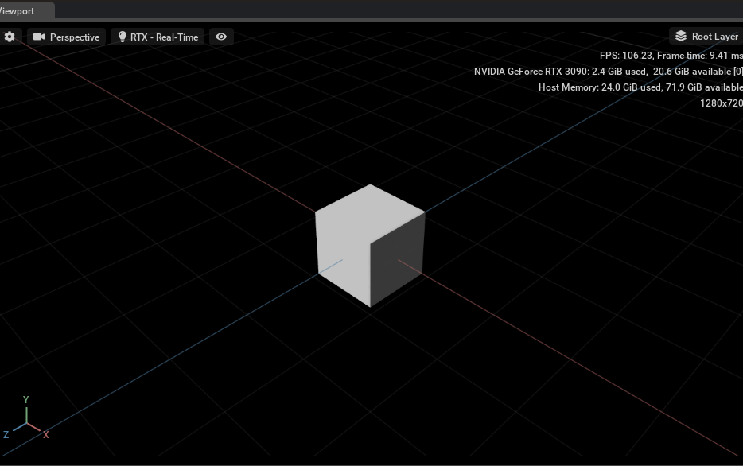
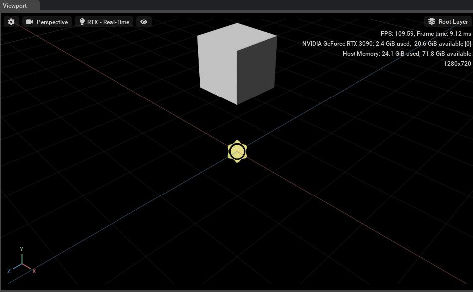
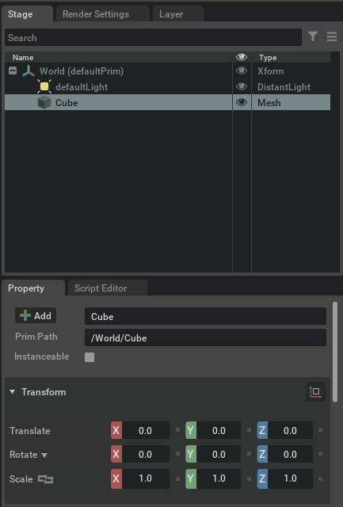
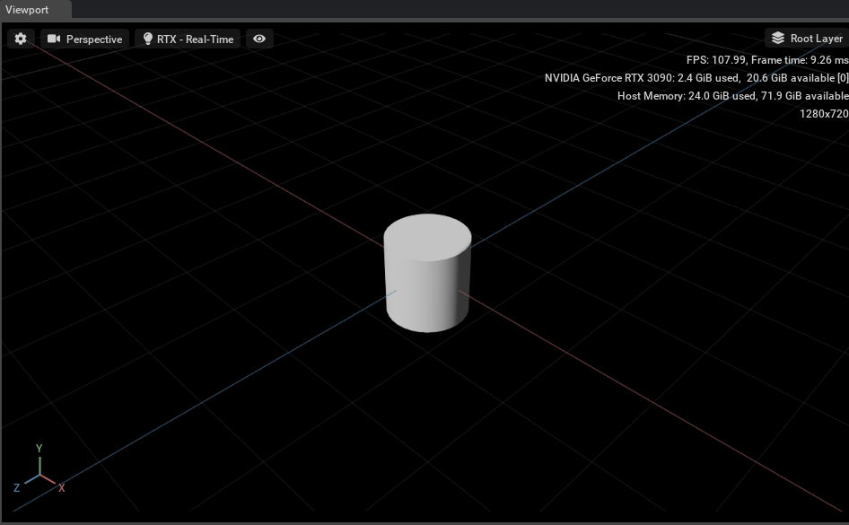
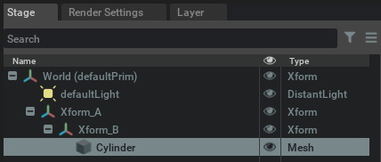
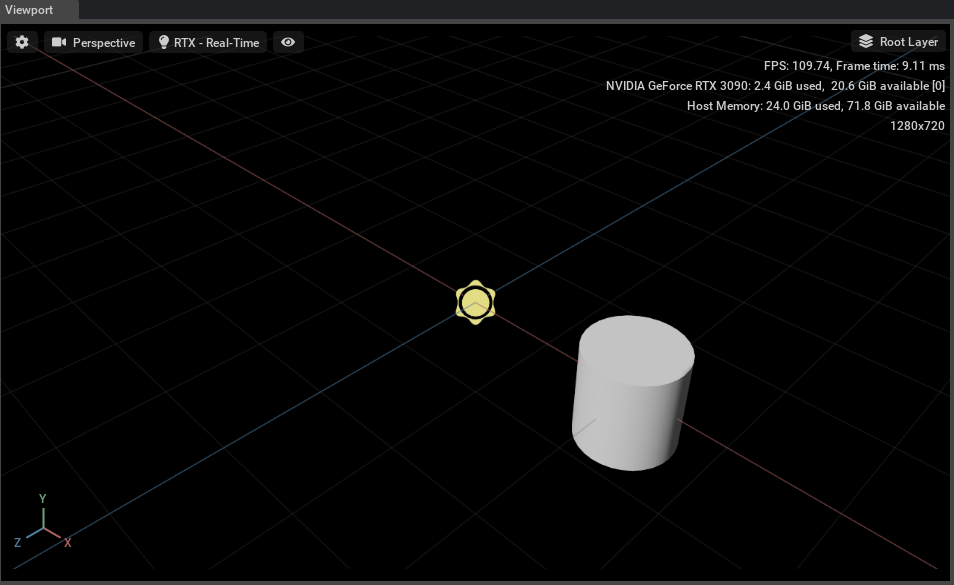
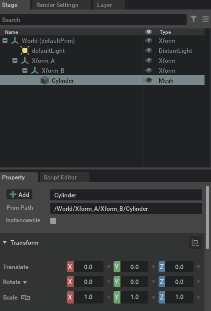
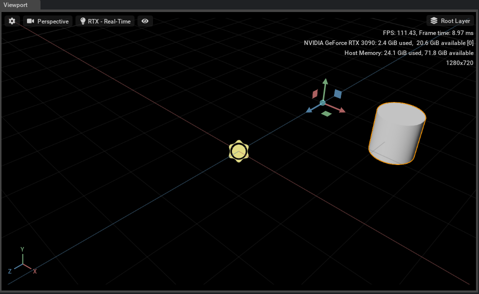
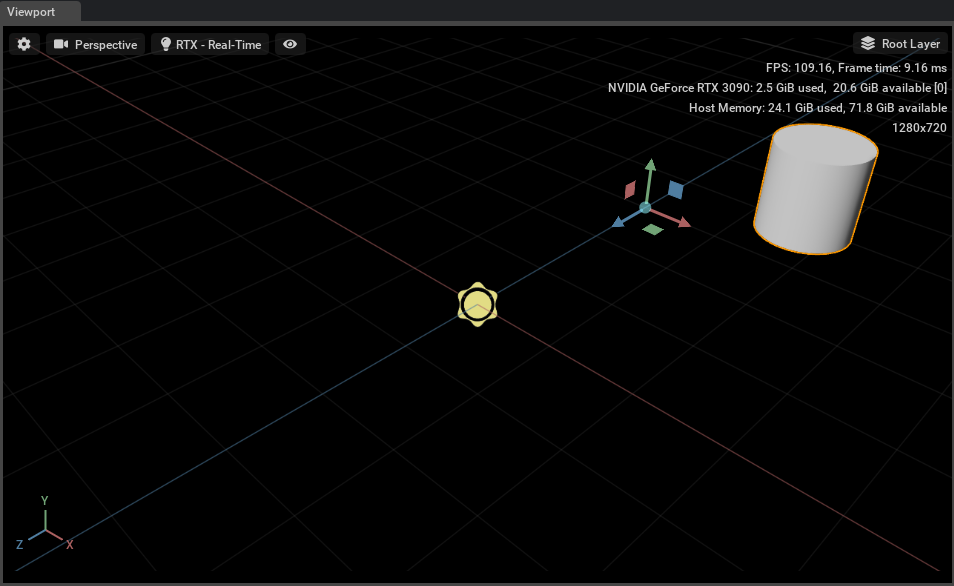

# Working with OmniHydra Transforms

Omniverse apps ship with a custom Hydra scene delegate named OmniHydra that augments the
functionality of the UsdImaging scene delegate. This enables Omniverse to extend Hydra with
high-performance scene editing, simulation, and proceduralism not otherwise available
in an off-the-shelf USD build. The key to runtime performance in OmniHydra is Fabric,
which is now accessible via the USDRT Scenegraph API.

## The RtXformable schema

OmniHydra leverages a special set of attributes for reasoning about prim transforms
in Fabric. To help create and query these attributes, USDRT provides the
RtXformable schema.

There are two ways to set transform data with the RtXformable schema:
  - world transform
  - local transform

If any world transform attribute is set on a prim in Fabric, it will take precedence over
any other transform data from USD or Fabric. The world transform is specified in three
parts.

|     Name    |    Fabric Attribute Name   |    Type     |        APIs                        |
| ----------- | -------------------------- | ----------- | ---------------------------------- |
| position    | _worldPosition             | Double3     | Create/GetWorldPositionAttr        |
| orientation | _worldOrientation          | Quatf       | Create/GetWorldOrientationAttr     |
| scale       | _worldScale                | Vector3f    | Create/GetWorldScaleAttr           |

If only one or two of the world transform attributes exist in Fabric, 
OmniHydra will use default values for the remaining attributes.

If no world transform attributes are set in Fabric, a local transform may be
specified for a prim.
(If any world transform attribute is specified, the local transform is ignored).
This local transform will take precedence over local transform data from USD for the prim, but
otherwise continue to participate in the transform hierarchy - changes to parent prims will
continue to affect the overall transform of the prim.

|     Name    |    Fabric Attribute Name   |    Type     |        APIs                        |
| ----------- | -------------------------- | ----------- | ---------------------------------- |
| localMatrix | _localMatrix               | Matrix4d    | Create/GetLocalMatrixAttr          |

Helper methods are provided to set either the world-space transform attribute values 
or the local transform value in Fabric using the computed values from the USD prim:
  - SetWorldXformFromUsd()
  - SetLocalXformFromUsd()

Important to note that _only_ OmniHydra XForm attributes in Fabric will drive the rendered prims. Any USD-style xformOps in Fabric are ignored by OmniHydra.


## Examples

### A cube in world space

Let's start with the simplest USD scene, a cube at the origin:



Now, let's use USDRT and the RtXformable schema to apply an OmniHydra world-space
transform in Fabric.

```python
import omni.usd
from usdrt import Usd, Rt, Gf, Sdf

stage = Usd.Stage.Attach(omni.usd.get_context().get_stage_id())
prim = stage.GetPrimAtPath(Sdf.Path("/World/Cube"))
xformable = Rt.Xformable(prim)
xformable.CreateWorldPositionAttr(Gf.Vec3d(0, 200, 0))
```

As expected, the cube is now elevated:



But note, if you inspect the cube properties in the Property window, it has no
transforms set in USD:



Fabric is a transient data store on top of USD, so values set in Fabric are not
automatically pushed back to the USD stage.

### A cylinder with a local transform

Let's start over with a new USD scene, a cylinder at the origin:



Unlike the cube in the last example, the cylinder has two Xform
prim ancestors:



Using the RtXformable schema, the local transform for the cylinder
prim can be set:

```python
import omni.usd
from usdrt import Usd, Rt, Gf, Sdf

stage = Usd.Stage.Attach(omni.usd.get_context().get_stage_id())
prim = stage.GetPrimAtPath(Sdf.Path("/World/Xform_A/Xform_B/Cylinder"))
xformable = Rt.Xformable(prim)
xformable.CreateLocalMatrixAttr(Gf.Matrix4d(1, 0, 0, 0, 0, 1, 0, 0, 0, 0, 1, 0, 200, 0, 0, 1))
```

As expected, the cylinder is translated along the X axis:



Like with the cube example, this data is only stored in Fabric - 
inspecting the USD data of the cylinder will show no transform
overrides in USD:



When using the local transform property with OmniHydra, the prim will
still participate in the overall transform hierarchy, including changes
to the USD scene and Fabric. For example, if the `/World/Xform_A` prim is selected
in the Stage window and dragged in the Viewport (in this case 300
units along the Z axis), updating the USD transform of the Xform prim,
the cylinder prim will inherit that ancestral transform in OmniHydra:



Likewise, if a local transform is authored in Fabric for the 
`/World/Xform_A/Xform_B` ancestor of the cylinder prim, the cylinder
will inherit that transform in OmniHydra as well:

```python
prim = stage.GetPrimAtPath(Sdf.Path("/World/Xform_A/Xform_B"))
xformable = Rt.Xformable(prim)
xformable.CreateWorldPositionAttr(Gf.Vec3d(0, 0, -200))
```


