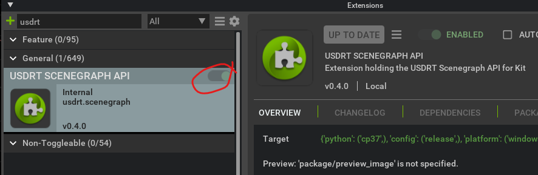
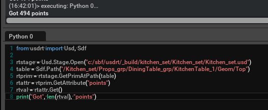

Getting the USDRT Scenegraph API
================================

##########
Inside Kit
##########

Starting with Kit 104, you can load the **USDRT Scenegraph API**
extension in Kit from the Extension Manager.

Once it's loaded, you can use the Python API directly in Kit, or from another
extension that declares a dependency on the USDRT Scenegraph API extension.

Similarly, you can use the C++ API from a Kit extension by declaring an extension dependency
to the USDRT Scenegraph API extension, and adding this path to the "includedirs" section of your
premake file:

.. code:: lua

    "%{kit_sdk}/dev/fabric/include"

The Kit extension manager will handle the plugin loading for you.

###########
Outside Kit
###########

Starting with Kit 106, USDRT Scenegraph API is bundled with
`kit-sdk <https://docs.omniverse.nvidia.com/kit/docs/kit-sdk/latest/index.html>`__.

See example extensions in `kit-extension-template <https://github.com/NVIDIA-Omniverse/kit-extension-template-cpp/tree/main/source/extensions>`__ for more details:
    - **omni.example.python.usdrt_mesh** : Example Kit extension that demonstrates how to use USDRT to create, update, and delete a UsdGeom.Mesh prim.
    - **omni.example.cpp.usdrt** : Example Kit extension that demonstrates inspecting Fabric data using the USDRT Scenegraph API, manipulating prim transforms in Fabric using the RtXformable schema, and deforming Mesh geometry
    - **omni.example.python.usdrt** : Example that demonstrates the above in Python.
    
