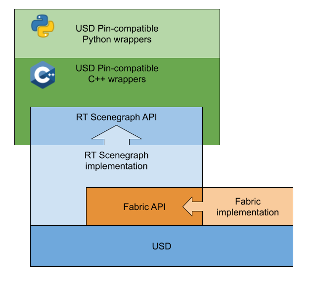

# USDRT Scenegraph API Usage

## About

The USDRT API is intended as a pin-compatible replacement for the USD API, with 
a goal of enabling low-cost transitions for existing USD-centric codebases to 
leverage the performance and replication features of Fabric. This is the vision:

**USD**
```c++
#include <pxr/base/vt/array.h>
#include <pxr/base/tf/token.h>
#include <pxr/usd/sdf/path.h>
#include <pxr/usd/usd/stage.h>
#include <pxr/usd/usd/prim.h>
#include <pxr/usd/usd/attribute.h>
#include <pxr/usd/usd/attribute.h>

PXR_NAMESPACE_USING_DIRECTIVE

UsdStageRefPtr stage = UsdStage::Open("./data/usd/tests/cornell.usda");
UsdPrim prim = stage->GetPrimAtPath(SdfPath("/Cornell_Box/Root/White_Wall_Back"));
UsdAttribute attr = prim.GetAttribute(TfToken("faceVertexIndices"));
VtArray<int> arrayResult;
attr.Get(&arrayResult);

CHECK(arrayResult.size() == 4);
CHECK(arrayResult[0] == 1);
CHECK(arrayResult[1] == 3);
```

**USDRT**
```c++
#include <usdrt/scenegraph/base/vt/array.h>
#include <usdrt/scenegraph/base/tf/token.h>
#include <usdrt/scenegraph/usd/sdf/path.h>
#include <usdrt/scenegraph/usd/usd/stage.h>
#include <usdrt/scenegraph/usd/usd/prim.h>
#include <usdrt/scenegraph/usd/usd/attribute.h>
#include <usdrt/scenegraph/usd/usdGeom/tokens.h>

using namespace usdrt;

UsdStageRefPtr stage = UsdStage::Open("./data/usd/tests/cornell.usda");
UsdPrim prim = stage->GetPrimAtPath(SdfPath("/Cornell_Box/Root/White_Wall_Back"));
UsdAttribute attr = prim.GetAttribute(UsdGeomTokens->faceVertexIndices);
VtArray<int> arrayResult;
attr.Get(&arrayResult);

CHECK(arrayResult.size() == 4);
CHECK(arrayResult[0] == 1);
CHECK(arrayResult[1] == 3);
```

Note that only the include lines and namespace directives were modified. In the USD example code above,
included files are from pxr and we are using the Pixar namespace directive, so the data is read
from USD. In the USDRT example code, the include files are from usdrt and using the usdrt namespace
directive, so the data is accessed from Fabric.

## API Status

### Core USD

With the Kit 104 release, a minimal subset of the USD API is available.
Significant portions of these classes have been implemented:

- UsdStage
- UsdPrim
- UsdAttribute
- UsdRelationship
- UsdPrimRange
- UsdTimeCode
- SdfPath
- SdfTypeValueName
- TfToken
- VtArray
- GfHalf
- GfMatrix(3/4)(d/f/h)
- GfQuat(d/f/h)
- GfVec(2/3/4)(d/f/h/i)
- GfRange(1/2/3)(d/f)
- GfRect2i

Specific details can be accessed via the C++ API Docs link. Because the API matches
USD, the rest of this document will review how USDRT interacts with Fabric, the current
limitations, and future development plans.

### Schema classes

As of Kit 105, all schema classes that ship with USD have the standard attribute get/set functions available.
Significant portions of these USD schema classes have been implemented:

- UsdGeom
- UsdLux
- UsdMedia
- UsdRender
- UsdShade
- UsdSkel
- UsdVol
- UsdPhysics

Additionally, Nvidia-specific schemas:

- ForceFieldSchema
- PhysxSchema
- Semantics

For some, custom code for additional functionality has been added. Specific details can be accessed via the C++ API Docs link.

### Rt schemas and classes

Functionality specific to USDRT, Fabric, and Omniverse is added in a new library, ```Rt```.
Schemas and support classes include:

- RtXformable (see [Working with OmniHydra Transforms](omnihydra_xforms.md))

## How USDRT Interacts with Fabric

USDRT does not replace USD's composition engine or sidestep the need for USD stages.
Under the hood, the USDRT scenegraph plugin still creates or maintains a USD stage
in order to populate Fabric. However, many USDRT operations read or write Fabric directly,
which allows many USD bottlenecks to be avoided. This also provides a way to interact with
Fabric using a familiar USD API, including Python bindings.



### Stages

There are (currently) three conceptual models for working with a stage in USDRT:
- Open or create a new stage, and automatically add a SimStageWithHistory for the stage
  - `usdrt::UsdStage::Open`
  - `usdrt::UsdStage::CreateNew`
  - `usdrt::UsdStage::CreateInMemory`
- Create a USDRT stage representing a pre-existing USD Stage and SimStageWithHistory
  (or create a SimStageWithHistory for a USD stage if one doesn't exist)
  - `usdrt::UsdStage::Attach`
- Create a USDRT stage with SimStageWithHistory only, and no underlying USD stage.
  - `usdrt::UsdStage::CreateOnlyInFabric`

The stage returned by the open/create APIs behaves in the same way that USD stages do - 
when the last reference to the `UsdStageRefPtr` is dropped, the underlying USD stage and
the associated SimStageWithHistory are cleaned up. 

A stage created with the Attach method does not attempt any cleanup
with the last reference to the `UsdStageRefPtr` is destroyed. It is assumed that because
a USD Stage and SimStageWithHistory already existed at `usdrt::UsdStage` creation time 
that they are owned by someone else, and should persist beyond the lifetime of the
`usdrt::UsdStage`. You can change the SimStageWithHistory ownership of an attached stage
with the `usdrt::UsdStage::SetStageWithHistoryOwnership` method (generally this
is not necessary).

It is likely that other RT-only methods for creating or defining stages will
be introduced in the future.

### Fabric population

In the Kit 104 release, USDRT takes a naive approach to loading data from a USD stage
into Fabric. 
USDRT will evolve over time to support additional
models of loading data into Fabric, using the USD stage as a fallback for data in some cases,
and synchronizing changes in the underlying USD stage into Fabric.

Fabric is lazily populated with USD data at the point where
any usdrt::UsdPrim object is created:
- ```usdrt::UsdStage::GetPrimAtPath``` adds the returned prim to Fabric if it is not already stored in Fabric
- ```usdrt::UsdStage::Traverse``` and ```usdrt::UsdPrimRange``` add the returned prims discovered during traversal they are not already stored in Fabric
- ```usdrt::UsdStage::DefinePrim``` creates a prim directly in Fabric, and does not add it to USD

The properties that are populated into Fabric for the prim are the properties with 
any authored opinion in USD. Attributes that only have fallback values are currently **not** populated into
Fabric. Additionally, the property values stored in Fabric are only those for the 
default value of the property - Fabric does not currently support USD timesamples.

Creating new properties on a USDRT prim will only add the property to Fabric - the
new property is not created on the USD stage:
- ```usdrt::UsdPrim::CreateAttribute```
- ```usdrt::UsdPrim::CreateRelationship```

Querying properties on a ```usdrt::UsdPrim``` only gives visibility into properties
that are present in Fabric - properties not in Fabric will return a value as though
the property does not exist.
- ```usdrt::UsdPrim::HasAttribute```
- ```usdrt::UsdPrim::GetAttribute```
- ```usdrt::UsdPrim::GetAttributes```
- ```usdrt::UsdPrim::HasRelationship```
- ```usdrt::UsdPrim::GetRelationship```
- ```usdrt::UsdPrim::GetRelationships```

It should be noted that ```usdrt::UsdStage::DefinePrim``` will create an otherwise
empty prim in Fabric. Properties of interest need to be subsequently created
for the prim using ```usdrt::UsdPrim::CreateAttribute``` and ```usdrt::UsdPrim::CreateRelationship```.
This will evolve over time as we consider the roles of schemas in USDRT and
Fabric data population strategies.

### Writing back to USD

As of the Kit 104 release, there are two methods for writing data in Fabric
back to the USD stage using USDRT:

- ```usdrt::UsdStage::WriteToStage()``` 
  - WriteToStage will write any modified properties in Fabric back to
    the EditTarget on the underlying USD stage, as long as those prims
    and properties already exist on the USD stage.
- ```usdrt::UsdStage::WriteToLayer(const std::string& filePath)```
  - WriteToLayer will write all prims and properties in Fabric to 
    a layer that is not part of the underlying USD stage. This is useful
    for exporting Fabric data as USD.

Additional support for writing data back to the USD stage will be added
in subsequent releases of USDRT.

### A note on transforms

OmniHydra (the Omniverse Scene Delegate that extends UsdImaging) can read prim
transform data directly from Fabric. This enables very fast visualization of
simulation data, since all simulation results are written to and read from Fabric.

The USDRT API provides a schema class for querying and manipulating this transform
data, ```usdrt::RtXformable```. For more information, see [Working with OmniHydra Transforms](omnihydra_xforms.md)

### Prim traversal

Like USD, stage traversals leverage the PrimRange class, invoked by either:
- ```usdrt::UsdStage::Traverse```
- or ```usdrt::UsdPrimRange``` constructor

There are two important notes, as of the Kit 104 release:
- PrimRanges that access a prim for the first time will cause that prim and its attributes to be loaded into Fabric
- Prims that are defined *only* in Fabric (via ```usdrt::UsdStage::DefinePrim```) will not appear in PrimRange results.
  Only prims that exist on the ```pxr::UsdStage``` will be returned by a ```usdrt::UsdPrimRange```, in the order
  defined by the ```pxr::UsdStage```.

As of Kit 106 release:
- Prims that are defined *only* in Fabric (via ```usdrt::UsdStage::DefinePrim```) *will* appear in PrimRange results.

This approach will evolve over time as development proceeds on USDRT.

### Accessing property values

As of the Kit 104 release, the USDRT API reads and writes property values from Fabric exclusively,
using the StageReaderWriter. 
There is currently no "passthrough" support to USD, although there may be in the future.

The ```Get()``` and ```Set()``` APIs implement value-templated access only - VtValue is currently not supported.

```c++
UsdAttribute attr = prim.GetAttribute(UsdGeomTokens->doubleSided);

bool result = false;
attr.Get(&result, 0.0);
CHECK(result);
```

Array-typed properties use ```usdrt::VtArray``` to access values in Fabric.

```c++
attr = prim.GetAttribute(UsdGeomTokens->faceVertexIndices);
VtArray<int> arrayResult;
attr.Get(&arrayResult, 0.0);
CHECK(arrayResult.size() == 4);
CHECK(arrayResult.IsFabricData());
CHECK(arrayResult[0] == 1);
CHECK(arrayResult[1] == 3);
```

```usdrt::VtArray``` has similar properties to ```pxr::VtArray```, in that it is 
[copy-on-write and copy-on-non-const-access](https://graphics.pixar.com/usd/release/api/class_vt_array.html#details), with **one important exception**.
A ```usdrt::VtArray``` that is populated from a call to ```usdrt::UsdAttribute::Get``` is
created in a state such that it is **attached** to the Fabric data it represents.
Modifying the VtArray in this attached state will modify the array data **directly in Fabric**.
The ```usdrt::VtArray::IsFabricData``` API indicates whether the VtArray is in this attached state,
and ```usdrt::VtArray::DetachFromSource``` will make an instance-local copy of the array data so
that further modifications to the VtArray will not write to Fabric. This avoids
unnecessary data copying and gives developers an efficient way to modify array-typed data in Fabric.

```c++
// prefetch a prim into Fabric
UsdStageRefPtr stage = UsdStage::Open("./data/usd/tests/cornell.usda");
UsdPrim prim = stage->GetPrimAtPath(SdfPath("/Cornell_Box/Root/Cornell_Box1_LP/White_Wall_Back"));

// Get array from Fabric
omni::fabric::StageReaderWriter sip(stage->GetStageReaderWriterId());
gsl::span<int> fabricArray =
    sip.getArrayAttribute<int>(omni::fabric::Path("/Cornell_Box/Root/Cornell_Box1_LP/White_Wall_Back"),
                                omni::fabric::Token("faceVertexIndices"));

// Get VtArray from USDRT
VtArray<int> fromFabric;
UsdAttribute attr = prim.GetAttribute(UsdGeomTokens->faceVertexIndices);
attr.Get(&fromFabric);
CHECK(fromFabric.IsFabricData());
CHECK(fromFabric[1] == 3);

// modification in VtArray attached to Fabric modifies Fabric
fromFabric[3] = 9;
CHECK(fromFabric.IsFabricData());
CHECK(fromFabric[3] == 9);
CHECK(fabricArray[3] == 9);

// detach from Fabric to localize array
fromFabric.DetachFromSource();
fromFabric[3] = 5;
CHECK(!fromFabric.IsFabricData());
CHECK(fromFabric[3] == 5);
CHECK(fabricArray[3] == 9);
fabricArray[3] = 12;
CHECK(fromFabric[3] == 5);
CHECK(fabricArray[3] == 12);
```

Some notes around value access:
- The ```Get()``` and ```Set()``` APIs have a time parameter, but this is currently ignored
  because Fabric does not yet support timesamples (although it likely will in the future)
- Linear algebra values use usdrt::Gf types, which are pin-compatible to their USD equivalents
- TfToken values use usdrt::TfToken, and SdfPath values use usdrt::SdfPath
- String array types are not currently supported, because Fabric does not support them yet 
- Relationships only support a single target in Kit 104 - a Fabric feature in Kit 105 adds
  support for multiple targets on relationships

