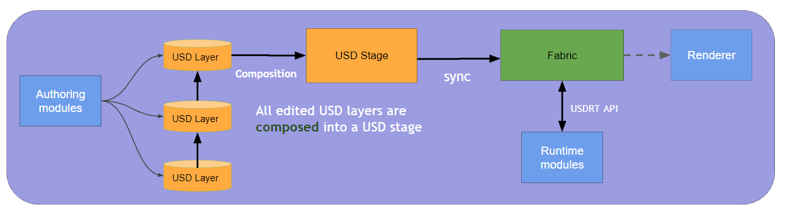

USD, Fabric, and USDRT
======================================================

########
Overview
########

**USD** is Pixar's library that allows large-scale scenes to be composed from hundreds
or thousands of component layers and modified using non-destructive operations.
Layers are backed by files on disk or a web service like Nucleus or AWS.
The USD library enables authoring and editing of individual layers and
inspection of the composed state of those layers, the USD stage.

**Fabric** is the Omniverse library that enables high-performance creation, modification,
and access of scene data, as well as communication of scene data between CPU and GPU
and other Fabric clients on a network. Data in Fabric can be populated from the local
composed USD stage, but may also be generated procedurally or populated over the network.
Fabric also provides a ringbuffer between simulation and one or more renderers to allow
them to run at different rates. Fabric indexes data and provides a query API to allow
systems such as physics and rendering to get only the data they need, without having to
traverse the scene each frame.

**USDRT** Scenegraph API is an Omniverse API that mirrors the USD API (and is pin-compatible in most cases),
but reads and writes data to and from Fabric instead of USD. It is designed to enable
low-cost transitions for developers and technical artists to use Fabric in their code
by starting with existing USD code or writing new code with USD APIs they already know,
in either C++ or Python.

####################
Features at a Glance
####################

.. list-table:: USD, Fabric, and USDRT Features
   :header-rows: 1
   :widths: 19 27 27 27

   * - 
     - USD
     - Fabric
     - USDRT
   * - **Developer**
     - Pixar
     - NVIDIA
     - NVIDIA
   * - **Data view**
     - Pre- and post-composition
     - Post-composition only
     - Post-composition only
   * - **API Languages**
     - C++, Python
     - C++
     - C++, Python
   * - **Python bindings**
     - boost::python
     - N/A
     - pybind11
   * - **ABI versioning**
     - No guarantees, ABI may change with each release
     - Versioned Carbonite interfaces
     - ONI, periodic stable forward-compatible releases
   * - **Vectorized APIs**
     - No
     - Yes
     - Not yet 
   * - **Cost to locate
       (e.g. all prims of a type,
       properties by name)**
     - O(n) - traversal of entire stage
     - O(1) - query
     - O(1) / O(n) - query by type or applied API / traversal of entire stage for others
   * - **GPU data synchronization**
     - No
     - Yes
     - Partial
   * - **Data persistence**
     - File-based storage
     - Transient, in-memory only
     - Transient, in-memory only
   * - **Data write speed**
     - Slow
     - Fastest
     - Fast

################
Which API to use
################

USD, Fabric, and USDRT each provide different capabilities for interacting with
scene data in Omniverse. Here's some guidelines about which API is most appropriate
for your project or extension.

USD
---

The USD API can be used for both pre- and post- composition operations.
That is, reading and authoring data directly from/to individual layers (pre-composition)
and inspecting the result of composing those layers into a stage (post-composition).
As a general rule, it is fast to read data from USD, but can be slow to write data to USD.

Use the USD API when you are:

* authoring persistent data (new assets and scenes) to be saved to one or more layers
* inspecting the composition of a stage (ex: checking a property value across
  all that layers where it is authored, querying composition arcs on a prim,
  discovering all the instances of a scenegraph prototype)
* modifying the composition of a stage (ex: changing a variantSet selection, enabling or
  disabling instancing for a prim, adding a new reference to a prim)

Fabric
------

The Fabric API operates on a post-composition view of the USD stage.
Fabric cannot modify the composition of a stage (ex: change a variantSet selection)
or inspect pre-composition data from individual USD layers. Data may be authored to Fabric that does
not exist in USD (both prims and properties), and Fabric may not contain all prims
and properties that exist on the USD stage. Fabric manages synchronization of data to and from the
GPU for GPU-accelerated operations and rendering.

Use the Fabric API when you:

* are inspecting the composed state of the USD stage
* are authoring transient data like simulation results, procedurally generated geometry,
  and interactive transform updates
* want to author data rapidly, to be stored back to USD at a later time or not at all
* want the option to use vectorized APIs for reading or writing data (see `vectorized example`_ below)
* want to read or modify data on the GPU
* want to quickly query the data to process it every frame, for example to get all the 
  physics prims, all the renderable prims, or all the prims that have a particular set
  of attributes
* are using C++

USDRT
-----

The USDRT API provides a USD-like API on top of Fabric. If you are already familiar
with the USD API, you can apply your existing knowledge to immediately begin
working with Fabric.

Use the USDRT API when you:

* want to work with Fabric (see above - transient data, fast data writes)
  
  **AND**
* want a USD-like API
* don't need access to vectorized APIs
* want fast queries by prim type or applied API, or are ok with traversing the stage to find the
  prims you want to process or know their paths without searching
* are using C++ or Python

#############
Code examples
#############

A few code examples are provided here to demonstrate how to accomplish a task with the
USD, Fabric, and USDRT APIs.

USD and USDRT samples are compared side-by-side, as the intention of the USDRT
Scenegraph API is to be as compatible with the USD API as possible.

Fabric does not provide a Python API, so there are no Python
samples for Fabric code. USDRT is the designated API for interacting with
Fabric through Python.

These samples are part of the usdrt unit test suites, so
validation asserts are mixed in throughout. For C++ the tests use
`doctest <https://github.com/doctest/doctest>`__, so the tests use the
``CHECK()`` macro. For Python the tests use
`unittest <https://docs.python.org/3/library/unittest.html>`__, so you will
see checks like ``self.assertTrue()`` and ``self.assertEqual()``.

Get and modify the displayColor property on one prim
----------------------------------------------------

For this example, we look at modifying an attribute on a prim with a known
path. In all cases, this data acn be accessed and modified directly.

C++
~~~

USD and USDRT
^^^^^^^^^^^^^

The code for the USD sample and the USDRT sample is the same, with the exception
of the namespace using directive. However, the USDRT sample is reading data from
Fabric, while the USD sample is reading data from the USD stage.

.. list-table::
   :header-rows: 1

   * - USD
     - USDRT
   * - .. literalinclude:: test_example_code/TestExampleCode.cpp
           :language: c++
           :dedent:
           :start-after: Begin example one property USD
           :end-before: End example one property USD
     - .. literalinclude::  test_example_code/TestExampleCode.cpp
           :language: c++
           :dedent:
           :start-after: Begin example one property RT
           :end-before: End example one property RT

Fabric
^^^^^^

Fabric's ``StageReaderWriter`` class provides separate APIs for accessing
non-array-typed attributes and array-typed attributes. As noted in the code comments,
there are also separate APIs for accessing data as a read-only (const) pointer,
a writable (non-const) pointer, or a read/write (non-const) pointer - using
the write or read/write APIs will mark the attribute as potentially modified in
Fabric's change tracking system. Fabric change tracking subscribers may then
take appropriate action based on potentially modified attribute values.

.. list-table::
   :header-rows: 1

   * - Attribute type
     - Read-only API
     - Write API
     - Read/Write API
   * - Non-array
     - ``getAttributeRd()``
     - ``getAttributeWr()``
     - ``getAttribute()``
   * - Array
     - ``getArrayAttributeRd()``
     - ``getArrayAttributeWr()``
     - ``getArrayAttribute()``

Because primvars are always represented by an array (even when the array only
contains a single item, i.e. ``constant`` interpolation), the
``getArrayAttributeRd()`` and ``getArrayAttributeWr()`` APIs are used in this example.

.. literalinclude::  test_example_code/TestExampleCode.cpp
           :language: c++
           :dedent:
           :start-after: Begin example one property Fabric
           :end-before: End example one property Fabric

Python
~~~~~~

USD and USDRT
^^^^^^^^^^^^^

Like the C++ example, the code for the USD sample and the USDRT sample
is the same, with the exception of the packages import namespace. And also
like the C++ example, the USDRT sample is reading data from
Fabric, while the USD sample is reading data from the USD stage.

.. list-table::
   :header-rows: 1

   * - USD
     - USDRT
   * - .. literalinclude::  test_example_code/test_examples.py
           :language: python
           :dedent:
           :start-after: Begin example one property USD
           :end-before: End example one property USD
     - .. literalinclude::  test_example_code/test_examples.py
           :language: python
           :dedent:
           :start-after: Begin example one property RT
           :end-before: End example one property RT

Find all Mesh prims and change the displayColor property
--------------------------------------------------------

In this example, we want to modify the displayColor property
on every Mesh prim on the stage. This demonstrates a key performance feature of
Fabric. Prim discovery with Fabric is very fast (``O(1)``) because
Fabric's internal storage organizes prims by shared sets of properties and metadata.
Prim discovery with USD can be quite expensive (``O(n)``) because it requires
traversing the entire stage to discover all prims with a specific type or
specific attributes. USDRT also supports fast queries (``O(1)``) with Fabric by
prim type or applied API schema.

C++
~~~

USD and USDRT
^^^^^^^^^^^^^

In this example, we see a key performance advantage in USDRT over USD.
With USDRT, querying the stage for prims by type or applied API schema has
a constant cost. With USD, this requires a traversal of the entire stage.

.. list-table::
   :header-rows: 1

   * - USD
     - USDRT
   * - .. literalinclude::  test_example_code/TestExampleCode.cpp
           :language: c++
           :dedent:
           :start-after: Begin example many prims and types USD
           :end-before: End example many prims and types USD
     - .. literalinclude::  test_example_code/TestExampleCode.cpp
           :language: c++
           :dedent:
           :start-after: Begin example many prims and types RT
           :end-before: End example many prims and types RT

Fabric
^^^^^^

Efficient *discovery* of prims in Fabric is accomplished using the
``StageReaderWriter::find()`` API, takes a set of property names and types
(represented by ``AttrNameAndType`` objects) and returns a ``PrimBucketList``
containing all Fabric buckets (data groupings) that match those requirements.
Note that in Fabric, prim type is also represented by a property of the type ``tag``.

Fabric's ``StageReaderWriter::find()`` is utilized in USDRT by a few APIs:

* ``UsdStage::GetPrimsWithTypeName()``
* ``UsdStage::GetPrimsWithAppliedAPIName()``
* ``UsdStage::GetPrimsWithTypeAndAppliedAPIName()``

Fabric queries are currently more general that USDRT
queries because they support querying by attribute name and type in addition
to prim type and applied API schema. Fabric also allows you to categorize your
query inputs by prim types and attribute names that should be present in **all**,
**any**, or **none** of the results.

This first example demonstrates a non-vectorized approach, where each
property is accessed individually using the ``getArrayAttributeWr`` method.

.. literalinclude::  test_example_code/TestExampleCode.cpp
           :language: c++
           :dedent:
           :start-after: Begin example many prims and types Fabric not vectorized
           :end-before: End example many prims and types Fabric not vectorized

.. _vectorized example:

Efficient *access and modification* of properties with Fabric can be accomplished
using its **vectorized** APIs. Internally, Fabric stores data so that all
properties of the same name and type are stored adjacent to each-other in memory
as an array, for each group of prims with matching sets of properties (aka bucket).
This allows access to *all* properties in a bucket with a single lookup and simple
pointer arithmetic, which is fast, GPU-friendly, and straightforward to parallelize
at scale. The example below demonstrates vectorized attribute access with Fabric:

.. literalinclude::  test_example_code/TestExampleCode.cpp
           :language: c++
           :dedent:
           :start-after: Begin example many prims and types Fabric vectorized
           :end-before: End example many prims and types Fabric vectorized

Like the non-vectorized versions, the vectorized APIs have separate methods for array and non-array
typed attributes, and read, write, and read/write versions of those methods. Using a write
or read/write method will mark a property as potentially modified in Fabric's
change tracker for *all prims in the bucket*.

.. list-table::
   :header-rows: 1

   * - Attribute type
     - Read-only API
     - Write API
     - Read/Write API
   * - Non-array
     - ``getAttributeArrayRd()``
     - ``getAttributeArrayWr()``
     - ``getAttributeArray()``
   * - Array
     - ``getArrayAttributeArrayRd()``
     - ``getArrayAttributeArrayWr()``
     - ``getArrayAttributeArray()``

Python
~~~~~~

USD and USDRT
^^^^^^^^^^^^^

.. list-table::
   :header-rows: 1

   * - USD
     - USDRT
   * - .. literalinclude::  test_example_code/test_examples.py
           :language: python
           :dedent:
           :start-after: Begin example many prims USD
           :end-before: End example many prims USD
     - .. literalinclude::  test_example_code/test_examples.py
           :language: python
           :dedent:
           :start-after: Begin example many prims RT
           :end-before: End example many prims RT

Get and modify a material binding relationship
----------------------------------------------

USDRT and Fabric also support relationship-type properties.

C++
~~~

USD and USDRT
^^^^^^^^^^^^^

.. list-table::
   :header-rows: 1

   * - USD
     - USDRT
   * - .. literalinclude::  test_example_code/TestExampleCode.cpp
           :language: c++
           :dedent:
           :start-after: Begin example relationship USD
           :end-before: End example relationship USD
     - .. literalinclude::  test_example_code/TestExampleCode.cpp
           :language: c++
           :dedent:
           :start-after: Begin example relationship RT
           :end-before: End example relationship RT

Fabric
^^^^^^

Fabric uses the same APIs to work with both attributes and relationships,
with ``omni::fabric::Path`` as the template type:
``StageReaderWriter::getAttribute<Path>()``.

An important note is that Fabric and USDRT only support a single
relationship target in Kit 104 - this is updated in Kit 105 to support
any number of targets on a relationship (like USD).

The example below contains an example of a Fabric API that bridges both
Kit releases, which will return the only relationship target in Kit 104,
and the *first* relationship target in Kit 105.

To get all relationship targets in Kit 105, you would use
``StageReaderWriter::getArrayAttribute<Path>()`` or the equivalent
read-only or write APIs.

.. literalinclude::  test_example_code/TestExampleCode.cpp
           :language: c++
           :dedent:
           :start-after: Begin example relationship Fabric
           :end-before: End example relationship Fabric

Python
~~~~~~

USD and USDRT
^^^^^^^^^^^^^

.. list-table:: 
   :header-rows: 1

   * - USD
     - USDRT
   * - .. literalinclude::  test_example_code/test_examples.py
           :language: python
           :dedent:
           :start-after: Begin example relationship USD
           :end-before: End example relationship USD
     - .. literalinclude::  test_example_code/test_examples.py
           :language: python
           :dedent:
           :start-after: Begin example relationship RT
           :end-before: End example relationship RT

Working with data on the GPU
----------------------------

Fabric has the capability of synchronizing data between CPU
memory and GPU memory. This can be useful for staging data 
on the GPU for running CUDA kernels to process it in a highly
parallelized manner. 

USDRT has some initial support for Fabric's GPU data through
its VtArray implementation - Fabric GPU data array-typed attributes
may be accessed though VtArray. Additionally, GPU data from
Python objects that implement the 
`CUDA Array interface <https://numba.readthedocs.io/en/stable/cuda/cuda_array_interface.html>`__
(such as `warp <https://developer.nvidia.com/warp-python>`__)
can be used to populate a VtArray and copy the data to Fabric
with a direct copy on the GPU.

C++
~~~

.. literalinclude::  test_example_code/TestExampleCode.cpp
           :language: c++
           :dedent:
           :start-after: Begin example GPU Fabric
           :end-before: End example GPU Fabric

Python
~~~~~~

.. literalinclude::  test_example_code/test_examples.py
           :language: python
           :dedent:
           :start-after: Begin example GPU
           :end-before: End example GPU

Interoperability between USD and USDRT
--------------------------------------

There are scenarios where it can be useful to leverage both USD
and USDRT together. This is possible with a little bit of careful
namespace management and some helpers for converting between a few key
types.

C++
~~~

.. literalinclude::  test_example_code/TestExampleCode.cpp
           :language: c++
           :dedent:
           :start-after: Begin example interop
           :end-before: End example interop

Python
~~~~~~

.. literalinclude::  test_example_code/test_examples.py
           :language: python
           :dedent:
           :start-after: Begin example interop
           :end-before: End example interop

############
Availability
############

.. list-table:: USD, Fabric, and USDRT Availability
   :header-rows: 1
   :stub-columns: 1

   * - 
     - USD
     - Fabric
     - USDRT
   * - Open-source repo
     - https://github.com/PixarAnimationStudios/USD
     - N/A
     - N/A
   * - Published Binaries
     - https://developer.nvidia.com/usd
     - N/A
     - N/A
   * - PyPi Package
     - `usd\_core <https://pypi.org/project/usd-core/>`__
     - N/A
     - N/A
   * - NVIDIA internal repo
     - omniverse/USD
     - omniverse/kit
     - omniverse/usdrt or kit_sdk 106+ [x]_
   * - packman package
     - nv_usd
     - kit_sdk
     - kit_sdk
   * - Kit-103
     - USD-20.08
     - carb.flatcache.plugin
     - N/A
   * - Kit-104
     - USD-20.08
     - carb.flatcache.plugin
     - USDRT Scenegraph API extension
   * - Kit-105
     - USD-22.11
     - omni.fabric.plugin
     - USDRT Scenegraph API extension
   * - Kit-106
     - USD-22.11
     - omni.fabric.plugin
     - USDRT Scenegraph API extension [x]_

.. [x] Starting in Kit 106, USDRT Scenegraph API extension is bundled with `kit-sdk <https://docs.omniverse.nvidia.com/kit/docs/kit-sdk/latest/index.html>`__
