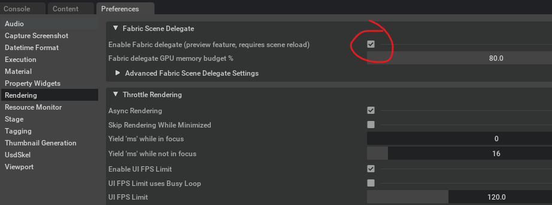
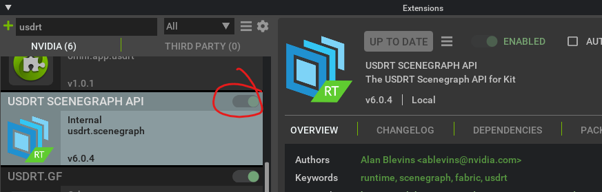
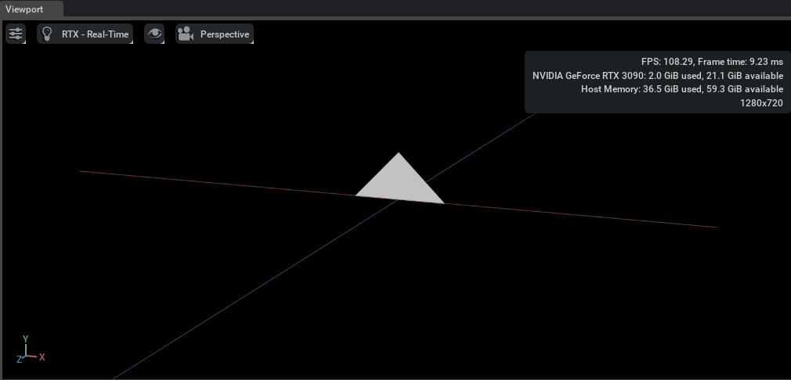
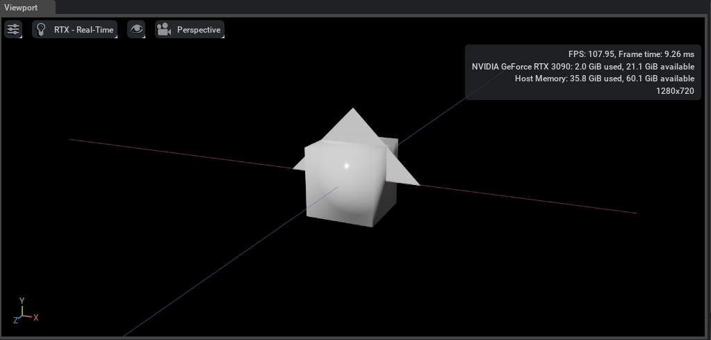
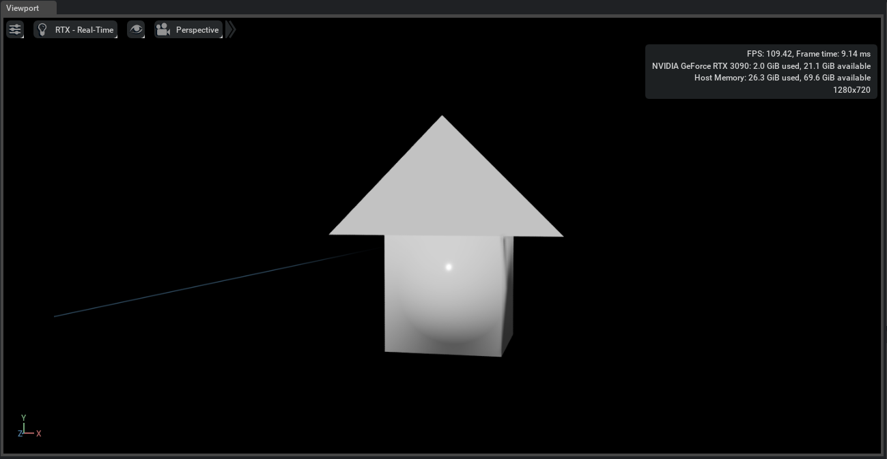

Authoring Geometry with USDRT and Rendering with Fabric Scene Delegate
======================================================================

#####
About
#####

The Fabric Scene Delegate is the next-generation Omniverse scene delegate for
Hydra. It leverages the power and performance of Fabric for a faster, more flexible,
streamlined rendering pipeline.

As you might expect, Fabric Scene Delegate uses Fabric as its data source for all rendering
operations. This is an exciting development, because it opens us to the possibility of
authoring renderable data directly to Fabric for use cases where USD data persistence is
not required.

This document gives a brief example of authoring geometry directly to Fabric using the
USDRT Scenegraph API, and rendering with Fabric Scene Delegate.

###############
Getting Started
###############

Enable Fabric Scene Delegate
----------------------------

**Starting with Kit 106.0, Fabric Scene Delegate is enabled in Composer and Explorer by default.**

If you are working in Kit, before you begin, you'll need to enable Fabric Scene Delegate in Kit.
Select **Edit->Preferences** in the main toolbar, and in the Preferences tab,
click **Rendering**. Then, in the **Fabric Scene Delegate** rendering preferences, toggle the checkbox
next to **Enable Fabric delegate**.

Finally, open or create a new USD stage to ensure that Fabric Scene Delegate is active.

.. note::
    The **Enable Fabric delegate** setting is not sticky, so it currently needs to be
    re-enabled between Kit sessions. This will likely change in a future release.

Enable the USDRT Scenegraph API
-------------------------------

You'll need to enable the USDRT Scenegraph API as well. Select **Window->Extensions**
in the main toolbar, and find **USDRT SCENEGRAPH API** in the extension list.
Toggle the slider to enable the extension.

Now you're ready to create some geometry in Fabric!

#########################################
Create Geometry with USDRT Scenegraph API
#########################################

In the Kit Script Editor window, or your own extension code, authoring geometry
is very similar to how it would be accomplished with the USD API. Here's a small example
that creates a triangle using a Mesh prim.

.. code:: python
    
    import omni.usd
    from usdrt import Usd, Sdf, UsdGeom, Rt, Gf, Vt

    stage_id = omni.usd.get_context().get_stage_id()

    stage = Usd.Stage.Attach(stage_id)

    prim = stage.DefinePrim("/World/Triangle", "Mesh")
    mesh = UsdGeom.Mesh(prim)

    points = mesh.CreatePointsAttr()
    points.Set(Vt.Vec3fArray(
        [Gf.Vec3f(100.0, 0, 0), Gf.Vec3f(0, 100.0, 0), Gf.Vec3f(-100.0, 0, 0)]))
    face_vc = mesh.CreateFaceVertexCountsAttr()
    face_vc.Set(Vt.IntArray([3]))
    face_vi = mesh.CreateFaceVertexIndicesAttr()
    face_vi.Set(Vt.IntArray([0, 1, 2]))

    rtbound = Rt.Boundable(prim)
    world_ext = rtbound.CreateWorldExtentAttr()
    world_ext.Set(Gf.Range3d(Gf.Vec3d(-100, 0, -100), Gf.Vec3d(100, 100, 100)))

    rtxform = Rt.Xformable(prim)
    local = rtxform.CreateFabricHierarchyLocalMatrixAttr()
    world = rtxform.CreateFabricHierarchyWorldMatrixAttr()

After this code runs, the triangle should appear in your viewport:

One potentially unfamiliar item in this example is the use of the ``Rt.Boundable`` and ``Rt.Xformable`` schema.
Fabric Scene Delegate requires that all renderable prims hold attributes that
contains the world and local transform matrices of the prim - the ``CreateFabricHierarchyLocalMatrixAttr()``
and ``CreateFabricHierarchyWorldMatrixAttr()`` APIs is the way to create and author that attribute.

Fabric Scene Delegate also prefers that all renderable prims hold an attribute that contains the extents of the prim
in world space - the ``CreateWorldExtentAttr()`` API is the way to create and author that attribute.
It is the responsibility of the author to calculate those extents and ensure their correctness.

Of course, Fabric Scene Delegate supports nearly all prim types in addition to Mesh.
Let's add a Cube to the scene:

.. code:: python

    prim = stage.DefinePrim("/World/Cube", "Cube")
    cube = UsdGeom.Cube(prim)
    size = cube.CreateSizeAttr()
    size.Set(100)

    rtbound = Rt.Boundable(prim)
    world_ext = rtbound.CreateWorldExtentAttr()
    world_ext.Set(Gf.Range3d(Gf.Vec3d(-50, -50, -50), Gf.Vec3d(50, 50, 50)))

    xformable = Rt.Xformable(prim)
    local = xformable.CreateFabricHierarchyLocalMatrixAttr()
    world = xformable.CreateFabricHierarchyWorldMatrixAttr()

It should appear in the viewport intersecting the original triangle Mesh:

Fabric Scene Delegate also uses the same transform attributes as OmniHydra, as described in the
:doc:`Working with OmniHydra Transforms <omnihydra_xforms>` documentation. Let's adjust the cube
so that it sits below the triangle.

Note that the world extent matrix for the prim will need to be adjusted
after the prim is transformed.

.. code:: python

    xformable = Rt.Xformable(prim)
    world = xformable.GetFabricHierarchyWorldMatrixAttr()
    world.Set(Gf.Matrix4d().SetTranslate(Gf.Vec3d(0, -50, -50)))

    rtbound = Rt.Boundable(prim)
    world_ext = rtbound.GetWorldExtentAttr()
    world_ext.Set(Gf.Range3d(Gf.Vec3d(-50, -100, -100), Gf.Vec3d(50, 0, 0)))

Here is the result:

It's not my dream house, but it will have to do for now!
