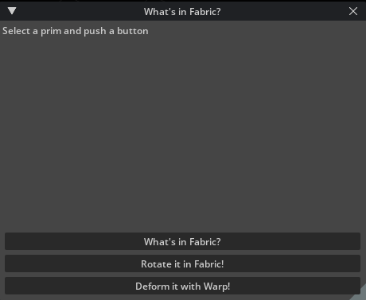
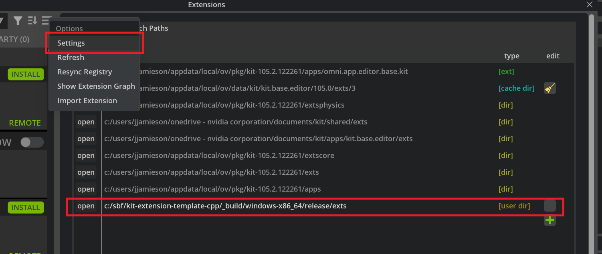
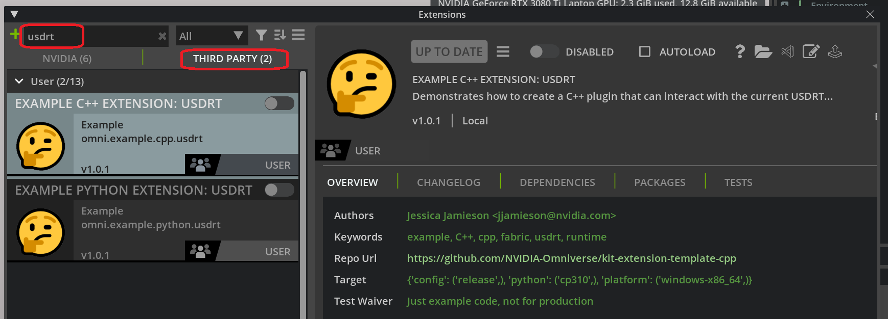
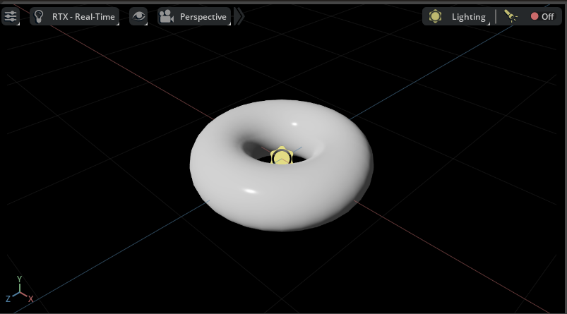
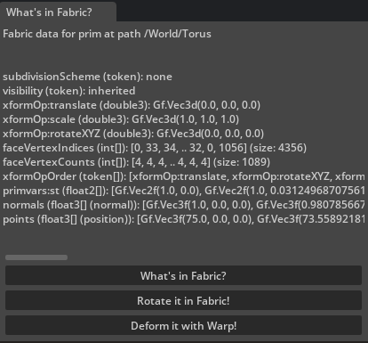
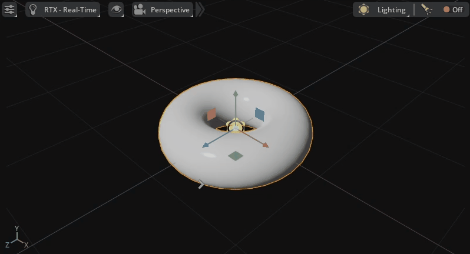
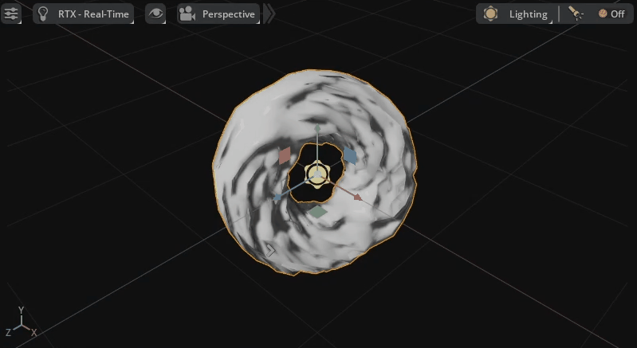

Example Kit Extension:  What's in Fabric?
=========================================

#####
About
#####

The `Kit Extension Template Cpp <https://github.com/NVIDIA-Omniverse/kit-extension-template-cpp>`_ public github repository has 2 example extensions that can be installed
named `omni.example.cpp.usdrt <https://github.com/NVIDIA-Omniverse/kit-extension-template-cpp/tree/main/source/extensions/omni.example.cpp.usdrt>`_
and `omni.example.python.usdrt <https://github.com/NVIDIA-Omniverse/kit-extension-template-cpp/tree/main/source/extensions/omni.example.python.usdrt>`_.
These are small Python & C++ extensions that
demonstrate a few concepts of working with the USDRT Scenegraph API:

- Inspecting Fabric data using the USDRT Scenegraph API
- Manipulating prim transforms in Fabric using the RtXformable schema
- Deforming Mesh geometry (In the python case: on the GPU with USDRT and Warp)

######################
Enabling the extension
######################

You can find the extensions in the `Kit Extension Template Cpp <https://github.com/NVIDIA-Omniverse/kit-extension-template-cpp>`_ repository on github.

- `omni.example.cpp.usdrt <https://github.com/NVIDIA-Omniverse/kit-extension-template-cpp/tree/main/source/extensions/omni.example.cpp.usdrt>`_
- `omni.example.python.usdrt <https://github.com/NVIDIA-Omniverse/kit-extension-template-cpp/tree/main/source/extensions/omni.example.python.usdrt>`_

To enable in kit, clone and build the Kit Extension Template Cpp repository.

In Kit, select Window -> Extensions -> Settings add a new search path to you build: `kit-extension-template-cpp/_build/windows-x86_64/release/exts`

Refrsh the extension registry, and you will find the examples under the Third Party tab. 

The extension will launch as a free-floating window, which can be
docked anywhere you find convenient (or not at all).

######################
Inspecting Fabric data
######################

You can inspect data in Fabric by selecting any prim in the viewport
or stage window, and then clicking the button labeled "What's in Fabric?".

Note that in the current implementation of the USDRT Scenegraph API, any creation
of a usdrt UsdPrim (ex: ``stage.GetPrimAtPath()``) will populate data for
that prim into Fabric if has not yet been populated.

If you create a Torus Mesh in an empty scene...

and click "What's in Fabric?", you should see something like this in the UI:

The code to get all of the prim attribute values from Fabric 
is straightforward and familiar to those with USD experience.
The ``get_fabric_data_for_prim`` function does all the work
using the USDRT Scenegraph API. 

Python
------

For python, we also have  ``is_vtarray`` and
``condensed_vtarray_str`` to encapsulate some
work around discovering VtArray instances and generating a
printed representation for them.

.. code:: python

    import omni.usd
    from usdrt import Usd, Sdf, Gf, Vt, Rt

    def get_fabric_data_for_prim(stage_id, path):
        """Get the Fabric data for a path as a string
        """
        if path is None:
            return "Nothing selected"

        stage = Usd.Stage.Attach(stage_id)

        # If a prim does not already exist in Fabric,
        # it will be fetched from USD by simply creating the
        # Usd.Prim object. At this time, only the attributes that have
        # authored opinions will be fetch into Fabric.
        prim = stage.GetPrimAtPath(Sdf.Path(path))
        if not prim:
            return f"Prim at path {path} is not in Fabric"

        # This diverges a bit from USD - only attributes
        # that exist in Fabric are returned by this API
        attrs = prim.GetAttributes()

        result = f"Fabric data for prim at path {path}\n\n\n"
        for attr in attrs:
            try:
                data = attr.Get()
                datastr = str(data)
                if data is None:
                    datastr = "<no value>"
                elif is_vtarray(data):
                    datastr = condensed_vtarray_str(data)
                
            except TypeError:
                # Some data types not yet supported in Python
                datastr = "<no Python conversion>"

            result += "{} ({}): {}\n".format(attr.GetName(), str(attr.GetTypeName().GetAsToken()), datastr)
        
        return result

    def is_vtarray(obj):
        """Check if this is a VtArray type

        In Python, each data type gets its own
        VtArray class i.e. Vt.Float3Array etc.
        so this helper identifies any of them.
        """
        return hasattr(obj, "IsFabricData")

    def condensed_vtarray_str(data):
        """Return a string representing VtArray data

        Include at most 6 values, and the total items
        in the array
        """
        size = len(data)
        if size > 6:
            datastr = "[{}, {}, {}, .. {}, {}, {}] (size: {})".format(
                data[0], data[1], data[2], data[-3], data[-2], data[-1], size
            )
        else:
            datastr = "["
            for i in range(size-1):
                datastr += str(data[i]) + ", "
            datastr += str(data[-1]) + "]"
        
        return datastr

The stage ID for the active stage in Kit can be retrieved using
``omni.usd.get_context().get_stage_id()`` - this is the ID of the 
USD stage in the global UsdUtilsStageCache, where Kit automatically
adds all loaded stages.

C++
---

In the C++ example, the entry point for the extension is python,
and use of the USDRT Scenegraph API is behind an
example C++ interface ``IExampleUsdrtInterface``. The interface provides
access to similar functions as in the python example. The code to get
all of the prim attribute values from Fabric is in
``ExampleUsdrtExtension::get_attributes_for_prim``.

.. code:: cpp
   
    inline std::string ExampleCppUsdrtExtension::get_attributes_for_prim(long int stageId, usdrt::SdfPath* path, std::vector<usdrt::UsdAttribute>* data)
    {
    
        if (!path || path->IsEmpty()) {
            return "Nothing selected";
        }

        if (data == nullptr) {
            return "Invalid data";
        }

        usdrt::UsdStageRefPtr stage = usdrt::UsdStage::Attach(omni::fabric::UsdStageId(stageId));

        // If a prim does not already exist in Fabric,
        // it will be fetched from USD by simply creating the
        // Usd.Prim object. At this time, only the attributes that have
        // authored opinions will be fetch into Fabric.
        usdrt::UsdPrim prim = stage->GetPrimAtPath(*path);
        if (!prim) {
            return "Prim at path " + path->GetString() + " is not in Fabric";
                
        }
        // This diverges a bit from USD - only attributes
        // that exist in Fabric are returned by this API
        std::vector<usdrt::UsdAttribute> attrs = prim.GetAttributes();
        *data = attrs;

        return "";
    }

################################################
Applying OmniHydra transforms using Rt.Xformable
################################################

The OmniHydra scene delegate that ships with Omniverse
includes a fast path for prim transform manipulation with Fabric.
The USDRT Scenegraph API provides the ``Rt.Xformable`` schema
to facilitate those transform manipulations in Fabric. You can
learn more about this in :doc:`omnihydra_xforms`

In this example, the **Rotate it in Fabric!** button will
use the ``Rt.Xformable`` schema to apply a random world-space
orientation to the selected prim. You can push the button
multiple times to make the prim dance in place!

The code to apply the OmniHydra transform in Fabric is simple enough:

Python
------

.. code:: python

    from usdrt import Usd, Sdf, Gf, Vt, Rt

    def apply_random_rotation(stage_id, path):
        """Apply a random world space rotation to a prim in Fabric
        """
        if path is None:
            return "Nothing selected"

        stage = Usd.Stage.Attach(stage_id)
        prim = stage.GetPrimAtPath(Sdf.Path(path))
        if not prim:
            return f"Prim at path {path} is not in Fabric"
        
        rtxformable = Rt.Xformable(prim)

        # If this is the first time setting OmniHydra xform,
        # start by setting the initial xform from the USD stage
        if not rtxformable.HasWorldXform():
            rtxformable.SetWorldXformFromUsd()

        # Generate a random orientation quaternion
        angle = random.random()*math.pi*2
        axis = Gf.Vec3f(random.random(), random.random(), random.random()).GetNormalized()
        halfangle = angle/2.0
        shalfangle = math.sin(halfangle)
        rotation = Gf.Quatf(math.cos(halfangle), axis[0]*shalfangle, axis[1]*shalfangle, axis[2]*shalfangle)

        rtxformable.GetWorldOrientationAttr().Set(rotation)

        return f"Set new world orientation on {path} to {rotation}"

C++
---

.. code:: cpp

    inline std::string ExampleCppUsdrtExtension::apply_random_rotation(long int stageId, usdrt::SdfPath* path, usdrt::GfQuatf* rot) {
        //Apply a random world space rotation to a prim in Fabric
        if (!path || path->IsEmpty()) {
            return "Nothing selected";
        }

        if (rot == nullptr) {
            return "Invalid data";
        }

        usdrt::UsdStageRefPtr stage = usdrt::UsdStage::Attach(omni::fabric::UsdStageId(stageId));
        usdrt::UsdPrim prim = stage->GetPrimAtPath(*path);
        if (!prim) {
            return "Prim at path " + path->GetString() + " is not in Fabric";
        }

        usdrt::RtXformable rtxformable = usdrt::RtXformable(prim);
        if (!rtxformable.HasWorldXform()) {
            rtxformable.SetWorldXformFromUsd();
        }

        std::random_device rd;  // Will be used to obtain a seed for the random number engine
        std::mt19937 gen(rd()); // Standard mersenne_twister_engine seeded with rd()
        std::uniform_real_distribution<float> dist(0.0f, 1.0f);
        float angle = dist(gen) * M_PI * 2;
        usdrt::GfVec3f axis = usdrt::GfVec3f(dist(gen), dist(gen), dist(gen)).GetNormalized();
        float halfangle = angle / 2.0;
        float shalfangle = sin(halfangle);
        usdrt::GfQuatf rotation = usdrt::GfQuatf(cos(halfangle), axis[0] * shalfangle, axis[1] * shalfangle, axis[2] * shalfangle);

        rtxformable.GetWorldOrientationAttr().Set(rotation);
        *rot = rotation;

        return "";
    }

#####################################
Deforming a Mesh
#####################################

Python (on the GPU with Warp)
-----------------------------

The USDRT Scenegraph API can leverage Fabric's support
for mirroring data to the GPU for array-type attributes with
its implementation of VtArray. This is especially handy
for integration with `warp <https://developer.nvidia.com/warp-python>`__,
NVIDIA's open-source Python library for running Python code
on the GPU with CUDA.

In addition to a fast path for transforms,
OmniHydra also provides a fast rendering path for Mesh point data
with Fabric. Any Mesh prim in Fabric with the ``Deformable`` tag will have its
point data pulled from Fabric for rendering by OmniHydra, rather than
the USD stage.

If you push the **Deform it with Warp!** button, the extension will
apply a Warp kernel to the point data of any selected prim - this
data modification will happen entirely on the GPU with CUDA, which makes it
possible to do operations on substantial Mesh data in very little time. If you
push the button repeatedly, you will see the geometry oscillate as the
deformation kernel is repeatedly applied.

The warp kernel used here is very simple, but it is possible to achieve
beautiful and complex results with Warp. Warp is amazing!

.. code:: python

    from usdrt import Usd, Sdf, Gf, Vt, Rt

    import warp as wp
    wp.init()

    @wp.kernel
    def deform(positions: wp.array(dtype=wp.vec3), t: float):
        tid = wp.tid()

        x = positions[tid]
        offset = -wp.sin(x[0])
        scale = wp.sin(t)*10.0

        x = x + wp.vec3(0.0, offset*scale, 0.0)

        positions[tid] = x
    
    def deform_mesh_with_warp(stage_id, path, time):
        """Use Warp to deform a Mesh prim
        """
        if path is None:
            return "Nothing selected"

        stage = Usd.Stage.Attach(stage_id)
        prim = stage.GetPrimAtPath(Sdf.Path(path))
        if not prim:
            return f"Prim at path {path} is not in Fabric"

        if not prim.HasAttribute("points"):
            return f"Prim at path {path} does not have points attribute"
        
        # Tell OmniHydra to render points from Fabric
        if not prim.HasAttribute("Deformable"):
            prim.CreateAttribute("Deformable", Sdf.ValueTypeNames.PrimTypeTag, True)

        points = prim.GetAttribute("points")
        pointsarray = points.Get()
        warparray = wp.array(pointsarray, dtype=wp.vec3, device="cuda")

        wp.launch(
            kernel=deform,
            dim=len(pointsarray),
            inputs=[warparray, time],
            device="cuda"
        )

        points.Set(Vt.Vec3fArray(warparray.numpy()))

        return f"Deformed points on prim {path}"

C++ (No GPU for simplicity of example)
--------------------------------------

In the python example, this uses warp to run the deformation on GPU
The more correct C++ equivalent would be to write a CUDA kernel for this
but for simplicity of this example, do the deformation here on CPU.

.. code:: cpp

    inline std::string  ExampleCppUsdrtExtension::deform_mesh(long int stageId, usdrt::SdfPath* path, int time)  {
        // Deform a Mesh prim
        if (!path || path->IsEmpty()) {
            return "Nothing selected";
        }

        usdrt::UsdStageRefPtr stage = usdrt::UsdStage::Attach(omni::fabric::UsdStageId(stageId));
        usdrt::UsdPrim prim = stage->GetPrimAtPath(*path);
        if (!prim) {
            return "Prim at path " + path->GetString() + " is not in Fabric";

        }

        if (!prim.HasAttribute("points")) {
            return "Prim at path " + path->GetString() + " does not have points attribute";
        }

        // Tell OmniHydra to render points from Fabric
        if (!prim.HasAttribute("Deformable")) {
            prim.CreateAttribute("Deformable", usdrt::SdfValueTypeNames->PrimTypeTag, true);
        }
        usdrt::UsdAttribute points = prim.GetAttribute("points");
        usdrt::VtArray<usdrt::GfVec3f> pointsarray;
        points.Get(&pointsarray);

        // Deform points
        // In the python example, this uses warp to run the deformation on GPU
        // The more correct C++ equivalent would be to write a CUDA kernel for this
        // but for simplicity of this example, do the deformation here on CPU.
        for (usdrt::GfVec3f& point : pointsarray) {
            float offset = -sin(point[0]);
            float scale = sin(time) * 10.0;

            point = point + usdrt::GfVec3f(0.0, offset * scale, 0.0);
        }

        points.Set(pointsarray);

        return "Deformed points on prim " + path->GetString();
    }
